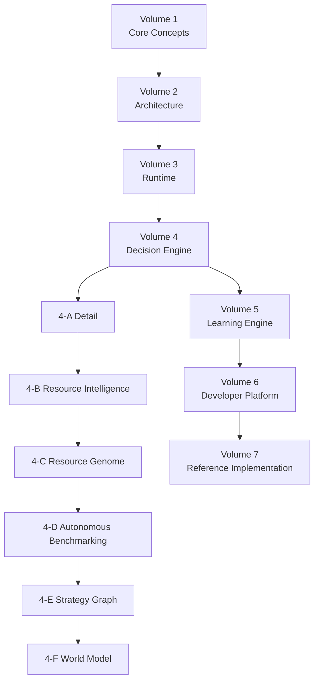

# Intent OS Specification

> **Human defines intent. System determines execution.**

인간과 인공지능 시스템 사이의 새로운 상호작용 구조를 정의하는 기술 명세서.

- **Version:** v0.1 Draft
- **Status:** Foundational Specification
- **Last Updated:** 2026-08-04

---

## 이름에 대하여

이 프로젝트는 초안 단계에서 **AI OS**로 불렸으나 **Intent OS**로 변경되었다.

이유: 이 시스템에서 AI는 여러 Resource 중 하나일 뿐이다. 검색 엔진, 데이터베이스, 자동화 도구, 인간 전문가도 동일하게 취급된다 ([Principle 03 — Resource Agnostic](v1-core-concepts.md#principle-03--resource-agnostic)). 이름에 "AI"가 들어가면 구현 과정에서 LLM 연결에만 집중하게 되어 핵심 설계 원칙과 충돌한다.

이 시스템의 실제 발명품은 AI를 고르는 방법이 아니라 **Intent → Task → Capability → Resource** 라는 순서다.

---

## 핵심 명제

Intent OS의 목적은 **지능 자체를 만드는 것**이 아니라, **지능 자원을 최적으로 활용하는 것**이다.

```
기존 방식                    Intent OS 방식
─────────                    ──────────
User                         User
  ↓                            ↓
Prompt                       Goal
  ↓                            ↓
AI                          Intent → Task → Capability
  ↓                            ↓
Answer                      Resource → Execution → Outcome
```

---

## 목차

| Volume | 내용 | 문서 |
|---|---|---|
| 1 | Core Concepts — 7개 핵심 객체와 설계 철학 | [v1-core-concepts.md](v1-core-concepts.md) |
| 2 | Architecture — 8개 Layer 구조 | [v2-architecture.md](v2-architecture.md) |
| 3 | Runtime — 실행 생명주기 7단계 | [v3-runtime.md](v3-runtime.md) |
| 4 | Decision Engine — Resource 선택 알고리즘 | [v4-decision-engine.md](v4-decision-engine.md) |
| 4-A | ↳ Decision Engine 상세 — 7개 모듈, Utility 공식 | [v4a-decision-engine-detail.md](v4a-decision-engine-detail.md) |
| 4-B | ↳ Resource Intelligence — Capability DNA, Drift 감지 | [v4b-resource-intelligence.md](v4b-resource-intelligence.md) |
| 4-C | ↳ Resource Genome — 행동 기반 AI 표현, Meta Prediction | [v4c-resource-genome.md](v4c-resource-genome.md) |
| 4-D | ↳ Autonomous Benchmarking — AI를 자동으로 연구·평가 | [v4d-autonomous-benchmarking.md](v4d-autonomous-benchmarking.md) |
| 4-E | ↳ Strategy Graph — 전략 자체를 학습·재사용 ⚠️연구 | [v4e-strategy-graph.md](v4e-strategy-graph.md) |
| 4-F | ↳ World Model — 사용자의 현실을 모델링 ⚠️연구 | [v4f-world-model.md](v4f-world-model.md) |
| 5 | Learning Engine — 경험 축적과 개선 | [v5-learning-engine.md](v5-learning-engine.md) |
| 6 | Developer Platform — 외부 Resource 연결 | [v6-developer-platform.md](v6-developer-platform.md) |
| 7 | Reference Implementation — MVP 및 로드맵 | [v7-reference-implementation.md](v7-reference-implementation.md) |

## Entity Specification

25개 Core Entity를 RFC/ISO 표준 수준으로 정의하는 명세. **모든 문서가 12개 필수 섹션을 강제**하므로 구현 시 해석의 여지가 거의 없다.

> **Entity 목록은 v2.0에서 동결되었다.** 25개 + 구조 문서 3개. 추가하려면 5개 심사 질문을 통과하고 major 버전을 올려야 한다.
> → [entities/e000b-entity-registry.md](entities/e000b-entity-registry.md)
>
> 전 Entity가 **L2**(12개 섹션 + JSON Schema)에 도달했다. → [준수 현황](entities/README.md)

> Entity 정의만으로는 운영체제가 되지 않는다. Entity 사이의 **관계와 불변식**이 함께 정의되어야 한다.
> → [entities/e000a-entity-relationships.md](entities/e000a-entity-relationships.md)

| Entity | 이름 | 문서 | 상태 |
|---|---|---|---|
| — | Entity 개요 — 25개 Core Entity, 준수 현황, 알려진 정합성 문제 | [entities/README.md](entities/README.md) | v3.0 Draft |
| 000 | **Specification Format** — 12개 필수 섹션, 번호 규칙, 준수 등급 | [entities/e000-spec-format.md](entities/e000-spec-format.md) | v1.0 Draft |
| 000-A | **Entity Relationships & Invariants** — Cardinality 전체표, 전역 불변식 16개 | [entities/e000a-entity-relationships.md](entities/e000a-entity-relationships.md) | v1.0 Draft |
| 000-B | **Entity Registry** — 25개 목록 동결, 추가/폐기 절차, Entity가 아닌 것 | [entities/e000b-entity-registry.md](entities/e000b-entity-registry.md) | **v2.0 FROZEN** |
| 001 | Goal — 정의, 규칙, Formal Grammar, Goal Types | [entities/e001-goal.md](entities/e001-goal.md) | v3.0 Draft |
| 001-A | Goal Graph — 6종 관계, 계층, Score, Propagation | [entities/e001a-goal-graph.md](entities/e001a-goal-graph.md) | v2.0 Draft |
| 001-B | Goal JSON Schema — CGR v2 필드 정의, v1→v2 마이그레이션 | [entities/e001b-goal-schema.md](entities/e001b-goal-schema.md) | v2.0 Draft |
| 001-C | Goal State Machine — 12개 상태, 상태별 Action, Guard | [entities/e001c-goal-state-machine.md](entities/e001c-goal-state-machine.md) | v2.0 Draft |
| 001-D | Goal Validation Rules — 검증 파이프라인, Completeness, Confidence | [entities/e001d-goal-validation.md](entities/e001d-goal-validation.md) | v2.0 Draft |
| 002 | Intent — Goal과 Task 사이의 중간 계층, 해결 영역, Confidence | [entities/e002-intent.md](entities/e002-intent.md) | v2.0 Draft |
| 003 | Context — Scope 계층, Freshness와 TTL, 수집·갱신 규칙 | [entities/e003-context.md](entities/e003-context.md) | v2.0 Draft |
| 004 | Constraint — Hard/Soft 구분, 6개 유형, 충돌과 완화 | [entities/e004-constraint.md](entities/e004-constraint.md) | v2.0 Draft |
| 005 | Task — 분해 규칙, 상태 머신, 실패 처리 | [entities/e005-task.md](entities/e005-task.md) | v2.0 Draft |
| 005-A | ↳ Task Graph — 임계 경로, SPOF, 재계획 시 보존 규칙 | [entities/e005a-task-graph.md](entities/e005a-task-graph.md) | v2.0 Draft |
| 006 | Capability — 명명 규칙, Matching, Level | [entities/e006-capability.md](entities/e006-capability.md) | v2.0 Draft |
| 006-A | ↳ Capability Taxonomy — 이름공간, 별칭, 난이도와 측정 정의 | [entities/e006a-capability-taxonomy.md](entities/e006a-capability-taxonomy.md) | v1.0 Draft |
| 007 | Resource — AI/Tool/Human 동일 취급, 등록과 Drift | [entities/e007-resource.md](entities/e007-resource.md) | v2.0 Draft |
| 008 | Plan — Planner 산출물, Versioning, Replanning 트리거 | [entities/e008-plan.md](entities/e008-plan.md) | v2.0 Draft |
| 009 | Decision — 감사 가능한 선택 기록, Rationale, 불변성 | [entities/e009-decision.md](entities/e009-decision.md) | v2.0 Draft |
| 010 | Memory — Episodic/Semantic/Procedural, Scope, Decay | [entities/e010-memory.md](entities/e010-memory.md) | v2.0 Draft |
| 011 | Knowledge — Memory로부터의 승격, Confidence와 반증 | [entities/e011-knowledge.md](entities/e011-knowledge.md) | v2.0 Draft |
| 012 | Feedback — Explicit/Implicit/Systemic, 라우팅, Feedback Loop | [entities/e012-feedback.md](entities/e012-feedback.md) | v2.0 Draft |
| 013 | Execution — Task 한 번의 시도, 재시도 체인, 실패 분류 | [entities/e013-execution.md](entities/e013-execution.md) | v1.0 Draft |
| 014 | Outcome — 측정값만 담는 불변 기록, goal_progress 델타 | [entities/e014-outcome.md](entities/e014-outcome.md) | v1.0 Draft |
| 015 | Evaluation — 4축 판정, **결과 품질과 결정 품질의 분리** | [entities/e015-evaluation.md](entities/e015-evaluation.md) | v1.0 Draft |
| 016 | Artifact — 과정과 독립적으로 보존되는 산출물, Provenance | [entities/e016-artifact.md](entities/e016-artifact.md) | v1.0 Draft |
| 017 | Assumption — 통제하지 못하는 전제, 반증 조건, Replanning | [entities/e017-assumption.md](entities/e017-assumption.md) | v1.0 Draft |
| 018 | Risk — 확률 × 영향, 조기 경보, 대응 전략 | [entities/e018-risk.md](entities/e018-risk.md) | v1.0 Draft |
| 019 | Policy — 최적화보다 우선하는 강제 규칙, 강제 지점 | [entities/e019-policy.md](entities/e019-policy.md) | v1.0 Draft |
| 020 | Event — 이미 일어난 일의 불변 순서 기록, Event Sourcing | [entities/e020-event.md](entities/e020-event.md) | v1.0 Draft |
| 021 | Session — 실행의 경계와 예산. Entity를 소유하지 않는다 | [entities/e021-session.md](entities/e021-session.md) | v1.0 Draft |
| 022 | Workflow — 재사용 가능한 제어 흐름 템플릿, 보상 트랜잭션 | [entities/e022-workflow.md](entities/e022-workflow.md) | v1.0 Draft |
| 023 | Agent — Resource를 사용하는 자율적 실행 주체, 권한 위임 | [entities/e023-agent.md](entities/e023-agent.md) | v1.0 Draft |
| 024 | Tool — 결정론적 인터페이스, 선언된 부수효과와 멱등성 | [entities/e024-tool.md](entities/e024-tool.md) | v1.0 Draft |
| 025 | Resource Profile — Context별 측정 기록, 스냅샷과 Drift | [entities/e025-resource-profile.md](entities/e025-resource-profile.md) | v1.0 Draft |

> **v2.0 분류 정정:** v1.0에서 Execution을 Process, Outcome을 Runtime State로 분류했으나 이를 정정했다. 운영체제에서 "실행 중"은 Process지만 `task_struct`는 Entity인 것과 같다. 판별 기준은 **"1년 뒤에 조회해야 하는가"** 이며, Execution 이력 없이는 Drift 감지가, Outcome 없이는 Learning이 불가능하다. Learning과 Prediction은 여전히 Process다 — 그 산출물이 Memory·Knowledge라는 별도 Entity다. 상세 근거는 [entities/README.md §1](entities/README.md) 참조.

## 스키마

기계가 읽을 수 있는 JSON Schema는 [`schemas/`](intent-os-spec/schemas/) 폴더에 있다.

| 스키마 | 대응 Entity |
|---|---|
| [`goal.schema.json`](intent-os-spec/schemas/goal.schema.json) | Entity 001-B — Canonical Goal Representation v2 |
| [`goal-state-machine.json`](intent-os-spec/schemas/goal-state-machine.json) | Entity 001-C — Goal State Machine |
| [`goal-graph.schema.json`](intent-os-spec/schemas/goal-graph.schema.json) | Entity 001-A — Goal Graph |
| [`intent.schema.json`](intent-os-spec/schemas/intent.schema.json) | Entity 002 |
| [`context.schema.json`](intent-os-spec/schemas/context.schema.json) | Entity 003 |
| [`constraint.schema.json`](intent-os-spec/schemas/constraint.schema.json) | Entity 004 |
| [`task.schema.json`](intent-os-spec/schemas/task.schema.json) | Entity 005 |
| [`capability.schema.json`](intent-os-spec/schemas/capability.schema.json) | Entity 006 |
| [`resource.schema.json`](intent-os-spec/schemas/resource.schema.json) | Entity 007 |
| [`plan.schema.json`](intent-os-spec/schemas/plan.schema.json) | Entity 008 |
| [`decision.schema.json`](intent-os-spec/schemas/decision.schema.json) | Entity 009 |
| [`memory.schema.json`](intent-os-spec/schemas/memory.schema.json) | Entity 010 |
| [`knowledge.schema.json`](intent-os-spec/schemas/knowledge.schema.json) | Entity 011 |
| [`feedback.schema.json`](intent-os-spec/schemas/feedback.schema.json) | Entity 012 |
| [`execution.schema.json`](intent-os-spec/schemas/execution.schema.json) | Entity 013 — Task 단위 실행 (v1.0에서 재정의) |
| [`outcome.schema.json`](intent-os-spec/schemas/outcome.schema.json) | Entity 014 |
| [`evaluation.schema.json`](intent-os-spec/schemas/evaluation.schema.json) | Entity 015 |
| [`artifact.schema.json`](intent-os-spec/schemas/artifact.schema.json) | Entity 016 |
| [`assumption.schema.json`](intent-os-spec/schemas/assumption.schema.json) | Entity 017 |
| [`risk.schema.json`](intent-os-spec/schemas/risk.schema.json) | Entity 018 |
| [`policy.schema.json`](intent-os-spec/schemas/policy.schema.json) | Entity 019 |
| [`event.schema.json`](intent-os-spec/schemas/event.schema.json) | Entity 020 |
| [`session.schema.json`](intent-os-spec/schemas/session.schema.json) | Entity 021 — 구 "Execution Instance"([Volume 3](v3-runtime.md))의 후신 |
| [`workflow.schema.json`](intent-os-spec/schemas/workflow.schema.json) | Entity 022 |
| [`agent.schema.json`](intent-os-spec/schemas/agent.schema.json) | Entity 023 |
| [`tool.schema.json`](intent-os-spec/schemas/tool.schema.json) | Entity 024 |
| [`resource-profile.schema.json`](intent-os-spec/schemas/resource-profile.schema.json) | Entity 025 |
| [`task-graph.schema.json`](intent-os-spec/schemas/task-graph.schema.json) | Entity 005-A |
| [`capability-taxonomy.schema.json`](intent-os-spec/schemas/capability-taxonomy.schema.json) | Entity 006-A |

---

## 의존 관계



---

## 가장 중요한 규칙

> **Never choose an AI before understanding the Goal.**
>
> 목표를 이해하지 않은 AI 선택은 항상 최적화 실패를 만든다.
