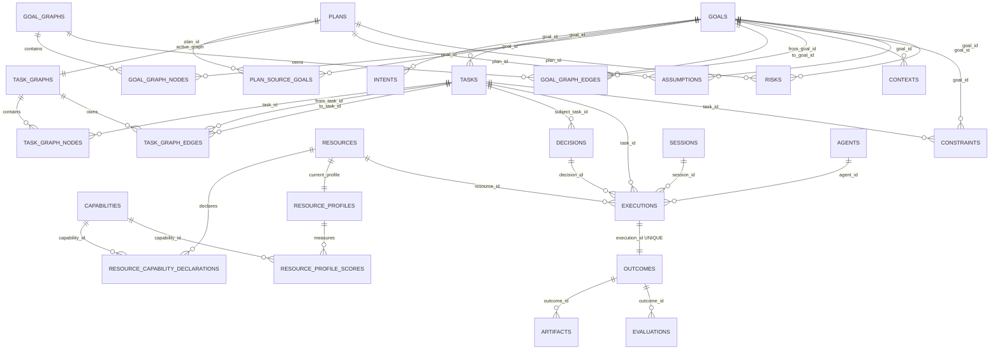

# PostgreSQL ERD v1 — Canonical Data Model

- **Version:** v1.0 Draft
- **Last Updated:** 2026-08-07
- **Depends on:** `entities/canonical-data-model-v1.md`

---

## 1. Purpose

이 문서는 Canonical Data Model v1을 PostgreSQL에 옮길 때의 **물리적 정본 구조**를 정의한다.

핵심 원칙은 하나다.

> 같은 사실을 두 테이블에 쓰지 않는다. 관계의 정본은 FK 또는 edge table 하나만 갖고, 역방향 목록·집계·현재 projection은 View/Materialized View로 만든다.

JSON Schema는 API/교환 형식이고, 이 문서는 저장 계층의 정본이다. 두 계층의 책임은 다르다.

| 계층 | 역할 |
|---|---|
| JSON Schema | 외부/내부 API payload 검증 |
| PostgreSQL base table | AUTHORITATIVE / REFERENCE 저장 |
| append-only table | SNAPSHOT / audit trail 저장 |
| View / Materialized View | DERIVED projection 제공 |

---

## 2. Core ERD



---

## 3. Canonical Base Tables

### 3.1 `goals`

Goal 자체의 정본 필드만 저장한다.

```sql
CREATE TABLE goals (
    goal_id             text PRIMARY KEY,
    version             integer NOT NULL CHECK (version >= 1),
    title               text NOT NULL,
    goal_type           text NOT NULL,
    objective           jsonb NOT NULL,
    motivation          jsonb,
    priority_level      text,
    stakeholders        jsonb,
    status_phase        text NOT NULL,
    status_entered_at   timestamptz,
    blocked_reason      text,
    quality_confidence  numeric(5,4),
    created_by          text NOT NULL,
    created_at          timestamptz NOT NULL,
    updated_at          timestamptz,
    source              text NOT NULL,
    origin_ref          text
);
```

**저장하지 않는 필드:** `parent_goal`, `child_goals`, `dependencies`, `related_goals`, `status.progress`, 계산된 priority score, completeness, current Context/Constraint.

이 값들은 View에서 제공한다.

### 3.2 `goal_graphs`

```sql
CREATE TABLE goal_graphs (
    graph_id        text PRIMARY KEY,
    root_goal_id    text REFERENCES goals(goal_id),
    scoring_weights jsonb,
    version         integer NOT NULL DEFAULT 1,
    created_at      timestamptz NOT NULL DEFAULT now()
);
```

### 3.3 `goal_graph_nodes`

```sql
CREATE TABLE goal_graph_nodes (
    graph_id text NOT NULL REFERENCES goal_graphs(graph_id) ON DELETE CASCADE,
    goal_id  text NOT NULL REFERENCES goals(goal_id),
    PRIMARY KEY (graph_id, goal_id)
);
```

Goal 객체 전체를 Graph에 embed하지 않는다.

### 3.4 `goal_graph_edges`

```sql
CREATE TABLE goal_graph_edges (
    graph_id       text NOT NULL REFERENCES goal_graphs(graph_id) ON DELETE CASCADE,
    from_goal_id   text NOT NULL REFERENCES goals(goal_id),
    to_goal_id     text NOT NULL REFERENCES goals(goal_id),
    relationship   text NOT NULL,
    weight         numeric,
    resolution     text,
    PRIMARY KEY (graph_id, from_goal_id, to_goal_id, relationship),
    CHECK (from_goal_id <> to_goal_id)
);
```

Goal 관계의 **단일 Source of Truth**다.

### 3.5 `tasks`

```sql
CREATE TABLE tasks (
    task_id               text PRIMARY KEY,
    goal_id               text NOT NULL REFERENCES goals(goal_id),
    objective             text NOT NULL,
    task_type             text,
    expected_output       text,
    execution_mode        text,
    priority              text,
    retry_policy          jsonb,
    state                 text,
    created_at            timestamptz NOT NULL DEFAULT now(),
    updated_at            timestamptz
);
```

`dependencies`, `assigned_resource_id`, `attempts`는 저장하지 않는다.

### 3.6 `task_capability_requirements`

```sql
CREATE TABLE task_capability_requirements (
    task_id        text NOT NULL REFERENCES tasks(task_id) ON DELETE CASCADE,
    capability_id  text NOT NULL REFERENCES capabilities(capability_id),
    min_level      text,
    weight         numeric(5,4),
    PRIMARY KEY (task_id, capability_id)
);
```

### 3.7 `plans`

```sql
CREATE TABLE plans (
    plan_id                       text NOT NULL,
    version                       integer NOT NULL,
    status                        text NOT NULL,
    estimated_cost                jsonb,
    estimated_duration            jsonb,
    expected_success_probability  numeric(5,4),
    risk_level                    text,
    constraint_margin             jsonb,
    supersedes                    text,
    abort_reason                  text,
    created_by                    text,
    created_at                    timestamptz,
    PRIMARY KEY (plan_id, version)
);
```

Plan의 `tasks` 배열은 API에서 SNAPSHOT으로 허용하지만 DB에서는 `plan_task_snapshots`로 분리한다.

### 3.8 `plan_source_goals`

```sql
CREATE TABLE plan_source_goals (
    plan_id       text NOT NULL,
    plan_version  integer NOT NULL,
    goal_id       text NOT NULL REFERENCES goals(goal_id),
    PRIMARY KEY (plan_id, plan_version, goal_id),
    FOREIGN KEY (plan_id, plan_version) REFERENCES plans(plan_id, version)
);
```

### 3.9 `plan_task_snapshots`

Plan 승인 당시의 Task 청사진을 보존한다. 현재 Task 상태와 동기화하지 않는다.

```sql
CREATE TABLE plan_task_snapshots (
    plan_id       text NOT NULL,
    plan_version  integer NOT NULL,
    task_id       text NOT NULL,
    snapshot      jsonb NOT NULL,
    PRIMARY KEY (plan_id, plan_version, task_id),
    FOREIGN KEY (plan_id, plan_version) REFERENCES plans(plan_id, version)
);
```

### 3.10 `task_graphs`

```sql
CREATE TABLE task_graphs (
    graph_id           text PRIMARY KEY,
    plan_id            text NOT NULL,
    plan_version       integer NOT NULL,
    graph_version      integer NOT NULL,
    previous_graph_id  text REFERENCES task_graphs(graph_id),
    workflow_ref       text,
    status             text NOT NULL,
    FOREIGN KEY (plan_id, plan_version) REFERENCES plans(plan_id, version)
);
```

### 3.11 `task_graph_nodes`

```sql
CREATE TABLE task_graph_nodes (
    graph_id text NOT NULL REFERENCES task_graphs(graph_id) ON DELETE CASCADE,
    task_id  text NOT NULL REFERENCES tasks(task_id),
    PRIMARY KEY (graph_id, task_id)
);
```

### 3.12 `task_graph_edges`

```sql
CREATE TABLE task_graph_edges (
    graph_id      text NOT NULL REFERENCES task_graphs(graph_id) ON DELETE CASCADE,
    from_task_id  text NOT NULL REFERENCES tasks(task_id),
    to_task_id    text NOT NULL REFERENCES tasks(task_id),
    redundant     boolean NOT NULL DEFAULT false,
    PRIMARY KEY (graph_id, from_task_id, to_task_id),
    CHECK (from_task_id <> to_task_id)
);
```

Task dependency의 **단일 Source of Truth**다.

---

## 4. Capability / Resource Tables

### 4.1 `capabilities`

```sql
CREATE TABLE capabilities (
    capability_id   text PRIMARY KEY,
    display_name    text NOT NULL,
    parent_id       text REFERENCES capabilities(capability_id),
    description     text,
    measurement     jsonb,
    taxonomy_version text,
    status          text NOT NULL
);
```

`children`은 `parent_id` 역조회로 만든다.

### 4.2 `resources`

```sql
CREATE TABLE resources (
    resource_id         text PRIMARY KEY,
    name                text NOT NULL,
    resource_type       text NOT NULL,
    provider            text,
    resource_version    text,
    declared_cost_model jsonb,
    limitations         jsonb,
    declared_availability text,
    lifecycle           text NOT NULL
);
```

**금지:** observed score, success rate, latency, drift를 이 테이블에 저장하지 않는다.

### 4.3 `resource_capability_declarations`

```sql
CREATE TABLE resource_capability_declarations (
    resource_id    text NOT NULL REFERENCES resources(resource_id) ON DELETE CASCADE,
    capability_id  text NOT NULL REFERENCES capabilities(capability_id),
    declared_score numeric,
    PRIMARY KEY (resource_id, capability_id)
);
```

### 4.4 `resource_profiles`

```sql
CREATE TABLE resource_profiles (
    profile_id        text PRIMARY KEY,
    resource_id       text NOT NULL UNIQUE REFERENCES resources(resource_id),
    snapshot_version  text NOT NULL UNIQUE,
    updated_at        timestamptz,
    status            text NOT NULL,
    cost_model        jsonb,
    performance       jsonb,
    availability      jsonb,
    drift             jsonb,
    limitations       jsonb,
    genome_ref        text,
    evidence          jsonb,
    visibility        text NOT NULL DEFAULT 'internal'
);
```

`UNIQUE(resource_id)`는 **현재 Profile이 Resource당 하나**라는 의미다. 과거 snapshot은 아래 history table로 이동한다.

### 4.5 `resource_profile_scores`

```sql
CREATE TABLE resource_profile_scores (
    profile_id        text NOT NULL REFERENCES resource_profiles(profile_id) ON DELETE CASCADE,
    capability_id     text NOT NULL REFERENCES capabilities(capability_id),
    context_key       text NOT NULL,
    context           jsonb NOT NULL,
    declared_score    numeric,
    observed_score    numeric,
    sample_size       integer,
    confidence        numeric NOT NULL,
    variance          numeric,
    last_observed_at  timestamptz,
    PRIMARY KEY (profile_id, capability_id, context_key)
);
```

`context_key`는 canonicalized JSON의 hash 또는 안정적 scope key다.

### 4.6 `resource_profile_snapshots`

Decision 재현을 위한 immutable snapshot.

```sql
CREATE TABLE resource_profile_snapshots (
    snapshot_version text PRIMARY KEY,
    resource_id      text NOT NULL REFERENCES resources(resource_id),
    profile_payload  jsonb NOT NULL,
    created_at       timestamptz NOT NULL,
    content_hash     text NOT NULL
);
```

UPDATE/DELETE 권한을 애플리케이션 role에서 제거한다.

---

## 5. Decision → Execution → Outcome Chain

### 5.1 `decisions`

```sql
CREATE TABLE decisions (
    decision_id              text PRIMARY KEY,
    decision_type            text NOT NULL,
    subject_goal_id          text REFERENCES goals(goal_id),
    subject_plan_id          text,
    subject_task_id          text REFERENCES tasks(task_id),
    selection                jsonb NOT NULL,
    alternatives_considered  jsonb NOT NULL,
    rationale                jsonb NOT NULL,
    utility_scores           jsonb,
    inputs_snapshot          jsonb NOT NULL,
    confidence               numeric NOT NULL,
    decided_by               text NOT NULL,
    status                   text NOT NULL,
    supersedes               text REFERENCES decisions(decision_id),
    forced_action            boolean NOT NULL DEFAULT false,
    rejection_reason         text,
    decided_at               timestamptz NOT NULL
);
```

Decision은 append-only에 가깝다. 핵심 판단 필드 UPDATE는 금지하고 `supersedes`로 대체한다.

### 5.2 `executions`

```sql
CREATE TABLE executions (
    execution_id          text PRIMARY KEY,
    task_id               text NOT NULL REFERENCES tasks(task_id),
    decision_id           text NOT NULL REFERENCES decisions(decision_id),
    session_id            text,
    resource_id           text NOT NULL REFERENCES resources(resource_id),
    agent_id              text,
    mode                  text NOT NULL DEFAULT 'single',
    attempt               integer NOT NULL DEFAULT 1,
    previous_execution_id text REFERENCES executions(execution_id),
    parent_execution_id   text REFERENCES executions(execution_id),
    status                text NOT NULL,
    contributes_to_goal   boolean NOT NULL DEFAULT true,
    created_at            timestamptz NOT NULL,
    started_at            timestamptz,
    finished_at           timestamptz,
    timeout_ms            integer,
    cost                  jsonb,
    usage                 jsonb,
    input_ref             text,
    logs_ref              text,
    error                 jsonb,
    failure_class         text,
    policy_evaluation     jsonb
);
```

`outcome_id`는 저장하지 않는다. `outcomes.execution_id UNIQUE`가 관계 정본이다.

### 5.3 `outcomes`

```sql
CREATE TABLE outcomes (
    outcome_id          text PRIMARY KEY,
    execution_id        text NOT NULL UNIQUE REFERENCES executions(execution_id),
    status              text NOT NULL,
    output_summary      text,
    output_count        integer,
    cost                jsonb NOT NULL,
    latency_ms          integer,
    usage               jsonb,
    measured_at         timestamptz NOT NULL,
    goal_progress       jsonb,
    contributes_to_goal boolean NOT NULL DEFAULT true,
    errors              jsonb,
    partial_reason      text,
    late_arrival        boolean NOT NULL DEFAULT false,
    supersedes          text REFERENCES outcomes(outcome_id),
    lifecycle_status    text
);
```

`task_id`, `artifacts[]`, `evaluation_ids[]`는 저장하지 않는다.

### 5.4 `artifacts`

```sql
CREATE TABLE artifacts (
    artifact_id          text PRIMARY KEY,
    outcome_id           text NOT NULL REFERENCES outcomes(outcome_id),
    content_hash         text,
    artifact_type        text NOT NULL,
    media_type           text,
    location             text,
    size_bytes           bigint,
    encoding             text,
    schema_ref           text,
    name                 text NOT NULL,
    summary              text,
    tags                 jsonb,
    produced_by          text NOT NULL REFERENCES resources(resource_id),
    derived_from         jsonb,
    duplicate_of         text REFERENCES artifacts(artifact_id),
    produced_at          timestamptz NOT NULL,
    retention_policy_id  text,
    visibility           text,
    contains_pii         boolean NOT NULL DEFAULT false,
    status               text
);
```

### 5.5 `evaluations`

```sql
CREATE TABLE evaluations (
    evaluation_id    text PRIMARY KEY,
    outcome_id       text NOT NULL REFERENCES outcomes(outcome_id),
    evaluator        text NOT NULL,
    evaluator_type   text NOT NULL,
    rubric_id        text,
    rubric_version   text,
    scores           jsonb NOT NULL,
    decision_review  jsonb,
    verdict          text NOT NULL,
    adopted          boolean NOT NULL DEFAULT true,
    rationale        jsonb,
    feedback_ids     jsonb,
    supersedes       text REFERENCES evaluations(evaluation_id),
    status           text,
    evaluated_at     timestamptz NOT NULL
);
```

---

## 6. Context / Governance Tables

### 6.1 `contexts`

Context는 세계 상태의 관측 정본이며 Goal 내부 JSON으로 복사하지 않는다.

```sql
CREATE TABLE contexts (
    context_id          text PRIMARY KEY,
    scope               text NOT NULL,
    goal_id             text REFERENCES goals(goal_id),
    task_id             text REFERENCES tasks(task_id),
    current_state       jsonb,
    environment         jsonb,
    user_profile        jsonb,
    history             jsonb,
    available_resources jsonb,
    items_meta          jsonb
);
```

### 6.2 `constraints`

```sql
CREATE TABLE constraints (
    constraint_id    text PRIMARY KEY,
    constraint_type  text NOT NULL,
    hardness         text NOT NULL,
    expression       text NOT NULL,
    unit             text,
    scope            text NOT NULL,
    goal_id          text REFERENCES goals(goal_id),
    task_id          text REFERENCES tasks(task_id),
    origin           text,
    penalty          jsonb,
    relaxation       jsonb,
    status           text
);
```

### 6.3 `assumptions`

```sql
CREATE TABLE assumptions (
    assumption_id       text PRIMARY KEY,
    goal_id             text REFERENCES goals(goal_id),
    plan_id             text,
    task_id             text REFERENCES tasks(task_id),
    assumption_type     text NOT NULL,
    statement           text NOT NULL,
    confidence          numeric NOT NULL,
    impact              text NOT NULL,
    validation          jsonb NOT NULL,
    on_invalidation     text NOT NULL,
    status              text NOT NULL,
    created_at          timestamptz,
    created_by          text
);
```

### 6.4 `risks`

`severity`는 저장해도 되지만 generated column 또는 read-only materialization으로 취급한다.

```sql
CREATE TABLE risks (
    risk_id          text PRIMARY KEY,
    goal_id          text REFERENCES goals(goal_id),
    plan_id          text,
    risk_type        text NOT NULL,
    statement        text NOT NULL,
    likelihood       numeric NOT NULL,
    impact           numeric NOT NULL,
    severity         numeric GENERATED ALWAYS AS (likelihood * impact) STORED,
    strategy         text NOT NULL,
    owner            text NOT NULL,
    status           text NOT NULL
);
```

---

## 7. Derived Views

### 7.1 `v_goal_relationships`

```sql
CREATE VIEW v_goal_relationships AS
SELECT
    graph_id,
    from_goal_id AS goal_id,
    to_goal_id AS related_goal_id,
    relationship,
    weight,
    resolution
FROM goal_graph_edges;
```

API의 `Goal.dependencies`, `Goal.related_goals`, `Goal.child_goals`를 이 View에서 projection한다.

### 7.2 `v_task_dependencies`

```sql
CREATE VIEW v_task_dependencies AS
SELECT graph_id, to_task_id AS task_id, from_task_id AS depends_on_task_id
FROM task_graph_edges;
```

### 7.3 `v_task_attempts`

```sql
CREATE VIEW v_task_attempts AS
SELECT task_id, count(*)::integer AS attempts
FROM executions
GROUP BY task_id;
```

### 7.4 `v_task_latest_assignment`

Task의 `assigned_resource_id` 호환 projection용이다.

```sql
CREATE VIEW v_task_latest_assignment AS
SELECT DISTINCT ON (e.task_id)
    e.task_id,
    e.resource_id AS assigned_resource_id,
    e.decision_id
FROM executions e
JOIN decisions d ON d.decision_id = e.decision_id
ORDER BY e.task_id, d.decided_at DESC;
```

### 7.5 `v_outcome_backlinks`

```sql
CREATE VIEW v_outcome_backlinks AS
SELECT
    o.outcome_id,
    e.task_id,
    array_agg(DISTINCT a.artifact_id) FILTER (WHERE a.artifact_id IS NOT NULL) AS artifact_ids,
    array_agg(DISTINCT ev.evaluation_id) FILTER (WHERE ev.evaluation_id IS NOT NULL) AS evaluation_ids
FROM outcomes o
JOIN executions e ON e.execution_id = o.execution_id
LEFT JOIN artifacts a ON a.outcome_id = o.outcome_id
LEFT JOIN evaluations ev ON ev.outcome_id = o.outcome_id
GROUP BY o.outcome_id, e.task_id;
```

---

## 8. Snapshot / Immutability Strategy

세 종류의 데이터는 UPDATE보다 새 row를 우선한다.

| 데이터 | 전략 |
|---|---|
| Decision | 새 Decision + `supersedes` |
| Outcome correction | 새 Outcome + `supersedes` |
| Evaluation revision | 새 Evaluation + `supersedes` |
| Resource Profile snapshot | `resource_profile_snapshots` append-only |
| Event | append-only, correction event만 추가 |
| Plan | `(plan_id, version)` 새 row |

PostgreSQL 권한 수준에서 append-only table에 UPDATE/DELETE를 주지 않는 것을 권장한다.

---

## 9. Transactions and Invariants

### INV-DB-01 — Terminal Execution → exactly one Outcome

`outcomes.execution_id UNIQUE NOT NULL`로 "최대 1개"를 강제하고, terminal 전이 transaction에서 Outcome insert를 함께 수행해 "최소 1개"를 강제한다.

```text
BEGIN
  UPDATE executions SET status = 'Completed' ...
  INSERT INTO outcomes (... execution_id ...)
COMMIT
```

둘을 별도 transaction으로 처리하지 않는다.

### INV-DB-02 — Task dependency is edge-owned

Task row에 `dependencies jsonb` column을 만들지 않는다.

### INV-DB-03 — Goal relationship is edge-owned

Goal row에 `parent_goal_id`, `child_goal_ids`, `dependencies` column을 만들지 않는다.

### INV-DB-04 — Resource observed performance is profile-owned

`resources`에 `success_rate`, `latency`, `observed_score`, `drift` column을 만들지 않는다.

### INV-DB-05 — Snapshot never auto-updates

Decision이 참조한 `resource_profile_snapshots.snapshot_version` row는 이후 Resource Profile 갱신과 무관하게 불변이다.

---

## 10. Index Strategy

필수 인덱스:

```sql
CREATE INDEX idx_tasks_goal ON tasks(goal_id);
CREATE INDEX idx_goal_edges_from ON goal_graph_edges(graph_id, from_goal_id);
CREATE INDEX idx_goal_edges_to ON goal_graph_edges(graph_id, to_goal_id);
CREATE INDEX idx_task_edges_from ON task_graph_edges(graph_id, from_task_id);
CREATE INDEX idx_task_edges_to ON task_graph_edges(graph_id, to_task_id);
CREATE INDEX idx_decisions_task_time ON decisions(subject_task_id, decided_at DESC);
CREATE INDEX idx_executions_task_time ON executions(task_id, created_at DESC);
CREATE INDEX idx_executions_resource_time ON executions(resource_id, created_at DESC);
CREATE INDEX idx_evaluations_outcome ON evaluations(outcome_id, evaluated_at DESC);
CREATE INDEX idx_profile_scores_lookup ON resource_profile_scores(capability_id, context_key, confidence DESC);
```

JSONB 내부를 자주 검색하는 `Context`, `Policy`, `Decision.inputs_snapshot`에는 실제 query가 확정된 뒤 선택적으로 GIN을 추가한다. 모든 JSONB에 무조건 GIN을 만들지 않는다.

---

## 11. Concurrency

### Goal / Task state

낙관적 잠금:

```sql
UPDATE goals
SET status_phase = $new_status, version = version + 1
WHERE goal_id = $goal_id AND version = $expected_version;
```

영향 row가 0이면 충돌로 처리하고 최신 상태를 다시 읽는다.

### Resource Profile

Profile 재계산 worker가 여러 개일 수 있으므로 `resource_id` 단위 advisory lock 또는 `SELECT ... FOR UPDATE`를 사용한다.

### Execution completion

Execution terminal transition + Outcome 생성은 같은 transaction에서 실행한다.

---

## 12. Event Outbox

상태 전이와 Event 발행 사이의 dual-write 문제를 피하기 위해 transactional outbox를 둔다.

```sql
CREATE TABLE event_outbox (
    event_id        text PRIMARY KEY,
    aggregate_type  text NOT NULL,
    aggregate_id    text NOT NULL,
    sequence        bigint NOT NULL,
    payload         jsonb NOT NULL,
    created_at      timestamptz NOT NULL DEFAULT now(),
    published_at    timestamptz,
    UNIQUE (aggregate_type, aggregate_id, sequence)
);
```

Entity state update와 outbox insert를 같은 transaction으로 묶는다.

---

## 13. Migration Order

기존 JSON 기반 prototype에서 PostgreSQL로 옮길 때 순서:

1. `goals`, `tasks`, `resources` identity/base table 생성
2. Goal/Task Graph edge table 생성
3. Resource Profile 및 Profile Score 분리
4. Decision → Execution → Outcome FK 체인 생성
5. Artifact/Evaluation 연결
6. Context/Constraint/Assumption/Risk 분리
7. 기존 중복 필드를 읽어 edge/profile table backfill
8. read path를 View 기반으로 전환
9. 중복 column write 차단
10. 마지막에 legacy column 제거

**중복 column을 먼저 삭제하지 않는다.** 먼저 canonical table을 채우고 read path를 전환한 뒤 제거한다.

---

## 14. Acceptance Criteria

DB ERD v1이 구현 가능한 상태라는 기준:

- [ ] Goal 관계는 `goal_graph_edges` 한 곳에서만 쓴다.
- [ ] Task 의존성은 `task_graph_edges` 한 곳에서만 쓴다.
- [ ] Resource observed performance는 `resource_profiles`에서만 쓴다.
- [ ] terminal Execution과 Outcome 생성은 atomic하다.
- [ ] Decision이 참조한 Resource Profile snapshot은 불변이다.
- [ ] 역방향 목록은 View로 생성된다.
- [ ] derived counter를 application write API가 수정할 수 없다.
- [ ] append-only record에 UPDATE/DELETE 권한이 없다.
- [ ] DAG 검증은 application validator + DB transaction boundary에서 수행된다.
- [ ] `tools/validate-canonical.py`의 Golden Fixture 10개가 통과한다.

---

## 15. Decision

**PostgreSQL v1은 완전 정규화된 관계형 DB와 JSONB의 혼합 모델을 사용한다.**

- identity / provenance / graph edge / FK 관계 → relational column/table
- polymorphic payload / frozen snapshot / rubric / policy expression → JSONB
- reverse link / aggregate / score projection → View 또는 Materialized View

이 구조가 Canonical Data Model v1을 저장 계층에서 가장 직접적으로 보존한다.
