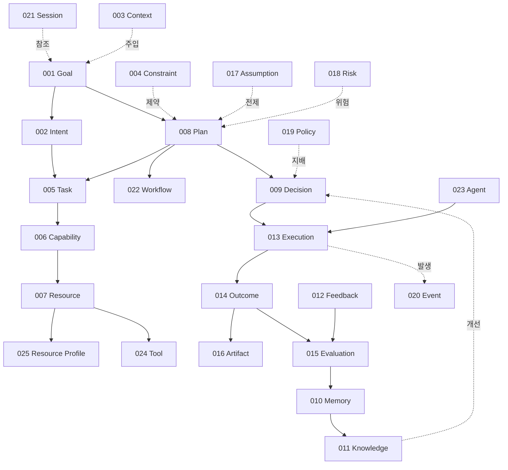

# Entity Specification

- **Version:** v3.0 Draft
- **Status:** Core Specification
- **Last Updated:** 2026-08-04

---

## 1. Entity란 무엇인가

운영체제를 만들 때는 먼저 Process, Thread, Memory 같은 핵심 개념을 하나씩 정의한다.

Intent OS도 같은 방식을 따른다. 시스템 안에 **"존재하는 것(Entity)"** 을 먼저 정의하고, 그 위에서 동작하는 Process와 Runtime State를 분리한다.

### Entity / Process / Runtime State 구분

| 분류 | 의미 | 저장 | 예 |
|---|---|---|---|
| **Entity** | 시스템에 존재하는 것. 식별자를 갖고 저장·조회된다 | 영속 | Goal, Task, Execution, Outcome |
| **Process** | 시스템이 수행하는 것. 동사다 | 비영속 | Planning, Deciding, Executing, Learning |
| **Runtime State** | 실행 중 변하는 값. Entity의 필드로 존재한다 | Entity에 종속 | `Execution.status`, `Goal.progress` |

판별 기준은 하나다.

> **1년 뒤에 조회해야 하는가?** 그렇다면 Entity다.

### ⚠️ v1.0 분류의 정정

v1.0에서는 **Execution을 Process, Outcome을 Runtime State**로 분류했다. **v2.0에서 이를 정정한다.**

운영체제의 비유가 그대로 답이 된다.

```
"프로세스가 돌고 있다"        → Process (동사, 저장 대상 아님)
 task_struct                → Entity  (명사, 커널이 소유하는 레코드)
 task_struct.state = RUNNING → Runtime State (Entity의 필드)
```

| 이름 | 계층 | 근거 |
|---|---|---|
| **Executing** | Process | 실행하는 행위 |
| **Execution** (E013) | **Entity** | 그 행위의 제어 블록. 식별자·비용·재시도 이력을 갖고 저장된다 |
| **Outcome** (E014) | **Entity** | 실행이 낳은 불변 기록. 감사·학습의 대상 |
| **Evaluation** (E015) | **Entity** | Outcome에 대한 판정 |
| **Learning / Prediction** | Process | 산출물은 Memory·Knowledge라는 별도 Entity다 |

Execution 이력 없이는 Resource Drift를 감지할 수 없고, Outcome 없이는 Learning이 성립하지 않는다. **둘 다 영속 대상이므로 Entity다.**

상세 근거는 [e000a §1](e000a-entity-relationships.md)에 있다.

---

## 2. Core Entity 목록 (25개 + 그래프/체계 3개)

```
기반 계층      Goal · Intent · Context · Constraint
분해 계층      Task · Capability · Resource · Plan
결정 계층      Decision
실행 계층      Execution · Outcome · Artifact
평가 계층      Evaluation · Feedback
학습 계층      Memory · Knowledge
거버넌스 계층   Assumption · Risk · Policy
운영 계층      Event · Session · Workflow · Agent · Tool · Resource Profile
```

여기에 구조를 다루는 3개 문서가 더해진다.

```
Goal Graph (001-A) · Task Graph (005-A) · Capability Taxonomy (006-A)
```

---

## 3. 작성 원칙

Entity 명세는 PRD 수준이 아니라 **RFC / ISO 표준** 수준으로 작성한다.

> **개발자 여러 명이 각자 구현해도 같은 결과를 만드는 명세서**

이를 위해 **모든 Entity 명세는 12개 필수 섹션을 강제한다.**

| § | 섹션 | § | 섹션 |
|---|---|---|---|
| 1 | Definition | 7 | Relationships |
| 2 | What it is NOT | 8 | Canonical Representation |
| 3 | Design Principles | 9 | Validation Rules |
| 4 | Attributes | 10 | Examples |
| 5 | Invariants | 11 | Edge Cases |
| 6 | Lifecycle | 12 | Open Issues |

형식의 전체 규정은 **[e000 — Specification Format](e000-spec-format.md)** 에 있다. 새 Entity 문서를 쓰기 전에 반드시 읽는다.

---

## 4. 명세 목차

### 메타 명세

| 번호 | 이름 | 문서 | 상태 |
|---|---|---|---|
| 000 | **Specification Format** — 12개 필수 섹션, 번호 규칙, 준수 등급 | [e000-spec-format.md](e000-spec-format.md) | v1.0 Draft |
| 000-A | **Entity Relationships & Invariants** — Cardinality 전체표, 전역 불변식 16개 | [e000a-entity-relationships.md](e000a-entity-relationships.md) | v1.0 Draft |
| 000-B | **Entity Registry** — 25개 목록 **동결**, 추가/폐기 절차, Entity가 아닌 것 | [e000b-entity-registry.md](e000b-entity-registry.md) | **v2.0 FROZEN** |

### Core Entity

| 번호 | 이름 | 문서 | 상태 |
|---|---|---|---|
| 001 | Goal — Definition | [e001-goal.md](e001-goal.md) | v3.0 Draft |
| 001-A | ↳ Goal Graph — 6종 관계, Score, Propagation | [e001a-goal-graph.md](e001a-goal-graph.md) | v2.0 Draft |
| 001-B | ↳ Goal JSON Schema (CGR v2) | [e001b-goal-schema.md](e001b-goal-schema.md) | v2.0 Draft |
| 001-C | ↳ Goal State Machine | [e001c-goal-state-machine.md](e001c-goal-state-machine.md) | v2.0 Draft |
| 001-D | ↳ Goal Validation Rules | [e001d-goal-validation.md](e001d-goal-validation.md) | v2.0 Draft |
| 002 | Intent | [e002-intent.md](e002-intent.md) | v2.0 Draft |
| 003 | Context | [e003-context.md](e003-context.md) | v2.0 Draft |
| 004 | Constraint | [e004-constraint.md](e004-constraint.md) | v2.0 Draft |
| 005 | Task | [e005-task.md](e005-task.md) | v2.0 Draft |
| 005-A | ↳ Task Graph — 임계 경로, SPOF, 재계획 시 보존 규칙 | [e005a-task-graph.md](e005a-task-graph.md) | v2.0 Draft |
| 006 | Capability | [e006-capability.md](e006-capability.md) | v2.0 Draft |
| 006-A | ↳ Capability Taxonomy — 명명·매칭·별칭·측정 정의 | [e006a-capability-taxonomy.md](e006a-capability-taxonomy.md) | v1.0 Draft |
| 007 | Resource | [e007-resource.md](e007-resource.md) | v2.0 Draft |
| 008 | Plan | [e008-plan.md](e008-plan.md) | v2.0 Draft |
| 009 | Decision | [e009-decision.md](e009-decision.md) | v2.0 Draft |
| 010 | Memory | [e010-memory.md](e010-memory.md) | v2.0 Draft |
| 011 | Knowledge | [e011-knowledge.md](e011-knowledge.md) | v2.0 Draft |
| 012 | Feedback | [e012-feedback.md](e012-feedback.md) | v2.0 Draft |
| 013 | **Execution** — Task 한 번의 시도. 재시도마다 새 레코드 | [e013-execution.md](e013-execution.md) | v1.0 Draft |
| 014 | **Outcome** — 실행이 낳은 것의 불변 측정 기록 | [e014-outcome.md](e014-outcome.md) | v1.0 Draft |
| 015 | **Evaluation** — 결과 품질과 결정 품질의 분리 판정 | [e015-evaluation.md](e015-evaluation.md) | v1.0 Draft |
| 016 | **Artifact** — 과정과 독립적으로 보존되는 산출물 | [e016-artifact.md](e016-artifact.md) | v1.0 Draft |
| 017 | **Assumption** — 통제하지 못하는 전제. 깨지면 Replanning | [e017-assumption.md](e017-assumption.md) | v1.0 Draft |
| 018 | **Risk** — 나쁜 사건의 가능성. 확률 × 영향 × 대응 | [e018-risk.md](e018-risk.md) | v1.0 Draft |
| 019 | **Policy** — 최적화보다 우선하는 강제 규칙 | [e019-policy.md](e019-policy.md) | v1.0 Draft |
| 020 | **Event** — 이미 일어난 일의 불변 순서 기록 | [e020-event.md](e020-event.md) | v1.0 Draft |
| 021 | **Session** — 실행의 경계. Entity를 소유하지 않는다 | [e021-session.md](e021-session.md) | v1.0 Draft |
| 022 | **Workflow** — 재사용 가능한 제어 흐름 템플릿 | [e022-workflow.md](e022-workflow.md) | v1.0 Draft |
| 023 | **Agent** — Resource를 사용하는 자율적 실행 주체 | [e023-agent.md](e023-agent.md) | v1.0 Draft |
| 024 | **Tool** — 결정론적 인터페이스와 선언된 부수효과 | [e024-tool.md](e024-tool.md) | v1.0 Draft |
| 025 | **Resource Profile** — Resource의 살아있는 측정 기록 | [e025-resource-profile.md](e025-resource-profile.md) | v1.0 Draft |

---

## 5. Entity 의존 관계



세 개의 경로가 있다.

| 경로 | 흐름 | 의미 |
|---|---|---|
| **하향 분해** | Goal → Intent → Task → Capability → Resource | 무엇을 원하는가에서 누가 할 것인가까지 |
| **실행** | Plan → Decision → Execution → Outcome → Artifact | 결정에서 산출물까지 |
| **상향 학습** | Evaluation → Memory → Knowledge → Decision | 결과가 다음 결정을 바꾼다 |

**Context, Constraint, Assumption, Risk, Policy, Event는 경로가 아니라 횡단 관심사다.** 특정 단계에 속하지 않고 모든 단계에 관여한다.

전체 Cardinality 표와 전역 불변식 16개는 **[e000a — Entity Relationships & Invariants](e000a-entity-relationships.md)** 에 있다.

---

## 6. 준수 현황 (Conformance)

등급 정의는 [e000 §6](e000-spec-format.md) 참조.

| 등급 | 조건 | 해당 문서 |
|---|---|---|
| **L3 — Verified** | L2 + 검증기 + 예시 30개 이상 | 없음 |
| **L2 — Specified** | 12개 섹션 전부 + JSON Schema | **전 Entity (001~025, 001-A, 005-A, 006-A) + 000, 000-A, 000-B** |
| **L1 — Draft** | §1~§9 존재. 일부 섹션 미비 | 없음 |

### 절 확장 문서 (형식 면제)

Entity 001의 명세가 커져 분리된 문서다. **12개 섹션 형식이 적용되지 않는다** — 이들은 그 자체가 e001의 한 절이기 때문이다([e000b §2](e000b-entity-registry.md)).

| 문서 | e001의 어느 절인가 |
|---|---|
| [e001b-goal-schema.md](e001b-goal-schema.md) | §8 Canonical Representation |
| [e001c-goal-state-machine.md](e001c-goal-state-machine.md) | §6 Lifecycle |
| [e001d-goal-validation.md](e001d-goal-validation.md) | §9 Validation Rules |

### L2 승격에서 함께 정정된 defect

001~012를 L2로 올리는 과정에서 발견된 실제 오류들이다.

| 문서 | defect | 정정 |
|---|---|---|
| 006 Capability | Rule Prefix `C`가 003 Context와 **충돌** | `C` → `CP`로 변경 ([e000 §3](e000-spec-format.md)) |
| 001 Goal | §3 `Goal Rule 1~5`와 §10 `Rule G-001~005`가 **같은 내용 중복 정의** | `Rule G-001~007`로 통합 |
| 006 / 006-A | Taxonomy 트리의 capability id가 **서로 어긋남** | 006-A를 권위로 확정 + id 마이그레이션 표 ([e006 §8](e006-capability.md)) |
| 007 / 025 | Resource와 Profile이 관측값을 **중복 보관** | 선언(007) / 관측(025) 분리. 스키마도 분할 |
| 008 Plan | `assumptions`가 검증 불가능한 **문자열 배열** | `assumption_ids` → [Assumption](e017-assumption.md) 참조 |
| 004 Constraint | `Policy` 타입이 실제로는 **Goal 독립 규칙** | 타입 제거. [Policy](e019-policy.md) Entity로 이관 |
| 010 / 012 | Outcome을 Runtime State로 분류. Feedback이 Learning으로 **직행** | Outcome은 Entity 014. Feedback → Evaluation → Memory 경로 확정 |
| 001-A Goal Graph | 스키마가 Goal 객체를 **복사해 임베드** | `goal_id` 참조로 전환 (진실 원천 이원화 제거) |

---

## 7. 알려진 정합성 문제

교차 검증에서 확인된 항목이다. 발견 즉시 기록하고, 해소되면 표에서 지운다.

| 항목 | 내용 | 조치 |
|---|---|---|
| 상태 필드명 불일치 | Task만 `state`, 나머지는 `status` | **미해소.** 다음 버전에서 `status`로 통일 |
| Volume 3의 Execution Instance | Goal 단위 실행 객체를 Execution이라 불렀으나 실제로는 Session이다 | [v3-runtime.md §3](../v3-runtime.md)에 반영 완료. 스키마는 `session.schema.json`으로 이관 |
| Volume 3 Runtime State Machine | `IDLE → … → COMPLETED`는 Session 내부 진행 단계다 | **미해소.** Session에 `phase` 필드 도입 예정 ([e021 §12](e021-session.md)) |
| 표현식 언어 3중화 | Constraint `expression` / Policy `condition` / Workflow `condition`이 각각 다른 문법 | **미해소.** 통합 문법 필요 ([e004 §12](e004-constraint.md)) |
| confidence 산출식 3중화 | Knowledge / Resource Profile / Feedback 집계가 각각 다른 방식 | **미해소.** 같은 공식 계열 필요 ([e011 §12](e011-knowledge.md)) |
| 기여도 귀속(Attribution) | Outcome의 `goal_progress` 델타를 어느 Task에 돌릴지 미정 | **미해소.** 배분 모델 선택 필요 ([e014 §12](e014-outcome.md)) |
| Resource Type `agent` | Entity 023 Agent와 이름이 겹친다 | 판별 기준을 [e023 §2](e023-agent.md)에 명시. 결정 루프 소유 여부로 구분 |
| Rubric의 소속 | Evaluation이 참조하지만 Entity로 정의되지 않았다 | [e015 §12](e015-evaluation.md) Open Issue |
| Connection(자격 증명) | Tool이 `auth_type`을 갖지만 계정 바인딩은 표현 불가 | [e024 §12](e024-tool.md) Open Issue |

---

## 8. 다음 단계

Entity 목록이 동결되고([e000b](e000b-entity-registry.md)) 전 Entity가 L2에 도달했다. 남은 작업은 **깊이**다.

| 우선순위 | 항목 | 내용 |
|---|---|---|
| 1 | **표현식 언어 통일** | Constraint `expression` / Policy `condition` / Workflow `condition`을 하나의 문법으로. 세 곳에서 각각 구현하면 비용이 3배다 |
| 2 | **confidence 산출식 확정** | Knowledge·Resource Profile·Feedback 집계가 같은 공식 계열을 써야 한다. 다르면 "0.9"가 서로 다른 의미가 된다 |
| 3 | **보류 Entity 4개 결정** | Rubric / Connection / Budget / Experiment. Reference Implementation 착수 전까지 결론 필요 ([e000b §3](e000b-entity-registry.md)) |
| 4 | **불변식 검증기** | [e000a §5](e000a-entity-relationships.md)의 전역 불변식 16개 + Entity별 불변식을 검사하는 구현 → [Volume 7](../v7-reference-implementation.md) |
| 5 | **Volume 갱신** | Volume 1~7이 12개 Entity를 전제로 쓰여 있다. 25개 체계로 갱신 |
| 6 | **L3 승격** | 각 Entity마다 실제 예시 30~50개 + 검증기 통과 |

### 도구

| 명령 | 검사 대상 |
|---|---|
| `python3 tools/validate-examples.py` | 문서의 JSON 예시가 대응 스키마를 통과하는가 |
| `python3 -c "import json,glob; [json.load(open(f)) for f in glob.glob('intent-os-spec/schemas/*.json')]"` | 스키마 파싱 |
