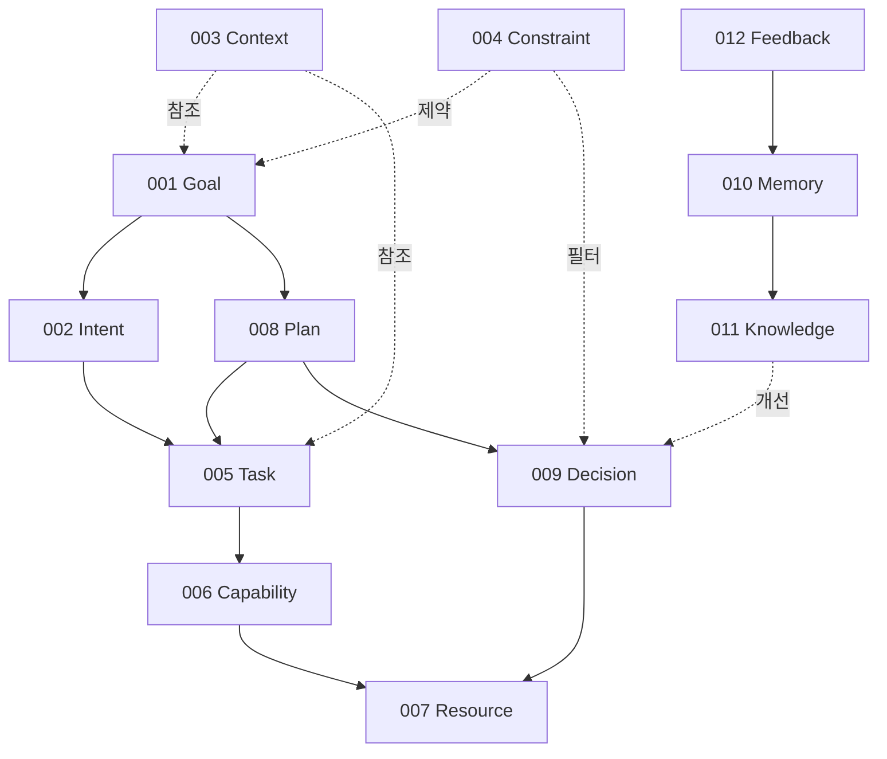

# Entity Specification

- **Version:** v1.0 Draft
- **Status:** Core Specification
- **Last Updated:** 2026-08-04

---

## 1. Entity란 무엇인가

운영체제를 만들 때는 먼저 Process, Thread, Memory 같은 핵심 개념을 하나씩 정의한다.

Intent OS도 같은 방식을 따른다. 시스템 안에 **"존재하는 것(Entity)"** 을 먼저 정의하고, 그 위에서 동작하는 Process와 Runtime State를 분리한다.

### Entity / Process / Runtime State 구분

초안에서는 Entity를 10개 정도로 잡았으나, **계층(Layer)이 섞여 있었다.**

예를 들어,

- **Execution**은 "실행 과정"이다 → Entity가 아니라 **Process**다.
- **Outcome**은 "실행 결과"다 → Entity가 아니라 **Runtime State**다.

| 분류 | 의미 | 예 |
|---|---|---|
| **Entity** | 시스템에 존재하는 것 | Goal, Task, Resource |
| **Process** | 시스템이 수행하는 것 | Execution, Learning, Prediction |
| **Runtime State** | 실행 중/후에 생기는 상태 | Outcome |

---

## 2. Core Entity 목록 (12개)

```
Goal
Intent
Context
Constraint
Task
Capability
Resource
Plan
Decision
Memory
Knowledge
Feedback
```

여기까지가 "존재하는 것(Entity)"이다.

- Execution은 Process다.
- Learning은 Process다.
- Prediction도 Process다.

---

## 3. 작성 원칙

Entity 명세는 PRD 수준이 아니라 **RFC / ISO 표준** 수준으로 작성한다.

목표는 다음과 같다.

> **개발자 여러 명이 각자 구현해도 같은 결과를 만드는 명세서**

이를 위해 각 Entity 명세는 다음을 포함하는 것을 지향한다.

- 형식 문법 (Formal Grammar)
- JSON Schema
- 생성 규칙
- 검증 알고리즘
- 추론 알고리즘
- 충돌 해결 규칙
- 계층 구조
- 우선순위 계산
- 변경 시 시스템 반응
- 실제 예시 다수

또한 진행 방식은 **Entity 하나를 운영체제 수준으로 완성한 뒤 다음 Entity로 넘어간다.** "Goal → Intent → Context…"를 얕게 훑는 것보다 장기적으로 더 좋은 설계다.

---

## 4. 명세 목차

| Entity | 이름 | 문서 | 상태 |
|---|---|---|---|
| 001 | Goal | [e001-goal.md](e001-goal.md) | v1.0 Draft |
| 001-A | Goal Graph | [e001a-goal-graph.md](e001a-goal-graph.md) | v1.0 Draft |
| 002 | Intent | [e002-intent.md](e002-intent.md) | v1.0 Draft |
| 003 | Context | [e003-context.md](e003-context.md) | v1.0 Draft |
| 004 | Constraint | [e004-constraint.md](e004-constraint.md) | v1.0 Draft |
| 005 | Task | [e005-task.md](e005-task.md) | v1.0 Draft |
| 006 | Capability | [e006-capability.md](e006-capability.md) | v1.0 Draft |
| 007 | Resource | [e007-resource.md](e007-resource.md) | v1.0 Draft |
| 008 | Plan | [e008-plan.md](e008-plan.md) | v1.0 Draft |
| 009 | Decision | [e009-decision.md](e009-decision.md) | v1.0 Draft |
| 010 | Memory | [e010-memory.md](e010-memory.md) | v1.0 Draft |
| 011 | Knowledge | [e011-knowledge.md](e011-knowledge.md) | v1.0 Draft |
| 012 | Feedback | [e012-feedback.md](e012-feedback.md) | v1.0 Draft |

---

## 5. Entity 의존 관계

Entity는 독립적으로 존재하지 않는다. 아래는 12개 Entity가 서로를 참조하는 구조다.



읽는 방법은 다음과 같다.

| 흐름 | 의미 |
|---|---|
| Goal → Intent → Task → Capability → Resource | 하향 분해(Decomposition). 원하는 상태에서 실행 주체까지 내려간다 |
| Context / Constraint | 횡단 관심사(Cross-cutting). 여러 Entity가 동시에 참조한다 |
| Plan / Decision | 계획과 선택의 산출물. Process가 만들어내는 Entity다 |
| Feedback → Memory → Knowledge → Decision | 상향 학습(Learning). 결과가 다음 결정을 개선한다 |

앞의 두 흐름은 **실행 경로**, 마지막 흐름은 **학습 경로**다. Intent OS는 이 두 경로가 하나의 순환을 이루는 구조다.

---

## 6. 다음 단계

12개 Core Entity의 v1.0 Draft가 모두 작성되었다. 다음 작업은 다음과 같다.

| 항목 | 내용 |
|---|---|
| **Entity 간 정합성 검증** | 한 Entity에서 정의한 상태·타입이 다른 Entity 문서와 어긋나지 않는지 교차 검증. 확인된 항목: Task만 상태 필드명이 `state`이고 나머지 Entity는 `status`다. 다음 버전에서 통일한다 |
| **Process 명세** | Execution, Learning, Prediction은 Entity가 아니라 Process다. 별도 명세가 필요하다 |
| **Runtime State 명세** | Outcome은 Runtime State다. Execution 명세와 함께 정의한다 |
| **예시 확충** | 각 Entity마다 실제 예시 30~50개 (현재는 핵심 예시 위주) |
| **Reference Implementation** | 스키마 기반 검증기(Validator) 구현 → [Volume 7](../v7-reference-implementation.md) |
