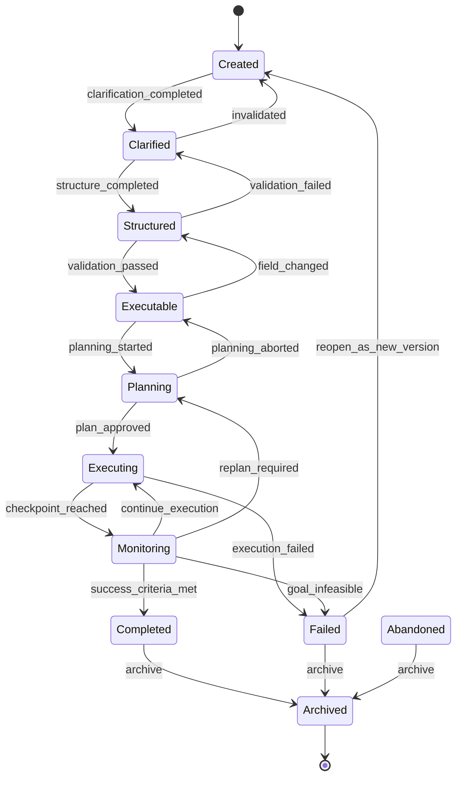

# Entity 001-C: Goal State Machine

- **Version:** v2.0 Draft
- **Status:** Core Entity
- **Format:** Annex — e001 Goal의 부속 문서 (e000 §7.1)
- **Last Updated:** 2026-08-04
- **Schema:** [`goal-state-machine.json`](../intent-os-spec/schemas/goal-state-machine.json) — 형식은 [`state-machine.schema.json`](../intent-os-spec/schemas/state-machine.schema.json)이 정의한다

---

## 1. Goal is a Living Object

지금까지 Goal은 단순한 Entity였다. 하지만 AI OS에서는 Goal이 **살아있는 객체(Living Object)** 여야 한다.

운영체제의 Process가 `NEW → READY → RUNNING → WAITING → TERMINATED`라는 상태를 가지듯, Goal도 상태(State)를 가지며 **각 상태에서 가능한 행동(Action)이 달라진다.**

이것은 일반 JSON Schema로 표현할 수 없다. JSON Schema는 "데이터의 형태"만 검증할 수 있고, "이 상태에서 저 상태로 가도 되는가"는 검증할 수 없다. 그래서 **State Machine Specification을 별도로 정의한다.**

역할 분담:

| 검증 대상 | 담당 |
|---|---|
| `status.phase` 값이 유효한 상태명인가 | [`goal.schema.json`](../intent-os-spec/schemas/goal.schema.json) (enum) |
| 이 전이가 합법인가, 이 행동이 허용되는가 | [`goal-state-machine.json`](../intent-os-spec/schemas/goal-state-machine.json) (이 문서) |

---

## 2. States

### Happy Path

```
Created → Clarified → Structured → Executable
   → Planning → Executing → Monitoring
   → Completed → Archived
```

### 전체 상태 다이어그램



(`Suspended`는 Created/종료 상태를 제외한 모든 상태에서 진입 가능하며, `resume` 시 진입 직전 상태로 복귀한다. 다이어그램의 가독성을 위해 생략.)

### 상태 정의

| 상태 | 의미 | Completeness Level |
|---|---|---|
| **Created** | 생성되었으나 모호함 (Raw Goal) | 1 |
| **Clarified** | 무엇을 원하는지는 명확하지만 측정 구조가 없음 | 1~2 |
| **Structured** | 측정 가능한 구조를 갖췄으나 미검증 | 2 |
| **Executable** | 검증 완료, 즉시 Planning 가능 | 3 |
| **Planning** | Planner가 Execution Graph 생성 중 | 3 |
| **Executing** | Task 실행 중 | 3 |
| **Monitoring** | 결과를 desired_state와 비교하며 관찰 중 | 3 |
| **Completed** | 성공 기준 충족. 직접 수정 금지 (Invariant 4) | 3 |
| **Failed** | 달성 실패. 원인은 Learning Engine의 입력 | — |
| **Suspended** | 일시 중지. 진입 전 상태를 기억 | — |
| **Abandoned** | 포기. 실패와 다르다 — 더 이상 원하지 않는 것 | — |
| **Archived** | 종료 상태(terminal). 읽기 전용 | — |

---

## 3. Allowed Actions per State

**같은 Goal이라도 상태에 따라 할 수 있는 일이 다르다.** 이것이 Goal을 살아있는 객체로 만드는 핵심이다.

| 상태 | 허용되는 행동 |
|---|---|
| Created | `clarify`, `ask_questions`, `edit`, `estimate_confidence`, `abandon` |
| Clarified | `structure`, `add_metric`, `add_constraints`, `edit`, `abandon` |
| Structured | `validate`, `detect_conflicts`, `compute_priority`, `edit`, `abandon` |
| Executable | `start_planning`, `recompute_priority`, `edit`, `suspend`, `abandon` |
| Planning | `generate_plan`, `evaluate_plan`, `approve_plan`, `suspend`, `abandon` |
| Executing | `execute_tasks`, `report_progress`, `update_current_state`, `suspend` |
| Monitoring | `measure`, `compare_with_desired_state`, `propagate_changes`, `replan`, `suspend` |
| Completed | `extract_learnings`, `create_follow_up_goal`, `archive` |
| Failed | `analyze_failure`, `extract_learnings`, `create_new_version`, `archive` |
| Suspended | `resume`, `abandon` |
| Abandoned | `archive` |
| Archived | `read` (읽기 전용) |

예를 들어:

- `Created` 상태의 Goal에는 `start_planning`을 할 수 없다. 모호한 Goal은 실행하지 않는다.
- `Executing` 상태의 Goal에는 `edit`이 없다. 실행 중 objective 변경은 수정이 아니라 **새로운 Goal**이다 (Global Rule 4).
- `Completed` 상태의 Goal은 수정할 수 없다. 후속이 필요하면 `create_follow_up_goal`을 쓴다.

---

## 4. Transitions & Guards

전이는 이벤트(event)로 발생하며, Guard 조건을 통과해야 한다. **Guard를 통과하지 못한 전이 요청은 거부되고, 시스템은 부족한 조건을 질문(Question Generation)으로 변환한다** ([e001d §6](e001d-goal-validation.md)).

핵심 Guard:

| 전이 | Guard |
|---|---|
| Created → Clarified | `objective.description` 존재 + Semantic Rules G-001~G-004 통과 |
| Clarified → Structured | `desired_state.metric` 존재 + completeness ≥ 60 |
| Structured → Executable | completeness ≥ 80 + **Owner 정확히 1명** + **미해소 CONFLICTS_WITH 없음** + Goal Graph 연결됨 (Invariant 2) |
| Executable → Planning | Planner가 Goal Score 기반으로 스케줄링 |
| Planning → Executing | Plan 승인 + Resource 할당 가능 |
| Monitoring → Completed | `current_state`가 `desired_state`의 operator/target 조건 충족 |
| Monitoring → Failed | deadline 내 달성 불가 판정 |

역방향 전이(정보가 무효화될 때):

| 전이 | 트리거 |
|---|---|
| Clarified → Created | 핵심 가정 또는 objective 변경 |
| Structured → Clarified | 검증 실패 |
| Executable → Structured | 검증에 영향을 주는 필드 수정 (version +1) |
| Planning → Executable | 실행 가능한 Plan 생성 실패 |
| Monitoring → Planning | Plan 무효화 — 가정 붕괴, 제약 변경, **Goal Propagation** ([e001a §14](e001a-goal-graph.md)) |

---

## 5. Global Rules

1. **모든 상태 전이는 `metadata.history`에 기록된다** (`change_type: "status_changed"`).
2. 상태를 변경하는 주체는 해당 상태의 `allowed_actions`에 정의된 행동만 수행할 수 있다.
3. Guard를 통과하지 못한 전이 요청은 거부되며, 부족한 조건은 질문으로 변환된다.
4. **Executing/Monitoring 상태에서 objective가 변경되면 그것은 수정이 아니라 새로운 Goal이다.** 기존 Goal을 Abandoned 처리하고 새 Goal을 생성한다 (`metadata.origin_ref`로 연결).
5. `Suspended`로의 전이는 Created, Completed, Failed, Abandoned, Archived를 제외한 모든 상태에서 허용된다. `resume`은 진입 직전 상태(`@previous`)로 복귀한다.

---

## 6. Goal Propagation과의 관계

Goal Graph의 Propagation([e001a §14](e001a-goal-graph.md))은 State Machine과 이렇게 연결된다.

```
상위 Goal의 constraints 변경
        ↓
Goal Propagation (Graph 순회)
        ↓
영향받는 Goal마다:
  - Executable 상태였다면 → Structured로 롤백 (재검증)
  - Planning/Monitoring 상태였다면 → replan_required 이벤트
  - Executing 상태였다면 → checkpoint 후 Monitoring에서 재평가
```

즉 Propagation은 "다른 Goal의 상태 전이를 유발하는 이벤트 소스"다.

---

## 7. Learning과의 관계

v1 lifecycle에는 `Learning`이라는 상태가 있었다. v2에서는 **Learning을 상태가 아니라 Completed/Failed 상태에서의 행동(`extract_learnings`)으로 재정의**했다.

이유: Learning은 Goal이 거치는 단계가 아니라 시스템이 수행하는 **Process**다 (Entity/Process 구분, [entities/README.md](README.md) §1). Goal은 Completed 또는 Failed에 도달하는 것으로 끝나고, Learning Engine([Volume 5](../v5-learning-engine.md))이 그 Goal을 읽어 학습한다.

---

## 8. Open Issues

- `Suspended`의 타임아웃 정책 — 무한정 중지된 Goal의 처리
- 상태 전이 권한 모델 — 어떤 role(Owner/Approver/system)이 어떤 이벤트를 발생시킬 수 있는가
- Maintenance Goal처럼 "끝나지 않는 Goal"의 Completed 판정 — 주기 평가(evaluation window) 개념 필요
- 병렬 하위 Goal들의 상태가 상위 Goal 상태에 집계되는 규칙 (roll-up semantics)
