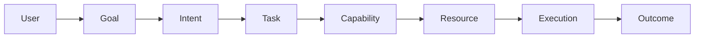
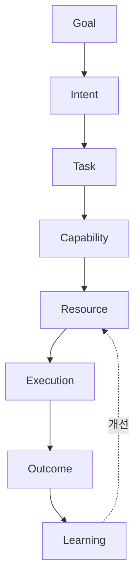

# Volume 1. Core Concepts Specification

- **Version:** v0.1 Draft
- **Status:** Foundational Specification
- **Last Updated:** 2026-07-31

---

## 1. Introduction

### 1.1 Purpose

Intent OS Specification은 인간과 인공지능 시스템 사이의 새로운 상호작용 구조를 정의하기 위한 기술 명세서이다.

현재의 AI 사용 방식은 사용자가 직접 다음을 수행해야 한다.

- 적절한 모델 선택
- 프롬프트 작성
- 도구 선택
- 작업 절차 설계
- 결과 평가

이는 초기 컴퓨터 시대에 사용자가 직접 메모리와 명령어를 관리해야 했던 방식과 유사하다. Intent OS는 이러한 복잡성을 추상화한다.

### 1.2 Core Statement

> **Human defines intent. System determines execution.**

인간은 원하는 결과를 정의한다. 시스템은 결과를 얻기 위한 모든 실행 과정을 결정한다.

### 1.3 Scope

**포함**

- 목표 이해
- 목표 구조화
- 작업 분해
- 능력 분석
- 자원 선택
- 실행 관리
- 결과 평가
- 학습 및 개선

**제외**

Intent OS는 자체적으로 다음을 목표로 하지 않는다.

- 새로운 LLM 개발
- 특정 AI 모델 대체
- 인간의 가치 판단 완전 대체

Intent OS의 목적은 지능 자체를 만드는 것보다 **지능 자원을 최적으로 활용하는 것**이다.

---

## 2. Design Philosophy

### Principle 01 — Goal First

모든 시스템 동작은 Goal에서 시작한다.



기존 방식은 `User → Prompt → AI → Answer` 였다.

**이유:** 사용자는 방법을 모른다. 사용자가 알아야 하는 것은 "무엇을 원하는가" 뿐이다.

---

### Principle 02 — Capability Before Resource

Intent OS는 AI 모델을 직접 선택하지 않는다. 먼저 필요한 **능력**을 정의한다.

| | 접근 |
|---|---|
| ❌ 잘못됨 | 이 일을 GPT에게 맡길까? Claude에게 맡길까? |
| ⭕ 올바름 | 이 일을 하기 위해 필요한 능력은 무엇인가? → 그 능력을 가장 잘 수행하는 Resource는 무엇인가? |

**예시**

사용자: *"광고 문구 작성해줘."*

```
Task: 광고 카피 작성

Required Capability:
  - 언어 생성
  - 설득 구조 설계
  - 브랜드 이해
  - 타겟 분석
  - 창의적 표현
```

그 이후 Resource를 선택한다.

---

### Principle 03 — Resource Agnostic

Intent OS는 특정 AI에 종속되지 않는다.

GPT, Claude, Gemini는 모두 **AI Resource**일 뿐이다. 하지만 다음도 동일한 Resource이다.

- 검색 엔진
- 데이터베이스
- 사람 전문가
- 자동화 도구
- 로봇

**핵심:** 중요한 것은 "누가 하는가"가 아니라 **"어떤 능력을 제공하는가"** 이다.

---

### Principle 04 — Predict Before Execute

Intent OS는 여러 Resource를 무작정 실행하지 않는다. 실행 전에 성공 가능성을 예측한다.

**비효율적 방식의 문제**

GPT 실행 → Claude 실행 → Gemini 실행 → 비교

- 비용 증가
- 시간 증가
- 불필요한 계산
- 확장 불가능

**Intent OS 방식**

```
Task 분석 → Resource Prediction → 가장 높은 확률의 Resource 선택 → 실행
```

---

### Principle 05 — Continuous Learning

Intent OS는 고정된 규칙 시스템이 아니다. 사용될수록 개선된다.

| 학습 대상 | |
|---|---|
| ❌ | LLM 자체 |
| ⭕ | Decision System |

**예시**

```
초기:        교육 마케팅 카피 → Claude 선택

데이터 축적 후:
             Claude: 85%
             GPT:    92%
             → GPT 선택
```

---

## 3. Fundamental Entity Model

Intent OS는 7개의 핵심 객체로 구성된다.

### 3.1 Goal

Goal은 사용자가 달성하고자 하는 **최종 상태**이다. Goal은 방법을 포함하지 않는다.

| | 예시 |
|---|---|
| ⭕ 좋은 Goal | 3개월 안에 신규 고객 100명 확보 |
| ❌ 나쁜 Goal | 인스타그램 광고 돌리기 (← 이건 Task다) |

**Schema** → [`schemas/goal.schema.json`](schemas/goal.schema.json)

```json
{
  "id": "",
  "objective": "",
  "constraints": [],
  "success_metrics": [],
  "deadline": "",
  "priority": "",
  "context": {}
}
```

**Attributes**

- **Objective** — 원하는 결과
- **Constraint** — 제약조건 (예산, 시간, 법적 제한, 사용 가능 자원)
- **Success Metric** — 성공 판단 기준 (매출, 사용자 수, 점수, 시간 절약)

---

### 3.2 Intent

Intent는 Goal의 **숨은 의도**를 분석한 결과이다. Goal과 Task 사이의 중간 계층이다.

```
Goal: 학생 모집

Intent 분석:
  목표: 신규 등록 증가
  가능한 해결 영역:
    - 홍보
    - 가격
    - 브랜드
    - 상담 프로세스
    - 고객 경험
```

---

### 3.3 Task

Task는 Goal 달성을 위해 수행해야 하는 **작업 단위**이다. Task는 독립적으로 실행 가능해야 한다.

```
Goal: 겨울캠프 100명 모집

Task:
  - 시장 조사
  - 경쟁 분석
  - 광고 제작
  - 랜딩페이지 개선
  - 상담 프로세스 설계
  - 성과 분석
```

**Schema** → [`schemas/task.schema.json`](schemas/task.schema.json)

```json
{
  "id": "",
  "objective": "",
  "required_capabilities": [],
  "dependencies": [],
  "expected_output": ""
}
```

---

### 3.4 Capability

Capability는 Task 수행에 필요한 **능력**이다. Intent OS에서 가장 중요한 추상화 계층이다.

| Task | 필요 Capability |
|---|---|
| 시장 조사 | 검색 능력, 데이터 분석, 패턴 발견, 요약, 비교 |
| 브랜드 슬로건 제작 | 언어 생성, 창의성, 감성 이해, 브랜드 전략 |

Capability는 계층 구조를 가진다.

```
Communication
├── Writing
│   ├── Copywriting
│   ├── Technical Writing
│   └── Storytelling
├── Translation
└── Persuasion
```

---

### 3.5 Resource

Resource는 Capability를 제공하는 **실행 주체**이다.

| 종류 | 예시 |
|---|---|
| AI Resource | LLM, Image Model, Video Model |
| Tool Resource | Search Engine, Browser, Database, Analytics Tool |
| Human Resource | 전문가, 검수자, 상담원 |

**Schema** → [`schemas/resource.schema.json`](schemas/resource.schema.json)

```json
{
  "id": "",
  "type": "",
  "capabilities": [],
  "cost": "",
  "latency": "",
  "reliability": "",
  "availability": ""
}
```

---

### 3.6 Execution

Execution은 Resource가 Task를 수행하는 **과정**이다. Execution은 관리 대상이다.

관리 요소: 상태, 비용, 시간, 실패, 재시도, 결과

---

### 3.7 Outcome

Outcome은 Execution의 **결과**이다. 단순한 답변이 아니다.

포함: 결과물, 품질, 사용자 만족도, 목표 달성 기여도, 비용

---

## 4. Core Relationship Model



---

## 5. Fundamental Rule

> **Never choose an AI before understanding the Goal.**
>
> 목표를 이해하지 않은 AI 선택은 항상 최적화 실패를 만든다.

---

## 6. Volume 1 Completion Criteria

- [x] 모든 핵심 Entity 정의 완료
- [x] Entity 간 관계 정의 완료
- [x] AI와 Resource 분리 완료
- [x] Goal 중심 구조 확립
- [x] Capability 중심 모델 확립
