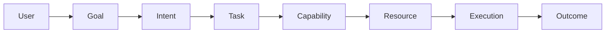
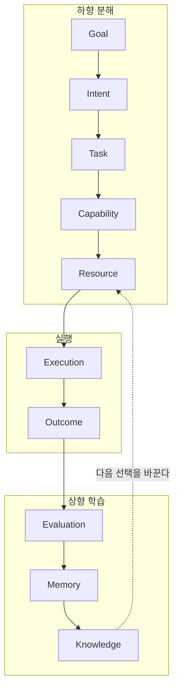

# Volume 1. Core Concepts Specification

- **Version:** v0.2 Draft
- **Status:** Foundational Specification
- **Last Updated:** 2026-08-04

---

## 1. Introduction

### 1.1 Purpose

Intent OS Specification은 인간과 인공지능 시스템 사이의 새로운 상호작용 구조를 정의하기 위한 기술 명세서이다.

현재의 AI 사용 방식은 사용자가 직접 다음을 수행해야 한다.

- 적절한 모델 선택
- 프롬프트 작성
- 도구 선택
- 작업 절차 설계
- 결과 평가

이는 초기 컴퓨터 시대에 사용자가 직접 메모리와 명령어를 관리해야 했던 방식과 유사하다. Intent OS는 이러한 복잡성을 추상화한다.

### 1.2 Core Statement

> **Human defines intent. System determines execution.**

인간은 원하는 결과를 정의한다. 시스템은 결과를 얻기 위한 모든 실행 과정을 결정한다.

### 1.3 Scope

**포함**

- 목표 이해
- 목표 구조화
- 작업 분해
- 능력 분석
- 자원 선택
- 실행 관리
- 결과 평가
- 학습 및 개선

**제외**

Intent OS는 자체적으로 다음을 목표로 하지 않는다.

- 새로운 LLM 개발
- 특정 AI 모델 대체
- 인간의 가치 판단 완전 대체

Intent OS의 목적은 지능 자체를 만드는 것보다 **지능 자원을 최적으로 활용하는 것**이다.

---

## 2. Design Philosophy

### Principle 01 — Goal First

모든 시스템 동작은 Goal에서 시작한다.



기존 방식은 `User → Prompt → AI → Answer` 였다.

**이유:** 사용자는 방법을 모른다. 사용자가 알아야 하는 것은 "무엇을 원하는가" 뿐이다.

---

### Principle 02 — Capability Before Resource

Intent OS는 AI 모델을 직접 선택하지 않는다. 먼저 필요한 **능력**을 정의한다.

| | 접근 |
|---|---|
| ❌ 잘못됨 | 이 일을 GPT에게 맡길까? Claude에게 맡길까? |
| ⭕ 올바름 | 이 일을 하기 위해 필요한 능력은 무엇인가? → 그 능력을 가장 잘 수행하는 Resource는 무엇인가? |

**예시**

사용자: *"광고 문구 작성해줘."*

```
Task: 광고 카피 작성

Required Capability:
  - 언어 생성
  - 설득 구조 설계
  - 브랜드 이해
  - 타겟 분석
  - 창의적 표현
```

그 이후 Resource를 선택한다.

---

### Principle 03 — Resource Agnostic

Intent OS는 특정 AI에 종속되지 않는다.

GPT, Claude, Gemini는 모두 **AI Resource**일 뿐이다. 하지만 다음도 동일한 Resource이다.

- 검색 엔진
- 데이터베이스
- 사람 전문가
- 자동화 도구
- 로봇

**핵심:** 중요한 것은 "누가 하는가"가 아니라 **"어떤 능력을 제공하는가"** 이다.

---

### Principle 04 — Predict Before Execute

Intent OS는 여러 Resource를 무작정 실행하지 않는다. 실행 전에 성공 가능성을 예측한다.

**비효율적 방식의 문제**

GPT 실행 → Claude 실행 → Gemini 실행 → 비교

- 비용 증가
- 시간 증가
- 불필요한 계산
- 확장 불가능

**Intent OS 방식**

```
Task 분석 → Resource Prediction → 가장 높은 확률의 Resource 선택 → 실행
```

---

### Principle 05 — Continuous Learning

Intent OS는 고정된 규칙 시스템이 아니다. 사용될수록 개선된다.

| 학습 대상 | |
|---|---|
| ❌ | LLM 자체 |
| ⭕ | Decision System |

**예시**

```
초기:        교육 마케팅 카피 → Claude 선택

데이터 축적 후:
             Claude: 85%
             GPT:    92%
             → GPT 선택
```

---

## 3. Fundamental Entity Model

Intent OS는 7개의 핵심 객체로 구성된다. 이 7개는 **개념의 최소 집합**이다. 구현에 필요한 전체 목록은 25개 Entity로 확장되며, 각각의 정식 명세는 [`entities/`](entities/README.md)에 있다.

### 3.0 Entity / Process / Runtime State

객체를 열거하기 전에 계층부터 나눈다. **"존재하는 것"과 "수행하는 것"과 "순간값"은 다른 종류다.**

| 분류 | 의미 | 저장 | 예 |
|---|---|---|---|
| **Entity** | 시스템에 존재하는 것. 식별자를 갖고 저장·조회된다 | 영속 | Goal, Task, Execution, Outcome |
| **Process** | 시스템이 수행하는 것. 동사다 | 비영속 | Planning, Deciding, Executing, Learning |
| **Runtime State** | 실행 중 변하는 값. Entity의 필드로 존재한다 | Entity에 종속 | `Execution.status`, `Goal.progress` |

판별 기준은 하나다.

> **1년 뒤에 조회해야 하는가?** 그렇다면 Entity다.

아래 §3.1~3.7의 7개 객체는 **모두 Entity다.** Planning·Deciding·Learning은 Entity가 아니라 Process이므로 이 목록에 없다. 상세 근거는 [e000a §1](entities/e000a-entity-relationships.md)에 있다.

> **v2.0 정정:** 이 문서의 v0.1에서는 Execution을 Process, Outcome을 Runtime State로 분류했다. 정정한다 — 둘 다 Entity다. 운영체제에서 "실행 중"은 Process지만 `task_struct`는 Entity인 것과 같다. Execution 이력 없이는 Resource Drift를 감지할 수 없고, Outcome 없이는 Learning이 성립하지 않는다.

#### 7개 객체와 Entity 명세의 대응

| Volume 1의 객체 | Entity 명세 | 스키마 |
|---|---|---|
| Goal | [001](entities/e001-goal.md) (+[001-A](entities/e001a-goal-graph.md) Graph) | [`goal.schema.json`](intent-os-spec/schemas/goal.schema.json) |
| Intent | [002](entities/e002-intent.md) | [`intent.schema.json`](intent-os-spec/schemas/intent.schema.json) |
| Task | [005](entities/e005-task.md) (+[005-A](entities/e005a-task-graph.md) Graph) | [`task.schema.json`](intent-os-spec/schemas/task.schema.json) |
| Capability | [006](entities/e006-capability.md) (+[006-A](entities/e006a-capability-taxonomy.md) Taxonomy) | [`capability.schema.json`](intent-os-spec/schemas/capability.schema.json) |
| Resource | [007](entities/e007-resource.md) | [`resource.schema.json`](intent-os-spec/schemas/resource.schema.json) |
| Execution | [013](entities/e013-execution.md) | [`execution.schema.json`](intent-os-spec/schemas/execution.schema.json) |
| Outcome | [014](entities/e014-outcome.md) | [`outcome.schema.json`](intent-os-spec/schemas/outcome.schema.json) |

나머지 18개(Context, Constraint, Plan, Decision, Memory, Knowledge, Feedback, Evaluation, Artifact, Assumption, Risk, Policy, Event, Session, Workflow, Agent, Tool, Resource Profile)는 [entities/README.md §2](entities/README.md)에 있다.

### 3.1 Goal

Goal은 사용자가 달성하고자 하는 **최종 상태**이다. Goal은 방법을 포함하지 않는다.

| | 예시 |
|---|---|
| ⭕ 좋은 Goal | 3개월 안에 신규 고객 100명 확보 |
| ❌ 나쁜 Goal | 인스타그램 광고 돌리기 (← 이건 Task다) |

**Schema** → [`schemas/goal.schema.json`](intent-os-spec/schemas/goal.schema.json)

```json
{
  "id": "",
  "objective": "",
  "constraints": [],
  "success_metrics": [],
  "deadline": "",
  "priority": "",
  "context": {}
}
```

**Attributes**

- **Objective** — 원하는 결과
- **Constraint** — 제약조건 (예산, 시간, 법적 제한, 사용 가능 자원)
- **Success Metric** — 성공 판단 기준 (매출, 사용자 수, 점수, 시간 절약)

---

### 3.2 Intent

Intent는 Goal의 **숨은 의도**를 분석한 결과이다. Goal과 Task 사이의 중간 계층이다.

**Entity 명세** → [entities/e002-intent.md](entities/e002-intent.md) · **Schema** → [`schemas/intent.schema.json`](intent-os-spec/schemas/intent.schema.json)

```
Goal: 학생 모집

Intent 분석:
  목표: 신규 등록 증가
  가능한 해결 영역:
    - 홍보
    - 가격
    - 브랜드
    - 상담 프로세스
    - 고객 경험
```

---

### 3.3 Task

Task는 Goal 달성을 위해 수행해야 하는 **작업 단위**이다. Task는 독립적으로 실행 가능해야 한다.

```
Goal: 겨울캠프 100명 모집

Task:
  - 시장 조사
  - 경쟁 분석
  - 광고 제작
  - 랜딩페이지 개선
  - 상담 프로세스 설계
  - 성과 분석
```

**Schema** → [`schemas/task.schema.json`](intent-os-spec/schemas/task.schema.json)

```json
{
  "id": "",
  "objective": "",
  "required_capabilities": [],
  "dependencies": [],
  "expected_output": ""
}
```

---

### 3.4 Capability

Capability는 Task 수행에 필요한 **능력**이다. Intent OS에서 가장 중요한 추상화 계층이다.

| Task | 필요 Capability |
|---|---|
| 시장 조사 | 검색 능력, 데이터 분석, 패턴 발견, 요약, 비교 |
| 브랜드 슬로건 제작 | 언어 생성, 창의성, 감성 이해, 브랜드 전략 |

Capability는 계층 구조를 가진다.

```
Communication
├── Writing
│   ├── Copywriting
│   ├── Technical Writing
│   └── Storytelling
├── Translation
└── Persuasion
```

이름공간·별칭·난이도의 정식 규칙은 [entities/e006a-capability-taxonomy.md](entities/e006a-capability-taxonomy.md)에 있다.

**Entity 명세** → [entities/e006-capability.md](entities/e006-capability.md) · **Schema** → [`schemas/capability.schema.json`](intent-os-spec/schemas/capability.schema.json)

---

### 3.5 Resource

Resource는 Capability를 제공하는 **실행 주체**이다.

| 종류 | 예시 |
|---|---|
| AI Resource | LLM, Image Model, Video Model |
| Tool Resource | Search Engine, Browser, Database, Analytics Tool |
| Human Resource | 전문가, 검수자, 상담원 |

**Schema** → [`schemas/resource.schema.json`](intent-os-spec/schemas/resource.schema.json)

```json
{
  "id": "",
  "type": "",
  "capabilities": [],
  "cost": "",
  "latency": "",
  "reliability": "",
  "availability": ""
}
```

---

### 3.6 Execution

Execution은 선택된 Resource로 Task 하나를 수행하는 **한 번의 시도**에 대한 영속 기록이다. 과정 자체가 아니라 그 과정의 **제어 블록**이다.

```
"지금 실행 중이다"     → Executing        (Process, 저장 대상 아님)
 Execution            → Entity           (제어 블록, 저장된다)
 Execution.status     → Runtime State    (RUNNING 같은 순간값)
```

같은 Task를 3번 재시도했다면 Execution은 **3개**다. 하나가 갱신되는 것이 아니다. 실패한 시도의 기록도 지우지 않는다 — 그것이 Resource 성능 측정의 데이터다.

기록 요소: 상태, 비용, 시간, 실패, 재시도 체인

**Entity 명세** → [entities/e013-execution.md](entities/e013-execution.md) · **Schema** → [`schemas/execution.schema.json`](intent-os-spec/schemas/execution.schema.json)

---

### 3.7 Outcome

Outcome은 Execution이 **실제로 무엇을 만들어냈는가**에 대한 불변 기록이다. 단순한 답변이 아니다.

Outcome은 **측정값만** 담는다. "좋았다 / 나빴다"는 판단은 담지 않는다.

| | 담는 것 | 예 |
|---|---|---|
| ⭕ Outcome | 사실 (측정) | 카피 3종 생성 · 0.42 USD · 1,820ms · 오류 0건 |
| ❌ Outcome 아님 | 판단 (평가) | 품질 0.93 · Goal 기여 0.87 · 채택함 → 이건 Evaluation이다 |

이 분리가 무너지면 결과론 편향이 데이터에 섞인다. **사실은 하나, 판단은 여럿이다.** 품질·만족도·목표 기여도의 판정은 [Evaluation](entities/e015-evaluation.md)(Entity 015)이 맡는다.

**Entity 명세** → [entities/e014-outcome.md](entities/e014-outcome.md) · **Schema** → [`schemas/outcome.schema.json`](intent-os-spec/schemas/outcome.schema.json)

---

## 4. Core Relationship Model

관계에는 세 개의 경로가 있다.



| 경로 | 흐름 | 성격 |
|---|---|---|
| **하향 분해** | Goal → Intent → Task → Capability → Resource | 무엇을 원하는가에서 누가 할 것인가까지 |
| **실행** | Resource → Execution → Outcome | 선택에서 산출물까지 |
| **상향 학습** | Outcome → Evaluation → Memory → Knowledge | 결과가 다음 결정을 바꾼다 |

> **Learning은 이 그림의 노드가 아니다.** Learning은 Process(동사)이고, 그것이 남기는 것이 [Memory](entities/e010-memory.md)·[Knowledge](entities/e011-knowledge.md)라는 Entity다. 학습하는 대상은 LLM이 아니라 **Decision System**이다([Principle 05](#principle-05--continuous-learning)).

위 그림은 경로를 보이기 위한 축약도다. Plan·Decision·Artifact·Policy·Session을 포함한 **전체 Entity 지도와 Cardinality 전체표, 전역 불변식 16개**는 [entities/e000a-entity-relationships.md](entities/e000a-entity-relationships.md)가 단일 권위다. Volume 1의 문서 안에서 Entity 간 불변식을 새로 만들지 않는다.

---

## 5. Fundamental Rule

> **Never choose an AI before understanding the Goal.**
>
> 목표를 이해하지 않은 AI 선택은 항상 최적화 실패를 만든다.

---

## 6. Volume 1 Completion Criteria

Volume 1은 **개념 계층만** 완결한다. Layer 구조는 [Volume 2](v2-architecture.md), 실행 생명주기는 [Volume 3](v3-runtime.md), 선택 알고리즘은 [Volume 4](v4-decision-engine.md)의 몫이다.

### 6.1 개념 정의

- [x] 모든 핵심 Entity 정의 완료 — 7개 축약 모델 → [25개 Entity 정식 명세](entities/README.md)
- [x] Entity 간 관계 정의 완료 — [Cardinality 전체표](entities/e000a-entity-relationships.md) 28행, 참조 방향 Rule REL-001~005
- [x] AI와 Resource 분리 완료 — [Principle 03](#principle-03--resource-agnostic), [Resource 007](entities/e007-resource.md) / [Agent 023](entities/e023-agent.md) / [Tool 024](entities/e024-tool.md)
- [x] Goal 중심 구조 확립 — [Goal 001](entities/e001-goal.md) 및 하위 4개 문서(Graph·Schema·State Machine·Validation)
- [x] Capability 중심 모델 확립 — [Capability 006](entities/e006-capability.md) + [Taxonomy 006-A](entities/e006a-capability-taxonomy.md)

### 6.2 계층과 무결성 (v0.2 추가)

7개 객체를 25개로 확장하면서 아래가 함께 확정되어야 개념 계층이 닫힌다.

- [x] Entity / Process / Runtime State 3계층 분류 확립 — [§3.0](#30-entity--process--runtime-state), 판별 기준 "1년 뒤에 조회해야 하는가"
- [x] Execution·Outcome의 계층 정정 — v0.1의 Process / Runtime State 분류를 Entity로 정정
- [x] 전역 불변식 정의 — [INV-01~16](entities/e000a-entity-relationships.md)
- [x] 모든 Entity에 기계 판독 스키마 존재 — JSON Schema 29개, 문서 예시 43개 전부 검증 통과(`tools/validate-examples.py`)
- [x] 명세 형식 표준화 — [12개 필수 섹션](entities/e000-spec-format.md) 강제

### 6.3 Volume 1 범위 밖으로 이월

- [ ] 불변식 자동 검사기 구현 → [Volume 7](v7-reference-implementation.md)
- [ ] 불변식 위반의 심각도 등급(`fatal / error / warn`) → [e000a §10](entities/e000a-entity-relationships.md)
- [ ] Entity 상태를 `Draft`에서 `Approved`로 승격 → 구현 검증 이후
