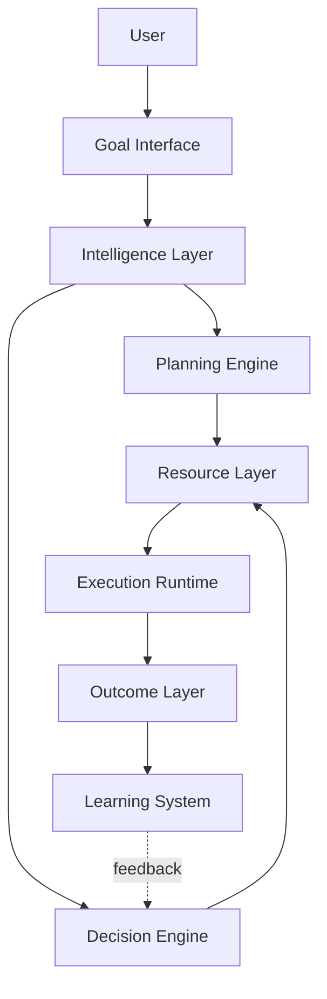
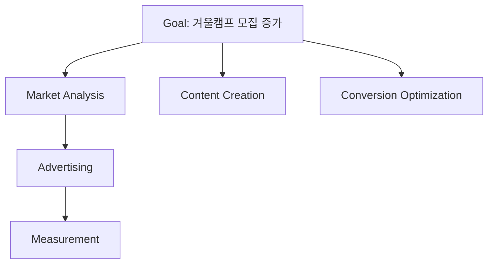

# Volume 2. Architecture Specification

- **Version:** v0.1 Draft
- **Status:** Foundational Architecture
- **Depends on:** [Volume 1 — Core Concepts](v1-core-concepts.md)

---

## 1. Introduction

### 1.1 Purpose

Intent OS Architecture Specification은 Intent OS의 내부 구조와 구성 요소 간 관계를 정의한다. 본 문서는 특정 기술 스택이나 특정 AI 모델 구현에 종속되지 않는다.

목표는 다음을 정의하는 것이다.

> 어떤 지능 Resource가 등장하더라도 동일한 구조 안에서 활용 가능한 **범용 실행 아키텍처**

### 1.2 Architectural Principle

기존 구조는 `User → Application → AI Model → Output` 이었다.

Intent OS 구조:



---

## 2. System Overview

Intent OS는 총 **8개의 핵심 Layer**로 구성된다.

| # | Layer | 한 줄 요약 |
|---|---|---|
| 1 | User Layer | 사용자 입력 수집 및 구조화 |
| 2 | Goal Layer | 의도를 Goal Object로 변환 |
| 3 | Planning Layer | Task Graph 생성 |
| 4 | Capability Layer | 필요 능력 정의 |
| 5 | Decision Layer | Resource 선택 |
| 6 | Resource Layer | 실행 주체 관리 |
| 7 | Execution Layer | 실제 실행 및 모니터링 |
| 8 | Learning Layer | 경험 축적 |

---

## 3. Layer Specification

### 3.1 User Layer

**Responsibility** — 사용자와 Intent OS 사이의 인터페이스를 담당한다.

> **중요한 원칙:** 사용자는 AI와 대화하지 않는다. 사용자는 **Goal과 대화한다.**

**Input 예시**

```
"겨울캠프 모집률을 높이고 싶어"
```

**Output** — User Layer는 자연어를 그대로 전달하지 않는다.

```
Raw User Input → Structured Goal Request
```

**주요 기능:** 자연어 입력, 음성 입력, 이미지 입력, 문서 입력, Context 수집

---

### 3.2 Goal Layer

**Component** — Goal Engine (Intent OS의 시작점)

**Responsibility** — 사용자의 의도를 Goal Object로 변환한다.

**Input**

```
"홍대 미술학원 겨울캠프 홍보하고 싶어"
```

**Output**

```json
{
  "objective": "Increase winter camp enrollment",
  "constraints": ["Budget unknown", "Target students"],
  "deadline": "Before winter"
}
```

**내부 모듈**

```
Goal Engine
├── Intent Extractor
├── Context Analyzer
├── Constraint Detector
├── Clarification Generator
└── Goal Validator
```

---

### 3.3 Planning Layer

**Component** — Planning Engine

**Responsibility** — Goal을 달성하기 위한 실행 계획을 생성한다.

> **중요:** Planner는 Task 목록을 만드는 것이 아니다. **Task Graph**를 만든다.



**Components**

```
Planner
├── Task Decomposer
├── Dependency Resolver
├── Strategy Generator
├── Timeline Builder
└── Risk Analyzer
```

---

### 3.4 Capability Layer

**Component** — Capability Engine

**Responsibility** — Task를 수행하기 위해 필요한 능력을 정의한다.

**예시**

```
Task: 광고 카피 제작

Capability:
  Language Generation
  + Persuasion
  + Marketing Knowledge
  + Audience Understanding
```

**Components**

```
Capability Engine
├── Capability Graph
├── Requirement Analyzer
├── Capability Matcher
└── Skill Scoring System
```

---

### 3.5 Decision Layer

**Component** — Decision Engine (Intent OS의 핵심 Brain)

**Responsibility** — 어떤 Resource를 사용할지 결정한다.

| Input | Output |
|---|---|
| Task | Selected Resource |
| Required Capability | Confidence Score |
| Available Resources | Execution Strategy |
| User Preference | |
| Historical Performance | |

**Decision Process**

```
Task
→ Capability Requirement
→ Candidate Resources
→ Performance Prediction
→ Cost Optimization
→ Selection
```

상세 내용은 [Volume 4 — Decision Engine](v4-decision-engine.md) 참조.

---

### 3.6 Resource Layer

**Component** — Resource Manager

**Responsibility** — 모든 실행 가능한 Resource를 관리한다.

```
Resource
├── AI Model
├── External API
├── Database
├── Software Tool
├── Human Expert
└── Autonomous Agent
```

**Resource Registry 예시**

```json
{
  "name": "Claude",
  "type": "LLM",
  "capabilities": ["Reasoning", "Writing"],
  "cost": "medium",
  "latency": "fast"
}
```

---

### 3.7 Execution Layer

**Component** — Runtime Engine

**Responsibility** — 결정된 계획을 실제 실행한다.

```
Task → Resource Allocation → Execution → Monitoring → Result Collection
```

**State 관리**

```
Pending → Running → Completed
                  ↘ Failed
```

**Error Handling 예시**

```
Claude API 실패 → Retry → Alternative Resource → Continue
```

---

### 3.8 Learning Layer

**Component** — Learning Engine

**Responsibility** — Intent OS의 경험을 축적한다.

**학습 대상:** Resource 선택, Task 분해, Planning 전략, Execution 방식

**Learning Loop**

```
Decision → Execution → Outcome → Evaluation
→ Knowledge Update → Future Decision Improvement
```

상세 내용은 [Volume 5 — Learning Engine](v5-learning-engine.md) 참조.

---

## 4. Core Data Flow

```
User Input
→ Goal Engine → Goal Object
→ Planner → Task Graph
→ Capability Engine → Capability Requirement
→ Decision Engine → Resource Selection
→ Runtime Execution → Outcome
→ Learning Engine → System Improvement
```

---

## 5. Component Communication Model

Intent OS 내부 통신은 **Event 기반 구조**를 기본으로 한다.

```
GoalCreated Event
→ Planner Service
→ TaskGeneration Event
→ Decision Engine
→ ResourceSelected Event
→ Runtime
```

---

## 6. System State Model

| 대상 | 상태 흐름 |
|---|---|
| **Goal** | Created → Understanding → Confirmed → Executing → Completed |
| **Task** | Pending → Assigned → Running → Completed → Evaluated |
| **Resource** | Available → Selected → Executing → Unavailable |

---

## 7. Architecture Constraints

### Constraint 1 — No Direct Model Dependency

어떤 기능도 특정 AI 모델을 직접 호출하지 않는다.

| | 구조 |
|---|---|
| ❌ | `Marketing Module → GPT API` |
| ⭕ | `Marketing Task → Decision Engine → Resource Selection` |

### Constraint 2 — Every Decision Must Be Explainable

Intent OS의 모든 선택은 기록되어야 한다.

```
Selected Claude because:
  - Korean writing score: 92
  - Marketing capability: 88
  - Cost efficiency: 90
```

### Constraint 3 — Every Execution Creates Data

실행은 단순 결과 생성이 아니다. 항상 다음을 기록한다.

Input · Decision · Execution · Outcome · Feedback

---

## 8. Architecture Summary

```
Human
→ Intent OS
→ Understanding Intelligence
→ Planning
→ Decision Brain
→ Universal Resource Layer
→ Execution Runtime
→ Continuous Learning
```

---

## Volume 2 Completion Criteria

- [x] 전체 Layer 정의
- [x] Component 책임 정의
- [x] 데이터 흐름 정의
- [x] Resource 추상화 정의
- [x] 특정 AI 종속성 제거
- [x] Runtime 구조 정의
