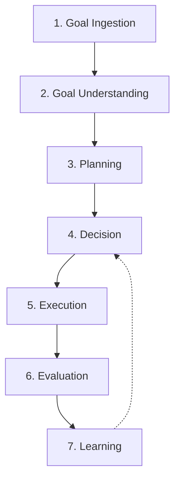
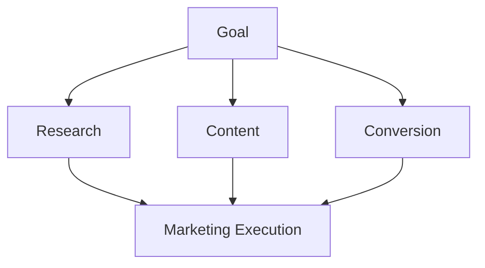

# Volume 3. Runtime Specification

- **Version:** v0.1 Draft
- **Status:** Runtime Architecture Specification
- **Depends on:** [Volume 1](v1-core-concepts.md), [Volume 2](v2-architecture.md)

---

## 1. Introduction

### 1.1 Purpose

Runtime Specification은 Intent OS가 사용자의 Goal을 입력받은 순간부터 Outcome을 생성하고 학습 데이터로 저장하기까지의 **전체 실행 생명주기(Lifecycle)** 를 정의한다.

### 1.2 Runtime Philosophy

| 기존 AI 시스템 | Intent OS |
|---|---|
| Input → Model → Output | Goal → Understanding → Planning → Decision → Execution → Evaluation → Learning |

---

## 2. Runtime Overview

Intent OS Runtime은 **7개의 주요 단계**로 구성된다.



---

## 3. Runtime Object Model

### Execution Instance

**정의:** 하나의 Goal이 처리되는 전체 실행 단위

**Schema** → [`schemas/execution.schema.json`](intent-os-spec/schemas/execution.schema.json)

```json
{
  "execution_id": "",
  "goal_id": "",
  "status": "",
  "created_at": "",
  "tasks": [],
  "decisions": [],
  "resources": [],
  "outcomes": []
}
```

**예시**

사용자 입력: *"겨울캠프 모집률을 높이고 싶어"*

```
Execution Instance #001

Goal:   Increase Winter Camp Enrollment
Tasks:  - Market Analysis
        - Content Strategy
        - Landing Page Optimization
Status: Planning
```

---

## 4. Runtime Lifecycle

### Stage 1 — Goal Ingestion

**목적:** 사용자의 입력을 시스템에 전달한다.

```
Raw Input → Input Normalization → Context Attachment → Goal Engine
```

**Context 포함 정보**

Intent OS는 입력만 보지 않는다. 함께 고려하는 것:

- 사용자 정보
- 이전 대화
- 프로젝트 정보
- 시간
- 위치
- 사용 가능한 자원

**Output:** Goal Candidate

---

### Stage 2 — Goal Understanding

**Component:** Goal Engine

**목적:** 사용자의 진짜 목표를 이해한다.

**문제** — 사용자는 보통 Goal을 정확히 표현하지 않는다.

```
사용자: "인스타 광고 만들어줘"

숨은 Goal 가능성:
  1. 신규 고객 확보
  2. 브랜드 인지도 상승
  3. 기존 고객 재활성화
```

따라서 Intent OS는 **질문을 생성한다.**

#### Clarification System

질문 기준:

> **Expected Information Gain > User Friction**

즉, "많이 물어보기"가 아니라 **"결과 품질을 가장 많이 높이는 질문"만** 한다.

| | 질문 |
|---|---|
| ❌ 나쁜 질문 | "타겟 고객층은 누구인가요?" |
| ⭕ 좋은 질문 | "이번 캠프의 가장 중요한 목표는 무엇인가요?"<br>① 최대 모집 인원 확보 ② 브랜드 인지도 증가 ③ 기존 학생 유지 |

---

### Stage 3 — Planning

**Component:** Planning Engine

- **입력:** Confirmed Goal
- **출력:** Task Graph

#### Task Graph

Intent OS는 Linear Workflow(`A → B → C`)를 사용하지 않는다. **Dependency Graph**를 사용한다.



#### Dynamic Planning

> **중요:** 계획은 고정되지 않는다. 실행 중 결과에 따라 변경된다.

```
광고 집행
→ 데이터 분석
→ 예상보다 검색량 부족
→ 계획 수정: SEO 강화
```

---

### Stage 4 — Decision

**Component:** Decision Engine

**목적:** 각 Task에 적합한 Resource 선택.

| Input | Process |
|---|---|
| Task | Candidate Generation |
| Required Capability | ↓ Performance Prediction |
| Available Resources | ↓ Cost Calculation |
| Historical Data | ↓ Risk Assessment |
| Cost Constraint | ↓ Final Selection |

#### Decision Score Model

```
Score = Quality × Weight
      + Reliability × Weight
      + Speed × Weight
      − Cost × Weight
      − Risk × Weight
```

**예시**

```
Task: 광고 카피 작성
Candidate: GPT / Claude / Gemini / Human Copywriter

결과: Claude — Probability 91% → Selected
```

상세 내용은 [Volume 4](v4-decision-engine.md) 참조.

---

### Stage 5 — Execution

**Component:** Runtime Engine

Execution은 세 가지 형태를 가진다.

#### 5.1 Sequential Execution (순차 실행)

```
Research → Analysis → Report
```

#### 5.2 Parallel Execution (병렬 실행)

```
Market Research
+ Competitor Analysis
+ Customer Analysis
→ Strategy
```

#### 5.3 Conditional Execution (조건부 실행)

```
IF conversion < target
    → Improve Landing Page
ELSE
    → Scale Advertisement
```

#### Execution Monitoring

Runtime은 항상 상태를 추적한다.

```
CREATED → QUEUED → RUNNING → WAITING → COMPLETED
                                     ↘ FAILED
```

---

### Stage 6 — Evaluation

**Component:** Evaluation Engine

**목적:** 결과가 좋은지 판단한다.

| 평가 기준 | 의미 |
|---|---|
| Quality | 결과 품질 |
| Goal Alignment | 목표와 얼마나 가까운가 |
| Efficiency | 비용 대비 효과 |
| User Satisfaction | 사용자 평가 |

**Output**

```json
{
  "quality_score": 0.91,
  "goal_alignment": 0.87,
  "cost_efficiency": 0.95
}
```

---

### Stage 7 — Learning

**Component:** Learning Engine

**목적:** 다음 실행을 개선한다.

**학습 대상:** Goal Pattern → Task Strategy → Resource Choice → Outcome

**예시**

```
100개의 마케팅 프로젝트 분석 결과:

교육 업종 + 20대 타겟 + 브랜드 광고
→ Claude + Search Tool 조합 성공률 높음

다음부터: 자동 추천
```

---

## 5. Runtime State Machine

```
IDLE → UNDERSTANDING → PLANNING → DECIDING
→ EXECUTING → EVALUATING → LEARNING → COMPLETED
```

---

## 6. Failure Handling

Intent OS는 **실패를 정상 상태로 취급한다.**

| Type | 예시 | 처리 |
|---|---|---|
| **1. Resource Failure** | API 장애 | Detect → Retry → Alternative Resource → Continue |
| **2. Goal Ambiguity** | 목표 불명확 | Pause → Ask User → Resume |
| **3. Low Confidence** | 성공 확률 낮음 | Generate Alternative Plans → Compare → Select |

---

## 7. Human Intervention Model

> Intent OS는 인간을 제거하지 않는다. **인간은 가장 중요한 Resource다.**

Human이 개입하는 경우:

- **High Impact Decision** — 예: 대규모 투자 결정
- **Value Judgment** — 예: 브랜드 방향
- **Low Confidence** — 예: 예측 신뢰도 부족

---

## 8. Runtime Optimization Principles

1. **Minimize Unnecessary Execution** — 무조건 여러 AI 실행 금지. 예측 후 실행.
2. **Preserve Context** — 모든 실행은 이전 Context를 유지해야 한다.
3. **Every Execution Produces Knowledge** — 실행은 비용이 아니라 학습 데이터다.

---

## 9. Runtime Summary

```
User Goal
→ Understand
→ Ask Only Necessary Questions
→ Generate Plan
→ Identify Required Capabilities
→ Select Best Resources
→ Execute
→ Evaluate
→ Learn
→ Improve Future Decisions
```

---

## Volume 3 Completion Criteria

- [x] Goal 처리 Lifecycle 정의
- [x] Runtime State 정의
- [x] Execution Object 정의
- [x] Planning → Decision → Execution 흐름 정의
- [x] 실패 처리 정의
- [x] Human Intervention 정의
- [x] Learning 연결 구조 정의
