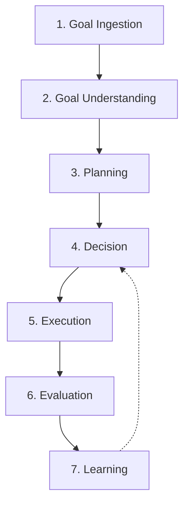
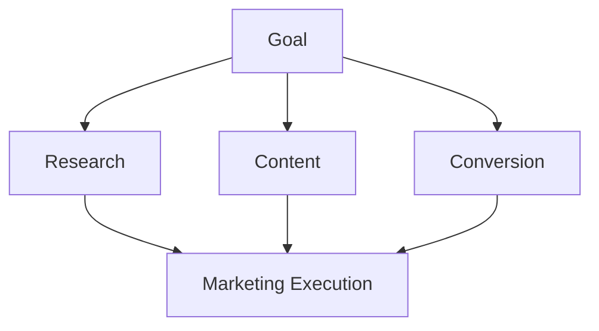

# Volume 3. Runtime Specification

- **Version:** v0.1 Draft
- **Status:** Runtime Architecture Specification
- **Depends on:** [Volume 1](v1-core-concepts.md), [Volume 2](v2-architecture.md)

---

## 1. Introduction

### 1.1 Purpose

Runtime Specification은 Intent OS가 사용자의 Goal을 입력받은 순간부터 Outcome을 생성하고 학습 데이터로 저장하기까지의 **전체 실행 생명주기(Lifecycle)** 를 정의한다.

### 1.2 Runtime Philosophy

| 기존 AI 시스템 | Intent OS |
|---|---|
| Input → Model → Output | Goal → Understanding → Planning → Decision → Execution → Evaluation → Learning |

---

## 2. Runtime Overview

Intent OS Runtime은 **7개의 주요 단계**로 구성된다.



---

## 3. Runtime Object Model

> **⚠️ v0.1 명세 정정 (2026-08-04)**
>
> 초안에서 "Execution Instance"라 부르던 **Goal 단위 실행 객체**는 실제로는 [Session](entities/e021-session.md)(Entity 021)이다.
> 이름이 [Execution](entities/e013-execution.md)(Entity 013, Task 한 번의 시도)과 겹쳐 계층 혼동을 낳았으므로 분리했다.

### 계층 구분

| 계층 | Entity | 단위 | 스키마 |
|---|---|---|---|
| **Session** | [021](entities/e021-session.md) | 하나 이상의 Goal을 추진하는 상호작용·실행 경계 | [`session.schema.json`](intent-os-spec/schemas/session.schema.json) |
| **Execution** | [013](entities/e013-execution.md) | Task 하나를 특정 Resource로 수행하는 **한 번의 시도** | [`execution.schema.json`](intent-os-spec/schemas/execution.schema.json) |
| **Outcome** | [014](entities/e014-outcome.md) | 그 시도가 낳은 불변 측정 기록 | [`outcome.schema.json`](intent-os-spec/schemas/outcome.schema.json) |

`Session 1 : Execution 0..N`, `Execution 1 : Outcome 0..1` 이다.

### Session

**정의:** 하나 이상의 Goal을 추진하는 경계 지어진 실행 단위. 일시적 Context와 예산을 보유하되 **영속 Entity는 참조만 한다.**

<!-- validate: session.schema.json -->
```json
{
  "session_id": "ses_057",
  "type": "interactive",
  "actor": "human:대표",
  "goal_ids": ["goal_01HZX9M4Y4QF2X"],
  "budget": { "max_cost": { "amount": 50000, "currency": "KRW" }, "max_executions": 200 },
  "started_at": "2026-08-04T09:00:00Z",
  "last_activity_at": "2026-08-04T09:42:00Z",
  "execution_ids": [],
  "decision_ids": [],
  "artifact_ids": [],
  "status": "Active"
}
```

**예시**

사용자 입력: *"겨울캠프 모집률을 높이고 싶어"*

```
Session ses_057

Goal:   goal_001  윈터캠프 학생 100명 모집
Tasks:  - 시장 조사
        - 콘텐츠 전략
        - 랜딩페이지 개선
Status: Active   (phase: Planning)
```

**Session이 끝나도 Goal·Plan·Outcome·Artifact·Memory는 살아남는다.** 사라지는 것은 대화 버퍼와 일시적 Context뿐이다 ([INV-16](entities/e000a-entity-relationships.md)).

---

## 4. Runtime Lifecycle

### Stage 1 — Goal Ingestion

**목적:** 사용자의 입력을 시스템에 전달한다.

```
Raw Input → Input Normalization → Context Attachment → Goal Engine
```

**Context 포함 정보**

Intent OS는 입력만 보지 않는다. 함께 고려하는 것:

- 사용자 정보
- 이전 대화
- 프로젝트 정보
- 시간
- 위치
- 사용 가능한 자원

**Output:** Goal Candidate

---

### Stage 2 — Goal Understanding

**Component:** Goal Engine

**목적:** 사용자의 진짜 목표를 이해한다.

**문제** — 사용자는 보통 Goal을 정확히 표현하지 않는다.

```
사용자: "인스타 광고 만들어줘"

숨은 Goal 가능성:
  1. 신규 고객 확보
  2. 브랜드 인지도 상승
  3. 기존 고객 재활성화
```

따라서 Intent OS는 **질문을 생성한다.**

#### Clarification System

질문 기준:

> **Expected Information Gain > User Friction**

즉, "많이 물어보기"가 아니라 **"결과 품질을 가장 많이 높이는 질문"만** 한다.

| | 질문 |
|---|---|
| ❌ 나쁜 질문 | "타겟 고객층은 누구인가요?" |
| ⭕ 좋은 질문 | "이번 캠프의 가장 중요한 목표는 무엇인가요?"<br>① 최대 모집 인원 확보 ② 브랜드 인지도 증가 ③ 기존 학생 유지 |

---

### Stage 3 — Planning

**Component:** Planning Engine

- **입력:** Confirmed Goal
- **출력:** Task Graph

#### Task Graph

Intent OS는 Linear Workflow(`A → B → C`)를 사용하지 않는다. **Dependency Graph**를 사용한다.



#### Dynamic Planning

> **중요:** 계획은 고정되지 않는다. 실행 중 결과에 따라 변경된다.

```
광고 집행
→ 데이터 분석
→ 예상보다 검색량 부족
→ 계획 수정: SEO 강화
```

---

### Stage 4 — Decision

**Component:** Decision Engine

**목적:** 각 Task에 적합한 Resource 선택.

| Input | Process |
|---|---|
| Task | Candidate Generation |
| Required Capability | ↓ Performance Prediction |
| Available Resources | ↓ Cost Calculation |
| Historical Data | ↓ Risk Assessment |
| Cost Constraint | ↓ Final Selection |

#### Decision Score Model

```
Score = Quality × Weight
      + Reliability × Weight
      + Speed × Weight
      − Cost × Weight
      − Risk × Weight
```

**예시**

```
Task: 광고 카피 작성
Candidate: GPT / Claude / Gemini / Human Copywriter

결과: Claude — Probability 91% → Selected
```

상세 내용은 [Volume 4](v4-decision-engine.md) 참조.

---

### Stage 5 — Execution

**Component:** Runtime Engine

Execution은 세 가지 형태를 가진다.

#### 5.1 Sequential Execution (순차 실행)

```
Research → Analysis → Report
```

#### 5.2 Parallel Execution (병렬 실행)

```
Market Research
+ Competitor Analysis
+ Customer Analysis
→ Strategy
```

#### 5.3 Conditional Execution (조건부 실행)

```
IF conversion < target
    → Improve Landing Page
ELSE
    → Scale Advertisement
```

#### Execution Monitoring

Runtime은 항상 상태를 추적한다. 상세 정의는 [Entity 013 §6](entities/e013-execution.md).

```
Created → Queued → Running → Waiting → Completed
                                     ↘ Failed / TimedOut / Aborted
```

**종료 상태 4개는 모두 Outcome 1개를 낳는다**([INV-04](entities/e000a-entity-relationships.md)). 실패도 결과다 — 실패 Outcome이 누락되면 Resource 성공률이 실제보다 높게 계산된다.

`Completed`는 "실행이 끝났다"는 뜻이지 "잘 됐다"는 뜻이 아니다. 성공 판정은 Stage 6의 [Evaluation](entities/e015-evaluation.md)이 한다.

---

### Stage 6 — Evaluation

**Component:** Evaluation Engine

**목적:** 결과가 좋은지 판단한다.

| 평가 기준 | 의미 |
|---|---|
| Quality | 결과 품질 |
| Goal Alignment | 목표와 얼마나 가까운가 |
| Efficiency | 비용 대비 효과 |
| User Satisfaction | 사용자 평가 |

네 기준의 명칭은 [Entity 015](entities/e015-evaluation.md)를 따른다. Volume 5 §5가 첫 항목을 `Goal Achievement`로 쓰던 것은 **`Goal Alignment`로 통일했다.**

**Output** — 아래는 점수 부분만 발췌한 것이다. Evaluation Entity의 전체 형태는 [Entity 015 §8](entities/e015-evaluation.md)에 있다.

<!-- validate: none -->
```json
{
  "quality_score": 0.91,
  "goal_alignment": 0.87,
  "cost_efficiency": 0.95,
  "user_satisfaction": 0.90
}
```

---

### Stage 7 — Learning

**Component:** Learning Engine

**목적:** 다음 실행을 개선한다.

**학습 대상:** Goal Pattern → Task Strategy → Resource Choice → Outcome

**예시**

```
100개의 마케팅 프로젝트 분석 결과:

교육 업종 + 20대 타겟 + 브랜드 광고
→ Claude + Search Tool 조합 성공률 높음

다음부터: 자동 추천
```

---

## 5. Runtime State Machine

아래 7단계는 **Session 내부의 진행 단계(phase)** 이지 Execution의 상태가 아니다. 두 계층을 혼동하면 안 된다.

```
Session.phase
IDLE → UNDERSTANDING → PLANNING → DECIDING
→ EXECUTING → EVALUATING → LEARNING → COMPLETED
```

| 계층 | 상태 | 묻는 것 |
|---|---|---|
| `Session.status` | Created / Active / Idle / Suspended / Completed / Expired / Aborted | Session이 **살아 있는가** |
| `Session.phase` | IDLE / UNDERSTANDING / PLANNING / DECIDING / EXECUTING / EVALUATING / LEARNING / COMPLETED | Session이 **어디까지 왔는가** |
| `Execution.status` | Created / Queued / Running / Waiting / Completed / Failed / TimedOut / Aborted | 이 시도가 **어떻게 되었는가** |

**`phase`는 [`session.schema.json`](intent-os-spec/schemas/session.schema.json)에 정식 도입되었다** ([Entity 021 §4](entities/e021-session.md), 2026-08-04). 초안에서 Open Issue였던 항목이다.

두 필드는 **독립적이다.** 곱집합이 모두 유효하지는 않지만, 아래 조합은 정상이다.

| status | phase | 의미 |
|---|---|---|
| `Active` | `EXECUTING` | 정상 실행 중 |
| `Suspended` | `EXECUTING` | 실행 도중 멈춤 — 인간 승인 대기(§7) |
| `Idle` | `PLANNING` | 계획 단계에서 사용자 입력 대기 |
| `Completed` | `LEARNING` | ❌ **불가.** `Completed`는 `phase = COMPLETED`를 요구한다 |

---

## 6. Failure Handling

Intent OS는 **실패를 정상 상태로 취급한다.**

| Type | 예시 | 처리 | 상태 변화 |
|---|---|---|---|
| **1. Resource Failure** | API 장애 | Detect → Retry → Alternative Resource → Continue | `Execution.status = Failed` → 새 Execution 생성 (`attempt` 증가) |
| **2. Goal Ambiguity** | 목표 불명확 | Ask User → Resume | `Session.status = Idle` (§7) |
| **3. Low Confidence** | 성공 확률 낮음 | Generate Alternative Plans → Compare → Select | Session 상태 불변. [4-A §11](v4a-decision-engine-detail.md) Multi-Agent 발동 |

> **`Pause`라는 상태는 없다.** 초안이 `Pause → Ask User → Resume`으로 적었으나 §5의 어느 상태 집합에도 `Pause`가 없다. 대기는 두 가지로 나뉘며, 어느 계층이 멈추는지가 다르다.

| 무엇을 기다리는가 | 멈추는 계층 | 상태 |
|---|---|---|
| 사용자의 답변 | Session | `Session.status = Idle` |
| 외부 시스템·인간 Resource의 작업 | Execution | `Execution.status = Waiting` |

Execution이 `Waiting`인 동안에도 Session은 `Active`다. 다른 Task가 병렬로 진행될 수 있기 때문이다.

---

## 7. Human Intervention Model

> Intent OS는 인간을 제거하지 않는다. **인간은 가장 중요한 Resource다.**

### 7.1 개입 발동 조건

| # | 조건 | 판정 | 예 |
|---|---|---|---|
| H1 | **High Impact Decision** | [4-A §9.2](v4a-decision-engine-detail.md)의 `R5 Irreversibility ≥ 0.5` | 대규모 투자 결정, 대외 발송 |
| H2 | **Value Judgment** | Goal의 `desired_state`로 환원 불가한 선택 | 브랜드 방향 |
| H3 | **Low Confidence** | `Confidence < 0.70` ([4-A §13](v4a-decision-engine-detail.md)) | 예측 신뢰도 부족 |
| H4 | **Policy 요구** | [Policy](entities/e019-policy.md)가 승인을 명시적으로 요구 | 예산 초과 집행 |

H1과 H4는 **차단형**이다 — 승인 없이 진행할 수 없다. H2와 H3은 **자문형**이며, 타임아웃 시 §7.3의 기본 동작으로 넘어간다.

### 7.2 개입 프로토콜

```
개입 발동
→ Execution.status = Waiting        (실행 중이던 시도를 멈춘다)
→ Session.status  = Idle            (사용자 응답 대기)
→ 승인 요청 생성 (질문 + 근거 + 기본 선택지)
→ ┌ 응답 있음 → Session.status = Active → Execution 재개 또는 Abort
  └ 타임아웃  → §7.3
```

승인 요청에는 **반드시 셋을 포함한다.** 셋 중 하나라도 없으면 인간은 판단할 수 없고, 형식적 승인만 남는다.

| 항목 | 내용 |
|---|---|
| 질문 | 무엇을 결정해야 하는가 |
| 근거 | 왜 물어보는가 — 발동 조건(H1~H4)과 그 수치 |
| 기본 선택지 | 응답이 없으면 무엇이 일어나는가 |

### 7.3 타임아웃

무한 대기는 허용하지 않는다. Session의 `idle_timeout`([Entity 021 §4](entities/e021-session.md))이 만료되면 개입 유형에 따라 갈린다.

| 유형 | 타임아웃 시 |
|---|---|
| **차단형** (H1, H4) | `Execution.status = Aborted`, `failure_class = policy_violation`. **묵시적 승인으로 간주하지 않는다** |
| **자문형** (H2, H3) | 기본 선택지로 진행. Decision에 `human_input: timeout` 기록 |

차단형에서 침묵을 승인으로 해석하면 안 되는 이유는 [Volume 2 Constraint 2](v2-architecture.md) 때문이다 — 아무도 내리지 않은 결정은 설명할 수 없다.

### 7.4 인간은 Resource이기도 하다

§7.1~7.3은 인간이 **승인자**로 개입하는 경우다. 인간이 **실행자**로 쓰이는 경우는 개입이 아니라 통상 Execution이며, [Entity 007](entities/e007-resource.md)의 `type: human`으로 다뤄진다.

| | 승인자 | 실행자 |
|---|---|---|
| 계기 | H1~H4 발동 | Decision이 선택 |
| 표현 | Session이 대기 | Execution 1건 |
| 지연 | `idle_timeout` | `timeout_ms` |

❌ 김 카피라이터에게 카피를 맡기는 것은 Human Intervention이 아니다. Resource 선택 결과일 뿐이다.

---

## 8. Runtime Optimization Principles

1. **Minimize Unnecessary Execution** — 무조건 여러 AI 실행 금지. 예측 후 실행.
2. **Preserve Context** — 모든 실행은 이전 Context를 유지해야 한다.
3. **Every Execution Produces Knowledge** — 실행은 비용이 아니라 학습 데이터다.

---

## 9. Runtime Summary

```
User Goal
→ Understand
→ Ask Only Necessary Questions
→ Generate Plan
→ Identify Required Capabilities
→ Select Best Resources
→ Execute
→ Evaluate
→ Learn
→ Improve Future Decisions
```

---

## Volume 3 Completion Criteria

| 항목 | 근거 | 판정 |
|---|---|---|
| Goal 처리 Lifecycle 정의 | §4 Stage 1~7 | ✅ |
| Runtime State 정의 | §5 (3개 상태축 + `phase` 스키마 도입 완료) | ✅ |
| Execution Object 정의 | §3 (Session / Execution / Outcome 계층) | ✅ |
| Planning → Decision → Execution 흐름 정의 | §4 Stage 3~5 | ✅ |
| 실패 처리 정의 | §6 (3유형 + 상태 변화 + 대기 계층 구분) | ✅ |
| Human Intervention 정의 | §7.1 발동 조건 · §7.2 프로토콜 · §7.3 타임아웃 · §7.4 역할 구분 | ✅ |
| Learning 연결 구조 정의 | §4 Stage 7 · §8 | ⚠️ 부분 — 연결점만 정의. 학습 알고리즘은 [Volume 5](v5-learning-engine.md)에 위임 |
