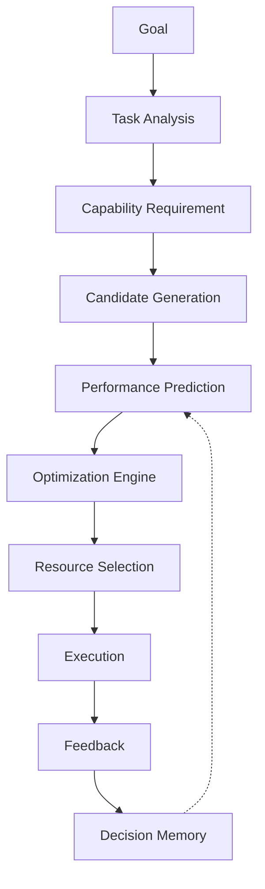

# Volume 4. Decision Engine Specification

- **Version:** v0.1 Draft
- **Status:** Core Intelligence Specification
- **Depends on:** [Volume 1](v1-core-concepts.md), [Volume 2](v2-architecture.md), [Volume 3](v3-runtime.md)

> **본 문서는 개요다.** 구현 수준의 상세 명세는 아래 세 문서를 참조한다.
>
> - [Volume 4-A — Decision Engine Detailed Specification](v4a-decision-engine-detail.md)
> - [Volume 4-B — Resource Intelligence Specification](v4b-resource-intelligence.md)
> - [Volume 4-C — Resource Genome & Meta Prediction Engine](v4c-resource-genome.md)
> - [Volume 4-D — Autonomous Benchmarking Engine](v4d-autonomous-benchmarking.md)
> - [Volume 4-E — Strategy Graph Engine](v4e-strategy-graph.md) ⚠️ 장기 연구
> - [Volume 4-F — World Model Engine](v4f-world-model.md) ⚠️ 장기 연구

---

## 1. Introduction

### 1.1 Purpose

Decision Engine Specification은 Intent OS가 실행 과정에서 발생하는 모든 **선택 문제**를 해결하기 위한 의사결정 구조를 정의한다.

Decision Engine의 역할:

- 적합한 Resource 선택
- 실행 전략 결정
- 비용 대비 효율 최적화
- 불확실성 관리
- 지속적인 선택 개선

### 1.2 Core Principle

| 기존 AI 활용 | Intent OS |
|---|---|
| 사용자 → AI 선택 → Prompt 작성 → 결과 확인 | Goal → Capability Requirement → Resource Prediction → Optimal Selection → Execution |

### 1.3 Definition

> Decision Engine은 **주어진 Goal과 Task를 가장 효율적으로 달성할 수 있는 실행 조합을 선택하는 시스템**이다.

---

## 2. Decision Model

Intent OS의 선택 문제는 **Optimization Problem**으로 정의한다.

### 2.1 Objective Function

목표: `Maximize(Expected Utility)`

$$EU = Q \times P - C - L - R$$

| Symbol | Meaning |
|---|---|
| Q | 예상 품질 (Quality) |
| P | 성공 확률 (Probability) |
| C | 비용 (Cost) |
| L | 지연시간 (Latency) |
| R | 위험 (Risk) |

> **즉, 비싼 최고의 모델을 선택하는 것이 아니다.**

**예시**

| | Quality | Cost | Speed |
|---|---|---|---|
| Resource A | 95 | 100 | 50 |
| Resource B | 90 | 10 | 90 |

간단한 작업에서는 **B가 더 적합할 수 있다.**

---

## 3. Decision Architecture

Decision Engine은 6개의 Module로 구성된다.

```
Decision Engine
├── Task Analyzer
├── Capability Mapper
├── Candidate Generator
├── Performance Predictor
├── Optimization Engine
└── Decision Memory
```

### 3.1 Volume 4-A 모듈과의 대응

> **권위:** 모듈 분해의 정본은 [Volume 4-A §3](v4a-decision-engine-detail.md)이다. 본 문서의 6개는 개요 수준의 묶음이며, 4-A는 이를 **7개**로 나눈다.

| 본 문서 (개요) | Volume 4-A (정본) | 비고 |
|---|---|---|
| Task Analyzer | Task Intelligence Module | 동일 |
| Capability Mapper | Capability Graph Engine | 동일 |
| Candidate Generator | Resource Discovery Engine | 동일 |
| Performance Predictor | Performance Prediction Engine | 동일 |
| Optimization Engine | Utility Optimization Engine | 동일 |
| — | **Risk Management Engine** | 개요에는 없다. 4-A §9에서 신설 |
| Decision Memory | Decision Memory Engine | 동일 |

개요에 Risk Management Engine이 없는 이유는 §2 목적함수가 위험 `R`을 이미 항으로 포함하기 때문이다. 그러나 `R`을 **누가 산출하는가**는 개요 수준에서 정의되지 않으므로, 구현 단계에서는 4-A §9를 따른다.

---

## 4. Task Analyzer

**Responsibility** — Task를 분석하여 Resource 선택 기준을 생성한다.

**Input**

```
Task: "수능 미술학원 광고 카피 작성"
```

**Analysis**

```
Task Type:  Creative Writing
Difficulty: Medium

Required Capability:
  - Korean Writing
  - Persuasion
  - Education Marketing
  - Audience Understanding
```

**Output**

<!-- validate: none -->
```json
{
  "task_type": "marketing_copy",
  "required_capabilities": ["writing", "persuasion", "marketing"]
}
```

---

## 5. Capability Mapper

**Responsibility** — Task를 Capability Requirement로 변환한다.

| Task | Capability |
|---|---|
| 시장 조사 | Search, Data Analysis, Pattern Recognition, Summarization |
| 영상 제작 | Visual Generation, Storytelling, Editing, Motion Understanding |

---

## 6. Candidate Generator

**Responsibility** — 가능한 Resource 후보를 생성한다.

```
Input:  Required Capability + Available Resources

Output: Candidates
        GPT-5.5 / Claude / Gemini / Perplexity / Search Tool / Human Expert
```

> **중요:** Candidate Generator는 최종 선택하지 않는다. **후보만 만든다.**

---

## 7. Performance Predictor

**가장 중요한 Module**

**Purpose** — 실행하기 전에 성능을 예측한다.

| 기존 방식 | Intent OS 방식 |
|---|---|
| 실행 → 평가 | 예측 → 선택 → 실행 |

### 7.1 Prediction Input

**Resource Metadata**

```
Model: Claude
Capabilities:
  Writing:   95
  Reasoning: 90
  Coding:    85
```

**Historical Performance**

```
교육 마케팅 Task:
  Claude — Success Rate 92%
  GPT    — Success Rate 88%
```

**Context**

```
Language: Korean
Industry: Education
Audience: Parents
```

### 7.2 Prediction Output

<!-- validate: none -->
```json
{
  "resource": "Claude",
  "quality_prediction": 0.91,
  "success_probability": 0.88,
  "confidence": 0.84
}
```

---

## 8. Optimization Engine

**Responsibility** — 여러 조건을 고려하여 최종 선택한다.

**고려 요소:** Quality, Cost, Speed, Reliability, Privacy, User Preference

### 8.1 Dynamic Weighting

> **중요한 부분.** 가중치는 고정되지 않는다.

| 사용자 발화 | Weight |
|---|---|
| "오늘 발표라서 빨리 필요해" | Speed ↑↑ / Quality ↑ / Cost ↓ |
| "100억 투자 제안서" | Quality ↑↑↑ / Reliability ↑↑ / Speed ↓ |

---

## 9. Multi-Agent Decision

**질문:** 여러 AI를 동시에 돌리는 것은 낭비 아닌가?

**맞다.** Intent OS는 기본적으로 하지 않는다.

### Default Policy — Single Best Prediction

먼저 하나 선택.

### Exception Policy

다음 경우에만 Multi-Agent 실행:

1. **High Impact Task** — 투자 계약서, 의료 연구, 법률 문서
2. **Low Confidence** — Prediction Confidence **< 0.70**
3. **Conflicting Objectives** — 최저 비용 + 최고 품질처럼 두 목표 충돌

> **임계값의 정본은 [Volume 4-A §11](v4a-decision-engine-detail.md)이다.** 초안에서 본 문서가 `< 60%`, 4-A가 `< 70%`로 갈렸으나 **0.70으로 통일했다.** 근거는 4-A §13의 Confidence 구성이다 — Confidence는 네 요소의 결합값이라 0.60~0.70 구간에도 예측 분산이 크게 남는다. 발동 임계값은 4-A 한 곳에서만 정의하고 본 문서는 참조한다.

---

## 10. Decision Memory

Intent OS는 선택 기록을 저장한다.

```
Task Pattern → Selected Resource → Outcome → Feedback
```

**예시 — 100회 실행 결과**

| 한국 입시 마케팅 | 성공률 |
|---|---|
| Claude | 93% |
| GPT | 87% |
| Gemini | 81% |

다음 Decision에 자동 반영.

---

## 11. Resource Ranking System

모든 Resource는 실시간 Score를 가진다.

```
Claude
  Writing:         96
  Reasoning:       91
  Korean:          94
  Cost Efficiency: 90
  ─────────────────────
  Overall:         93
```

> **중요:** Ranking은 절대 순위가 아니다. **조건별 Ranking**이다.
>
> `Best AI for Coding ≠ Best AI for Marketing`

---

## 12. Model Update Tracking

**문제:** AI 모델은 계속 변화한다.

```
오늘:  Model A > Model B
내일:  Model B > Model A   ← 가능
```

따라서 Resource Registry는 지속 업데이트된다.

**Update Source:** 공식 API 변경, Benchmark, 사용자 결과 데이터, 비용 변화, Latency 변화

---

## 13. Decision Explainability

모든 결정은 설명 가능해야 한다.

```
Selected: Claude

Reason:
  1. Korean writing capability high
  2. Education marketing history strong
  3. Cost efficiency optimal

Confidence: 89%
```

---

## 14. Failure Recovery

Decision 실패 예: 선택한 모델 결과 품질 부족

```
Evaluation → Failure Detection → Decision Update
→ Alternative Resource → Retry
```

---

## 15. Future Advanced Model

향후 **Meta Decision Model**이 가능하다.

```
Goal → Decision Model → Decision Model 선택
```

즉, 어떤 Decision Engine이 더 좋은지 판단하는 **상위 Decision Engine.**

---

## 16. Decision Engine Summary



---

## Volume 4 Completion Criteria

| 항목 | 근거 | 판정 |
|---|---|---|
| AI 선택 기준 정의 | §2 목적함수 | ✅ |
| 비용/품질/속도 최적화 구조 정의 | §2.1, §8 · 계산 정본 [4-A §8](v4a-decision-engine-detail.md) | ✅ |
| Multi-Agent 실행 기준 정의 | §9 · 임계값 정본 [4-A §11](v4a-decision-engine-detail.md) | ✅ |
| Resource Ranking 구조 정의 | §11 · 상세 [4-B §9](v4b-resource-intelligence.md) | ✅ |
| Model Update Tracking 정의 | §12 | ⚠️ 부분 — 갱신 소스만 나열, 감지·반영 메커니즘은 [4-B §13](v4b-resource-intelligence.md)에 위임 |
| Decision Learning 구조 정의 | §10 | ✅ |
| Explainability 정의 | §13 · 영속 표현 [Entity 009](entities/e009-decision.md) | ✅ |

본 문서는 **개요다.** 수치·알고리즘의 정본은 4-A~4-D에 있으며, 값이 갈릴 경우 하위 문서를 따른다.
