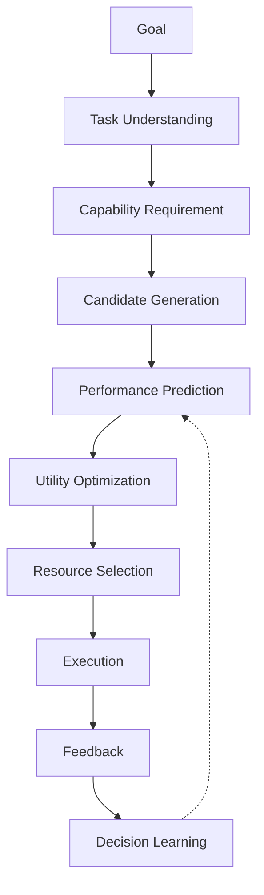
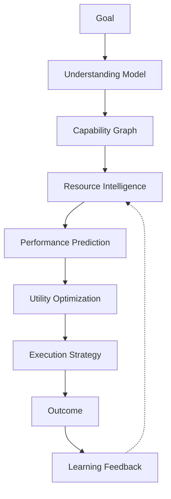

# Volume 4-A. Decision Engine Detailed Specification

- **Version:** v1.0 Draft
- **Classification:** Core Intelligence Layer
- **Status:** Technical Design Document
- **Depends on:** [Volume 4 — Decision Engine](v4-decision-engine.md)

> Volume 4가 "무엇을 선택해야 하는가"라는 개념 수준이라면, 본 문서는 **실제 구현 가능한 수준**으로 내려간다.
>
> **목표:** Intent OS가 수천 개의 AI 모델, Agent, Tool 중에서 특정 Goal에 대해 가장 높은 기대 가치를 가진 조합을 선택하는 Decision Intelligence System을 설계한다.

---

## 1. Decision Engine Definition

### 1.1 Definition

Decision Engine은 Intent OS의 중앙 의사결정 시스템이다.

```
Goal → Task → Capability Requirement → Resource Candidate
→ Prediction → Optimization → Execution Strategy
```

### 1.2 핵심 질문

Intent OS는 항상 다음 네 가지 질문에 답해야 한다.

| # | 질문 |
|---|---|
| Q1 | 이 목표를 달성하려면 어떤 **능력**이 필요한가? |
| Q2 | 현재 사용 가능한 Resource 중 누가 이 능력을 **가장 잘** 제공하는가? |
| Q3 | 최고 성능 Resource가 아니라 **최적 효율** Resource는 무엇인가? |
| Q4 | 얼마나 **확신**할 수 있는가? |

---

## 2. Decision Engine Architecture



---

## 3. Decision Engine Components

Decision Engine은 **7개의 핵심 모듈**로 구성된다.

```
Decision Engine
├── Task Intelligence Module
├── Capability Graph Engine
├── Resource Discovery Engine
├── Performance Prediction Engine
├── Utility Optimization Engine
├── Risk Management Engine
└── Decision Memory Engine
```

---

## 4. Task Intelligence Module

### 4.1 Purpose

사용자의 목표를 분석하여 Decision 가능한 형태로 변환한다.

**Input**

```
"우리 학원 겨울캠프 모집률을 올리고 싶어"
```

**Output**

```json
{
  "domain": "Education Marketing",
  "objective": "Increase enrollment",
  "task_category": [
    "Market Research",
    "Content Creation",
    "Advertising Strategy"
  ],
  "constraints": {
    "budget": "unknown",
    "deadline": "2 months"
  }
}
```

### 4.2 Task Classification

> Task는 단순 분류가 아니다. **다차원 Vector**로 표현한다.

```
Task = [
  Domain,
  Difficulty,
  Creativity,
  Reasoning,
  Accuracy,
  Speed,
  DataRequirement
]
```

**예시 — 광고 카피 작성**

```
[
  Marketing,
  Medium,
  High Creativity,
  Medium Reasoning,
  Medium Accuracy,
  High Speed,
  Low Data
]
```

---

## 5. Capability Graph Engine

### 5.1 Purpose

Task를 필요한 능력의 조합으로 변환한다.

```
Task: 시장 분석 보고서 작성
  ↓
Capability Graph:
  Market Research + Search + Data Analysis + Reasoning + Writing
```

### 5.2 Capability Ontology

Intent OS는 Capability를 표준화한다.

```
Intelligence
├── Language
│   ├── Writing
│   ├── Translation
│   └── Summarization
├── Reasoning
│   ├── Planning
│   ├── Logic
│   └── Strategy
├── Creation
│   ├── Image
│   ├── Video
│   └── Design
├── Technical
│   ├── Coding
│   ├── Debugging
│   └── Architecture
└── Research
    ├── Search
    ├── Analysis
    └── Verification
```

---

## 6. Resource Discovery Engine

### 6.1 Purpose

가능한 Resource 후보를 찾는다. AI Model, Agent, API, Tool, Human Expert, Database — 모두 동일한 Resource다.

### 6.2 Candidate Filtering

```
전체 Resource        10,000개
  ↓ Capability Filter    300개
  ↓ Availability Filter  100개
  ↓ Cost Filter           30개
  ↓ Prediction 대상      5~10개
```

> **중요:** 모든 AI를 실행하지 않는다.

---

## 7. Performance Prediction Engine

**가장 중요한 영역.**

### 7.1 목적

실행 전에 결과 품질을 예측한다.

```
Input:  Task + Resource + Context
Output: Expected Performance
```

**예시**

```
Resource: Claude
Task:     Korean Marketing Copy

Prediction:
  Quality:             93%
  Success Probability: 89%
  Confidence:          86%
```

### 7.2 Prediction Model 발전 단계

| Level | 방식 | 내용 |
|---|---|---|
| **1** | Rule Based | `IF Creative Writing THEN Increase Claude Score` |
| **2** | Historical Learning | 1000개 실행 결과 분석 → Pattern 발견 |
| **3** | Neural Decision Model | Goal + Context + Resource → Success Prediction |

시간 축으로는 `초기: Rule + Benchmark` → `중기: ML Ranking` → `장기: Meta Decision Model`.

---

## 8. Utility Optimization Engine

### 8.1 목적

최종 선택 기준 계산.

$$Utility = (Q \times W_q) + (S \times W_s) + (R \times W_r) - (C \times W_c) - (L \times W_l) - Risk$$

| 항목 | 의미 |
|---|---|
| Q | Quality |
| S | Success Probability |
| R | Reliability |
| C | Cost |
| L | Latency |
| Risk | 위험 |

### 8.2 Dynamic Weight System

> **중요:** 가중치는 상황마다 변경된다.

| 상황 | Weight |
|---|---|
| 급한 발표 준비 | Speed ↑↑ / Quality ↑ / Cost ↓ |
| 법률 계약 검토 | Accuracy ↑↑↑ / Reliability ↑↑ / Speed ↓ |

---

## 9. Multi-Resource Decision

Intent OS는 항상 하나의 AI만 쓰지 않는다.

| Case | 형태 | 예시 |
|---|---|---|
| **1. Single Resource** | Simple Task → One Model | |
| **2. Pipeline** | 순차 연결 | Research AI → Reasoning AI → Writing AI |
| **3. Collaborative Agent** | 역할 분담 | Planner Agent + Executor Agent + Reviewer Agent |

---

## 10. Multi-Agent Activation Rules

> **무조건 여러 AI 실행 금지.**

| Rule | 조건 | 예시 |
|---|---|---|
| 1 | High Impact | 투자 제안서, 법률 문서, 의료 연구 |
| 2 | Low Confidence | Confidence < 70% |
| 3 | High Uncertainty | Prediction Variance High |

---

## 11. Prompt Compiler Integration

Decision Engine은 Resource 선택만 하지 않는다. **Prompt도 생성한다.**

```
Task → Selected Resource → Resource Optimization → Prompt Generation
```

같은 Goal(광고 카피 작성)이라도 Resource별로 Prompt가 달라진다.

| Resource | Prompt 형태 |
|---|---|
| GPT | Structured reasoning format |
| Claude | Long context creative brief |
| Gemini | Multimodal analysis format |

---

## 12. Decision Confidence System

모든 Decision은 Confidence를 가진다.

```
Selected Resource: Claude
Confidence:        91%
```

**Confidence 구성**

```
Confidence = Historical Data
           + Prediction Accuracy
           + Context Similarity
           + Resource Stability
```

---

## 13. Decision Failure Handling

| Case | 상황 | 처리 |
|---|---|---|
| **1. 예측 실패** | Prediction 90% → Actual 50% | Feedback → Model Update → Score Adjustment |
| **2. Resource 가용성** | Selected AI unavailable | Fallback Resource |
| **3. User Reject** | 결과 불만족 | Preference Update |

---

## 14. Decision Memory Structure

```json
{
  "goal_pattern": "education marketing",
  "task": "advertisement copy",
  "selected_resource": "Claude",
  "prediction": 0.91,
  "actual_result": 0.95,
  "learning_signal": "positive"
}
```

---

## 15. Decision Evolution

| 시점 | 기반 |
|---|---|
| Day 1 | Benchmark |
| Month 3 | User Data |
| Year 1 | Self Optimizing Decision Model |

---

## 16. Ultimate Architecture



---

## 17. 핵심 차별점

| | 접근 |
|---|---|
| 기존 AI Aggregator | 여러 AI를 한 화면에서 사용 |
| **Intent OS** | **AI 선택 문제 자체를 제거** |

| | 질문 |
|---|---|
| 기존 | "어떤 AI가 좋아?" |
| **Intent OS** | **"목표가 무엇인가?"** |

---

## Volume 4-A Completion Criteria

- [x] Decision Architecture 상세화
- [x] Task 분석 구조 정의
- [x] Capability Graph 정의
- [x] Resource Selection 알고리즘 정의
- [x] Utility Optimization 정의
- [x] Multi-Agent 조건 정의
- [x] Prompt Compiler 연결 정의
- [x] Learning Feedback 구조 정의

**다음:** [Volume 4-B — Resource Intelligence](v4b-resource-intelligence.md)
