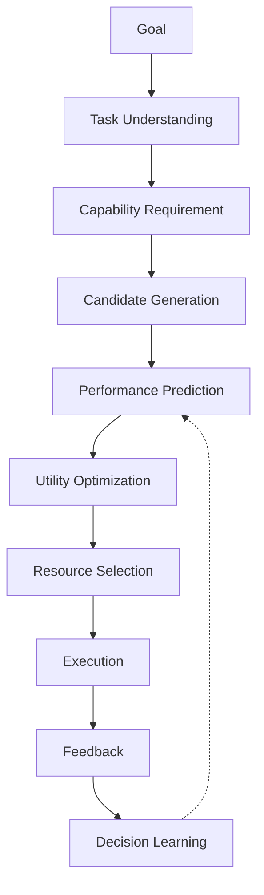
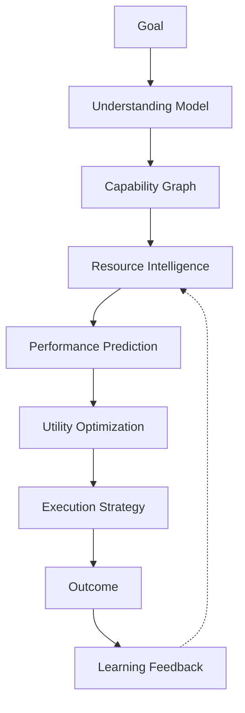

# Volume 4-A. Decision Engine Detailed Specification

- **Version:** v1.0 Draft
- **Classification:** Core Intelligence Layer
- **Status:** Technical Design Document
- **Depends on:** [Volume 4 — Decision Engine](v4-decision-engine.md)

> Volume 4가 "무엇을 선택해야 하는가"라는 개념 수준이라면, 본 문서는 **실제 구현 가능한 수준**으로 내려간다.
>
> **목표:** Intent OS가 수천 개의 AI 모델, Agent, Tool 중에서 특정 Goal에 대해 가장 높은 기대 가치를 가진 조합을 선택하는 Decision Intelligence System을 설계한다.

---

## 1. Decision Engine Definition

### 1.1 Definition

Decision Engine은 Intent OS의 중앙 의사결정 시스템이다.

```
Goal → Task → Capability Requirement → Resource Candidate
→ Prediction → Optimization → Execution Strategy
```

### 1.2 핵심 질문

Intent OS는 항상 다음 네 가지 질문에 답해야 한다.

| # | 질문 |
|---|---|
| Q1 | 이 목표를 달성하려면 어떤 **능력**이 필요한가? |
| Q2 | 현재 사용 가능한 Resource 중 누가 이 능력을 **가장 잘** 제공하는가? |
| Q3 | 최고 성능 Resource가 아니라 **최적 효율** Resource는 무엇인가? |
| Q4 | 얼마나 **확신**할 수 있는가? |

---

## 2. Decision Engine Architecture



---

## 3. Decision Engine Components

Decision Engine은 **7개의 핵심 모듈**로 구성된다.

```
Decision Engine
├── Task Intelligence Module
├── Capability Graph Engine
├── Resource Discovery Engine
├── Performance Prediction Engine
├── Utility Optimization Engine
├── Risk Management Engine
└── Decision Memory Engine
```

**본 문서가 모듈 분해의 정본이다.** 각 모듈의 명세 절은 다음과 같다.

| # | 모듈 | 절 | [Volume 4](v4-decision-engine.md) 개요 명칭 |
|---|---|---|---|
| 1 | Task Intelligence Module | §4 | Task Analyzer |
| 2 | Capability Graph Engine | §5 | Capability Mapper |
| 3 | Resource Discovery Engine | §6 | Candidate Generator |
| 4 | Performance Prediction Engine | §7 | Performance Predictor |
| 5 | Utility Optimization Engine | §8 | Optimization Engine |
| 6 | Risk Management Engine | §9 | (개요에 없음) |
| 7 | Decision Memory Engine | §15 | Decision Memory |

---

## 4. Task Intelligence Module

### 4.1 Purpose

사용자의 목표를 분석하여 Decision 가능한 형태로 변환한다.

**Input**

```
"우리 학원 겨울캠프 모집률을 올리고 싶어"
```

**Output** — Task Intelligence Module은 자체 형식을 만들지 않는다. **[Goal](entities/e001-goal.md) 1개와 [Task](entities/e005-task.md) N개**를 낸다.

<!-- validate: goal.schema.json -->
```json
{
  "goal_id": "goal_01HZX9M4Y4QF2X",
  "version": 1,
  "title": "2027 윈터캠프 학생 모집",
  "goal_type": "Outcome",
  "objective": {
    "description": "겨울캠프 등록 학생 수를 늘린다",
    "desired_state": {
      "metric": "registered_students",
      "operator": ">=",
      "target": 100,
      "unit": "students",
      "baseline": 42
    }
  },
  "constraints": { "deadline": "2026-10-04" },
  "context": { "environment": { "domain": "Education Marketing" } },
  "status": { "phase": "Structured", "progress": 0 },
  "metadata": {
    "created_by": "system",
    "created_at": "2026-08-04T09:05:00Z",
    "source": "conversation"
  }
}
```

`task_category` 3개는 각각 Task가 된다.

<!-- validate: task.schema.json -->
```json
{
  "id": "task_001",
  "goal_id": "goal_01HZX9M4Y4QF2X",
  "objective": "겨울캠프 대상 시장 조사",
  "task_type": "Research",
  "required_capabilities": [
    { "capability_id": "research.search", "min_level": "L3", "weight": 0.7 },
    { "capability_id": "research.analysis", "min_level": "L3", "weight": 0.3 }
  ],
  "dependencies": [],
  "state": "Pending"
}
```

**초안의 `"budget": "unknown"`, `"deadline": "2 months"` 표기는 폐기했다.** 전자는 제약이 아니라 미상이므로 필드를 비우고, 후자는 상대 기간이 아니라 절대 날짜(`constraints.deadline`)로 확정한다 — "2개월"은 언제 계산하느냐에 따라 값이 달라져 [Decision](entities/e009-decision.md)의 재현성을 깨뜨린다.

### 4.2 Task Classification

> Task는 단순 분류가 아니다. **다차원 Vector**로 표현한다.

```
Task = [
  Domain,
  Difficulty,
  Creativity,
  Reasoning,
  Accuracy,
  Speed,
  DataRequirement
]
```

**예시 — 광고 카피 작성**

```
[
  Marketing,
  Medium,
  High Creativity,
  Medium Reasoning,
  Medium Accuracy,
  High Speed,
  Low Data
]
```

---

## 5. Capability Graph Engine

### 5.1 Purpose

Task를 필요한 능력의 조합으로 변환한다.

```
Task: 시장 분석 보고서 작성
  ↓
Capability Graph:
  Market Research + Search + Data Analysis + Reasoning + Writing
```

### 5.2 Capability Ontology

Intent OS는 Capability를 표준화한다.

```
Intelligence
├── Language
│   ├── Writing
│   ├── Translation
│   └── Summarization
├── Reasoning
│   ├── Planning
│   ├── Logic
│   └── Strategy
├── Creation
│   ├── Image
│   ├── Video
│   └── Design
├── Technical
│   ├── Coding
│   ├── Debugging
│   └── Architecture
└── Research
    ├── Search
    ├── Analysis
    └── Verification
```

---

## 6. Resource Discovery Engine

### 6.1 Purpose

가능한 Resource 후보를 찾는다. AI Model, Agent, API, Tool, Human Expert, Database — 모두 동일한 Resource다.

### 6.2 Candidate Filtering

```
전체 Resource        10,000개
  ↓ Capability Filter    300개
  ↓ Availability Filter  100개
  ↓ Cost Filter           30개
  ↓ Prediction 대상      5~10개
```

> **중요:** 모든 AI를 실행하지 않는다.

위 숫자는 규모 예시일 뿐이다. 각 단계의 **판정 조건**은 다음과 같다.

| 단계 | 통과 조건 | 탈락 사유 |
|---|---|---|
| **F1 Capability** | Task가 요구한 모든 필수 Capability에 대해 `declared_score ≥ 60` | 필수 능력 1개라도 미보유 |
| **F2 Availability** | `lifecycle ∈ {Active, Optimized}` **AND** `availability ≥ 95%` | Deprecated·Removed·장애 중 |
| **F3 Constraint** | Goal·Session의 하드 제약을 위반하지 않음 (지역, 언어, 프라이버시 등급) | 제약 위반 |
| **F4 Cost** | `expected_cost ≤ remaining_budget` | 단독으로 예산 초과 |
| **F5 Risk Gate** | §9.4의 `Risk < 0.70` | 고위험 |

F1~F5는 **순서가 고정**이다. 비용이 싼 필터부터 적용해 뒤쪽의 비싼 계산(Prediction) 대상을 줄인다. F5는 Prediction 이전에 실행하되 Utility 계산 이전에 둔다.

### 6.3 Ranking과 Tie-break

F5까지 통과한 후보를 **Prediction 대상 K개**로 자른다.

```
K = clamp(ceil(0.1 × |통과 후보|), 3, 10)
```

자를 때의 정렬 키는 Utility가 아니다 — 아직 Prediction 전이므로 Utility를 계산할 수 없다. **사전 점수(prior score)** 로 정렬한다.

```
prior = 0.5 × capability_fit + 0.3 × context_match + 0.2 × reputation
```

| 기호 | 의미 | 범위 |
|---|---|---|
| `capability_fit` | 요구 Capability 점수의 가중 평균 ÷ 100 | 0~1 |
| `context_match` | 동일 Context(언어·도메인·대상)의 과거 성공률 | 0~1 |
| `reputation` | [4-B §15](v4b-resource-intelligence.md) Reputation ÷ 100 | 0~1 |

동점일 경우 **아래 순서대로** 비교한다. 무작위 선택은 하지 않는다 — 재현 불가능한 Decision은 [Volume 2 Constraint 2](v2-architecture.md)의 설명 가능성 요구를 위반한다.

| 순위 | Tie-break 기준 | 이유 |
|---|---|---|
| 1 | `confidence` 높은 쪽 | 근거가 많은 쪽을 신뢰 |
| 2 | `observed_score` 표본 수 많은 쪽 | 우연한 고득점 배제 |
| 3 | `expected_cost` 낮은 쪽 | 동등하면 싼 쪽 |
| 4 | `latency` 낮은 쪽 | 동등하면 빠른 쪽 |
| 5 | `resource_id` 사전순 | 최종 결정론적 확정 |

5단계까지 가면 어떤 입력에도 결과가 하나로 정해진다. Decision은 **같은 입력에 같은 출력**을 내야 한다.

---

## 7. Performance Prediction Engine

**가장 중요한 영역.**

### 7.1 목적

실행 전에 결과 품질을 예측한다.

```
Input:  Task + Resource + Context
Output: Expected Performance
```

**예시**

```
Resource: Claude
Task:     Korean Marketing Copy

Prediction:
  Quality:             93%
  Success Probability: 89%
  Confidence:          86%
```

### 7.2 Prediction Model 발전 단계

| Level | 방식 | 내용 |
|---|---|---|
| **1** | Rule Based | `IF Creative Writing THEN Increase Claude Score` |
| **2** | Historical Learning | 1000개 실행 결과 분석 → Pattern 발견 |
| **3** | Neural Decision Model | Goal + Context + Resource → Success Prediction |

시간 축으로는 `초기: Rule + Benchmark` → `중기: ML Ranking` → `장기: Meta Decision Model`.

---

## 8. Utility Optimization Engine

### 8.1 목적

최종 선택 기준 계산.

$$Utility = (Q \times W_q) + (S \times W_s) + (R \times W_r) - (C \times W_c) - (L \times W_l) - Risk$$

| 항목 | 의미 |
|---|---|
| Q | Quality |
| S | Success Probability |
| R | Reliability |
| C | Cost |
| L | Latency |
| Risk | 위험 |

**입력 정규화** — 다섯 항은 모두 0~1로 정규화한 뒤 넣는다. 단위가 다른 값을 그대로 더하면 공식이 성립하지 않는다.

| 기호 | 정규화 방법 | 0의 의미 | 1의 의미 |
|---|---|---|---|
| Q | `predicted_quality / 100` | 최악 | 최상 |
| S | 성공 확률 그대로 | 확실히 실패 | 확실히 성공 |
| R | `availability × (1 − error_rate)` | 항상 실패 | 항상 정상 |
| C | `expected_cost / remaining_budget` | 무료 | 예산 전액 소진 |
| L | `expected_latency / max_acceptable_latency` | 즉시 | 허용 한계 |

`Risk`에는 가중치를 곱하지 않는다. §9.3에서 이미 내부 가중합을 마친 0~1 값이며, 여기서 다시 가중치를 곱하면 이중 적용이 된다.

### 8.2 Dynamic Weight System

> **중요:** 가중치는 상황마다 변경된다.

가중치는 화살표가 아니라 **숫자**다. 네 개의 Weight Profile을 정의하고, 각 Profile의 다섯 가중치 합은 항상 1이다.

| Profile | W<sub>q</sub> Quality | W<sub>s</sub> Success | W<sub>r</sub> Reliability | W<sub>c</sub> Cost | W<sub>l</sub> Latency | 합 |
|---|---|---|---|---|---|---|
| **P0 Balanced** (기본) | 0.30 | 0.25 | 0.15 | 0.20 | 0.10 | 1.00 |
| **P1 Speed-critical** | 0.20 | 0.15 | 0.10 | 0.15 | **0.40** | 1.00 |
| **P2 Accuracy-critical** | **0.35** | 0.25 | **0.30** | 0.05 | 0.05 | 1.00 |
| **P3 Cost-critical** | 0.20 | 0.20 | 0.10 | **0.45** | 0.05 | 1.00 |

**Profile 선택 규칙** — 위에서부터 먼저 맞는 것 하나를 적용한다. 복수 적용하지 않는다.

| 순위 | 조건 | Profile |
|---|---|---|
| 1 | Goal 제약에 `deadline`이 24시간 이내 | P1 |
| 2 | Task가 §11 Rule 1의 High Impact에 해당 | P2 |
| 3 | Session 잔여 예산 < 예상 비용 × 3 | P3 |
| 4 | 그 외 전부 | P0 |

| 상황 | 적용 Profile |
|---|---|
| 급한 발표 준비 | P1 — Latency 가중치 0.40 |
| 법률 계약 검토 | P2 — Quality 0.35 + Reliability 0.30 |

### 8.3 계산 예시

Task `광고 카피 작성`, Profile P0, 후보 2개.

| | Q | S | R | C | L | Risk |
|---|---|---|---|---|---|---|
| Claude | 0.95 | 0.92 | 0.95 | 0.30 | 0.20 | 0.10 |
| GPT | 0.82 | 0.80 | 0.93 | 0.22 | 0.15 | 0.12 |

```
Claude = 0.30(0.95) + 0.25(0.92) + 0.15(0.95)
       − 0.20(0.30) − 0.10(0.20) − 0.10
       = 0.2850 + 0.2300 + 0.1425 − 0.0600 − 0.0200 − 0.10
       = 0.4775

GPT    = 0.30(0.82) + 0.25(0.80) + 0.15(0.93)
       − 0.20(0.22) − 0.10(0.15) − 0.12
       = 0.2460 + 0.2000 + 0.1395 − 0.0440 − 0.0150 − 0.12
       = 0.4065
```

**선택: Claude (0.478 > 0.407).** GPT가 더 싸고 빠르지만(C·L 우세) 한국어 마케팅 품질 격차를 상쇄하지 못한다 — [4-B §8](v4b-resource-intelligence.md)의 실사용 데이터와 같은 결론이다.

같은 후보를 P3(Cost-critical)로 재계산하면 이렇게 된다.

```
Claude = 0.20(0.95)+0.20(0.92)+0.10(0.95) − 0.45(0.30) − 0.05(0.20) − 0.10 = 0.2240
GPT    = 0.20(0.82)+0.20(0.80)+0.10(0.93) − 0.45(0.22) − 0.05(0.15) − 0.12 = 0.1905
```

| Profile | Claude | GPT | 격차 |
|---|---|---|---|
| P0 Balanced | 0.4775 | 0.4065 | 0.0710 |
| P3 Cost-critical | 0.2240 | 0.1905 | 0.0335 |

**순위는 뒤집히지 않고 격차만 절반 이하로 좁는다.** 품질 격차(0.95 vs 0.82)가 비용 격차(0.30 vs 0.22)보다 크기 때문이다. Profile을 바꿔도 순위가 유지된다는 것은 이 Decision이 가중치 선택에 **민감하지 않다**는 뜻이며, 그 자체가 Confidence를 높이는 근거가 된다(§13).

순위를 실제로 뒤집으려면 `C`가 예산 대비 훨씬 커져야 한다. 예컨대 Claude의 `C`가 0.30이 아니라 0.60이면 P3에서 `0.2240 − 0.45(0.30) = 0.0890`이 되어 GPT에 역전당한다.

이것이 가중치를 숫자로 고정해야 하는 이유다 — 화살표로는 "역전에 얼마가 필요한가"를 계산할 수 없다.

---

## 9. Risk Management Engine

### 9.1 목적

§8의 Utility 공식은 `Risk` 항을 포함하지만, **누가 그 값을 만드는가**는 §3 모듈 목록에만 있고 정의되지 않았다. Risk Management Engine이 그 산출 주체다.

```
Task + Candidate Resource + Context → Risk Score (0~1)
```

Risk는 Utility의 감점 항이면서 동시에 **실행 차단 게이트**다. 즉 Utility가 아무리 높아도 Risk Gate를 통과하지 못하면 선택되지 않는다.

> Decision이 참조하는 Risk의 영속 표현은 [Entity 018 — Risk](entities/e018-risk.md)다. 본 절은 Decision 시점의 **산출 방법**만 정의한다.

### 9.2 Risk 분류

| # | Risk | 질문 | 주요 입력 |
|---|---|---|---|
| R1 | **Capability Risk** | 이 Resource가 요구 능력을 못 채울 위험 | Capability Score, Confidence ([4-B §10](v4b-resource-intelligence.md)) |
| R2 | **Reliability Risk** | 실행 자체가 실패할 위험 | Resource Health, 최근 오류율 ([4-B §14](v4b-resource-intelligence.md)) |
| R3 | **Cost Risk** | 예산을 초과할 위험 | 예상 비용 분산, Session budget |
| R4 | **Compliance Risk** | 정책·법·프라이버시를 위반할 위험 | [Entity 019 — Policy](entities/e019-policy.md) 평가 결과 |
| R5 | **Irreversibility Risk** | 실패해도 되돌릴 수 없는 위험 | Task의 외부 부수효과 유무 |

### 9.3 Risk Score 산출

각 항목을 0~1로 정규화한 뒤 가중합한다.

$$Risk = \sum_i w_i \cdot r_i \quad , \quad \sum_i w_i = 1$$

| 항목 | 기본 가중치 | 산출식 |
|---|---|---|
| R1 Capability | 0.25 | `1 − (score/100 × confidence)` |
| R2 Reliability | 0.20 | `1 − (availability × (1 − error_rate))` |
| R3 Cost | 0.15 | `min(1, expected_cost / remaining_budget)` |
| R4 Compliance | 0.30 | 위반 0건 → 0 / 경고 → 0.5 / 위반 → 1.0 |
| R5 Irreversibility | 0.10 | 되돌림 가능 → 0 / 부분 가능 → 0.5 / 불가 → 1.0 |

R4의 가중치가 가장 높은 이유는 나머지 넷은 재시도로 회복되지만 **정책 위반은 재시도로 회복되지 않기 때문**이다.

### 9.4 Risk Gate

Risk Score는 Utility 계산 **이전에** 게이트를 통과해야 한다.

| Risk 구간 | 처리 |
|---|---|
| `Risk ≥ 0.70` | **후보에서 제외.** Utility를 계산하지 않는다 |
| `0.40 ≤ Risk < 0.70` | 후보 유지. §11 Rule 3(High Uncertainty) 발동 |
| `Risk < 0.40` | 정상 통과 |

`R4 Compliance = 1.0`이면 다른 항목과 무관하게 **즉시 제외**한다. 가중합이 0.70에 못 미쳐도 마찬가지다 — 정책 위반은 가중치로 상쇄되는 값이 아니다.

### 9.5 Risk와 Confidence의 구분

두 값을 섞으면 안 된다.

| | Confidence (§13) | Risk (본 절) |
|---|---|---|
| 묻는 것 | **예측이 맞을 확률** | **틀렸을 때의 피해** |
| 낮을 때 | 정보가 부족하다 | 위험하다 |
| 대응 | 탐색·다중 실행 | 차단·인간 승인 |

❌ `Confidence 0.95 → 안전하다` — 확신에 찬 고위험 결정이 가장 위험하다. 계약서 자동 발송은 Confidence가 높아도 R5가 1.0이다.

---

## 10. Multi-Resource Decision

Intent OS는 항상 하나의 AI만 쓰지 않는다.

| Case | 형태 | 예시 |
|---|---|---|
| **1. Single Resource** | Simple Task → One Model | |
| **2. Pipeline** | 순차 연결 | Research AI → Reasoning AI → Writing AI |
| **3. Collaborative Agent** | 역할 분담 | Planner Agent + Executor Agent + Reviewer Agent |

---

## 11. Multi-Agent Activation Rules

> **무조건 여러 AI 실행 금지.**

**본 절이 발동 임계값의 정본이다.** [Volume 4 §9](v4-decision-engine.md)는 본 표를 참조하며 자체 값을 갖지 않는다.

| Rule | 조건 | 판정식 | 예시 |
|---|---|---|---|
| 1 | High Impact | Risk의 `R5 Irreversibility ≥ 0.5` **또는** `R4 Compliance ≥ 0.5` (§9.2) | 투자 제안서, 법률 문서, 의료 연구 |
| 2 | Low Confidence | `Confidence < 0.70` (§13) | 신규 모델, 과거 데이터 부족 |
| 3 | High Uncertainty | `0.40 ≤ Risk < 0.70` (§9.4) **또는** 상위 2개 후보의 Utility 차이 < 0.05 | 후보 간 우열이 불분명 |

Rule 3의 두 번째 조건이 필요한 이유는 §8.3에서 보인 것과 같다. Utility 격차가 충분히 크면 가중치를 바꿔도 순위가 유지되지만, 격차가 0.05 미만이면 Profile 선택 하나로 결과가 뒤집힌다. 그때는 하나를 고르는 대신 **둘 다 실행하고 비교하는 편이 싸다.**

세 Rule은 **OR 결합**이다. 하나만 참이어도 Multi-Agent를 발동한다.

---

## 12. Prompt Compiler Integration

Decision Engine은 Resource 선택만 하지 않는다. **Prompt도 생성한다.**

```
Task → Selected Resource → Resource Optimization → Prompt Generation
```

같은 Goal(광고 카피 작성)이라도 Resource별로 Prompt가 달라진다.

| Resource | Prompt 형태 |
|---|---|
| GPT | Structured reasoning format |
| Claude | Long context creative brief |
| Gemini | Multimodal analysis format |

---

## 13. Decision Confidence System

모든 Decision은 Confidence를 가진다.

```
Selected Resource: Claude
Confidence:        91%
```

**Confidence 구성** — 네 요소의 가중합이며 0~1이다. §11 Rule 2의 `0.70` 임계값은 이 값을 가리킨다.

$$Confidence = 0.30 \cdot H + 0.25 \cdot A + 0.30 \cdot C_{sim} + 0.15 \cdot S_{stab}$$

| 기호 | 요소 | 산출 | 0의 의미 |
|---|---|---|---|
| H | Historical Data | `min(1, n_samples / 30)` | 과거 실행 0건 |
| A | Prediction Accuracy | `1 − MAE(예측, 실제)` (최근 30건) | 예측이 매번 빗나감 |
| C<sub>sim</sub> | Context Similarity | 현재 Context와 과거 표본 Context의 유사도 | 완전히 다른 상황 |
| S<sub>stab</sub> | Resource Stability | `1 − drift_magnitude` ([4-B §13](v4b-resource-intelligence.md)) | 성능이 계속 흔들림 |

`H`의 분모 30은 [4-B §10](v4b-resource-intelligence.md)의 Capability Confidence와 같은 기준이다. 표본 30건 미만이면 Confidence가 구조적으로 0.70을 넘기 어렵고, 그 결과 신규 Resource는 자동으로 §11 Rule 2에 걸려 Multi-Agent 검증을 거친다. **이것은 부작용이 아니라 의도된 설계다** — Cold Start([4-B §11](v4b-resource-intelligence.md))가 안전하게 동작하는 이유가 여기에 있다.

---

## 14. Decision Failure Handling

| Case | 상황 | 처리 |
|---|---|---|
| **1. 예측 실패** | Prediction 90% → Actual 50% | Feedback → Model Update → Score Adjustment |
| **2. Resource 가용성** | Selected AI unavailable | Fallback Resource |
| **3. User Reject** | 결과 불만족 | Preference Update |

---

## 15. Decision Memory Structure

<!-- validate: none -->
```json
{
  "goal_pattern": "education marketing",
  "task": "advertisement copy",
  "selected_resource": "Claude",
  "prediction": 0.91,
  "actual_result": 0.95,
  "learning_signal": "positive"
}
```

---

## 16. Decision Evolution

| 시점 | 기반 |
|---|---|
| Day 1 | Benchmark |
| Month 3 | User Data |
| Year 1 | Self Optimizing Decision Model |

---

## 17. Ultimate Architecture



---

## 18. 핵심 차별점

| | 접근 |
|---|---|
| 기존 AI Aggregator | 여러 AI를 한 화면에서 사용 |
| **Intent OS** | **AI 선택 문제 자체를 제거** |

| | 질문 |
|---|---|
| 기존 | "어떤 AI가 좋아?" |
| **Intent OS** | **"목표가 무엇인가?"** |

---

## Volume 4-A Completion Criteria

각 항목은 **근거 절**을 명시한다. 근거 없는 체크는 인정하지 않는다.

| 항목 | 근거 | 판정 |
|---|---|---|
| Decision Architecture 상세화 | §3 (7개 모듈 전부 절 배정) | ✅ |
| Task 분석 구조 정의 | §4 | ✅ |
| Capability Graph 정의 | §5 | ✅ |
| Resource Selection 알고리즘 정의 | §6.2 필터 조건 · §6.3 정렬·Tie-break 5단계 | ✅ |
| Utility Optimization 정의 | §8.1 정규화 · §8.2 Weight Profile 4종 · §8.3 계산 예시 | ✅ |
| Risk 산출 구조 정의 | §9 | ✅ |
| Multi-Agent 조건 정의 | §11 (임계값 정본) | ✅ |
| Prompt Compiler 연결 정의 | §12 | ⚠️ 부분 — Resource별 Prompt 형태만 있고 컴파일 규칙 미정의 |
| Decision Confidence 정의 | §13 | ✅ |
| Learning Feedback 구조 정의 | §15, §16 · 갱신식 [Volume 5 §8.1](v5-learning-engine.md) | ✅ |

**미해결 1건(Prompt Compiler)은 Open Issue로 남긴다.** 체크 표시로 덮지 않는다.

**다음:** [Volume 4-B — Resource Intelligence](v4b-resource-intelligence.md)
