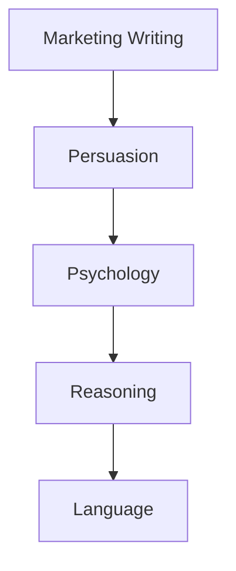
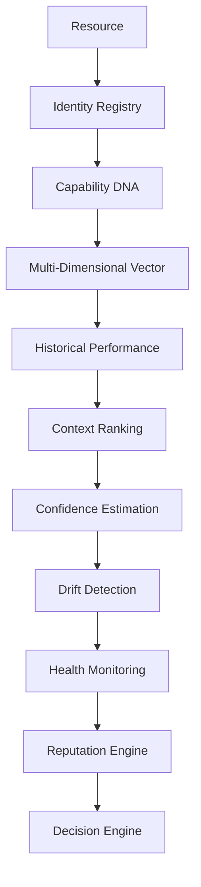

# Volume 4-B. Resource Intelligence Specification

- **Version:** v1.0 Draft
- **Classification:** Resource Intelligence Layer
- **Status:** Core Architecture
- **Depends on:** [Volume 4-A — Decision Engine Detail](v4a-decision-engine-detail.md)

> **핵심 질문:** AI를 어떻게 **객관적으로 이해하고 평가**할 것인가?
>
> 이것이 없으면 Intent OS는 결국 사람 손으로 "GPT는 코딩 잘함", "Claude는 글쓰기 잘함" 같은 룰을 적어놓는 수준에서 끝난다. 반대로 이것만 제대로 만들면 **AI가 1000개가 되어도 사람이 관리할 필요가 없어진다.**

---

## 1. Introduction

### 1.1 Purpose

Resource Intelligence는 모든 AI Model, Agent, Tool, API를 **실시간으로 이해하고 평가하는 시스템**이다. Decision Engine은 Resource Intelligence를 기반으로만 선택한다.

```
Decision Engine      = Brain
Resource Intelligence = Eyes
```

눈이 없으면 아무리 좋은 두뇌도 올바른 선택을 못 한다.

---

## 2. Core Philosophy

| | 방식 |
|---|---|
| 기존 AI 서비스 | `GPT = 코딩 잘함`, `Claude = 글쓰기 잘함` — 사람이 만든 규칙 |
| **Intent OS** | 모든 Resource는 **측정되고, 평가되고, 계속 업데이트된다** |

---

## 3. Resource Identity

모든 Resource는 하나의 객체다.

```json
{
  "resource_id": "openai:gpt-5.5",
  "provider": "OpenAI",
  "type": "LLM",
  "version": "5.5",
  "status": "active"
}
```

**Resource 종류:** LLM, Image Model, Video Model, Search Engine, Browser, Database, Code Executor, API, Human Expert, Agent

---

## 4. Capability DNA

**이 부분이 핵심이다.**

사람에게 IQ가 있는 것처럼, AI는 **Capability Vector**를 가진다.

```json
{
  "writing": 94,
  "reasoning": 91,
  "coding": 87,
  "math": 83,
  "translation": 95,
  "planning": 89,
  "multimodal": 78
}
```

하지만 이것만으로는 부족하다.

---

## 5. Multi-Dimensional Capability Vector

Capability는 하나의 점수가 아니다. 예를 들어 Writing은 다음과 같이 세분화된다.

```
Writing
├── Marketing
├── Technical
├── Academic
├── Creative
├── Korean
├── English
├── Long-form
└── Short-form
```

즉 `writing: 94`가 아니라:

```json
{
  "writing": {
    "marketing": 96,
    "technical": 85,
    "academic": 81,
    "creative": 95,
    "korean": 97,
    "english": 91
  }
}
```

---

## 6. Capability Ontology

Capability는 트리 구조가 아니라 **Graph**다.



하나의 Task는 Capability Graph를 탐색한다.

---

## 7. Resource Profile

모든 Resource는 Capability 외에도 여러 특성을 가진다.

```json
{
  "quality": 93,
  "cost": 70,
  "latency": 92,
  "reliability": 95,
  "privacy": 98,
  "context_window": 95,
  "tool_use": 88,
  "reasoning_depth": 90
}
```

---

## 8. Benchmark vs Real World

**가장 중요한 설계.** Intent OS는 Benchmark보다 **실사용 데이터를 더 신뢰한다.**

| | GPT | Claude |
|---|---|---|
| 벤치마크 | 95점 | — |
| 실제 사용자 (한국 교육 마케팅) | 78% | **92%** |

→ Intent OS는 **Claude를 선택한다.**

```
Benchmark < Production Data
```

---

## 9. Context-Aware Ranking

> **절대 순위는 없다.** AI마다 Context별 순위를 가진다.

```
Task → Korean Marketing → Education → Parents → Winter Camp
```

이 Context에서 Claude는 94점. 반면 `Medical Research`에서는 다른 모델이 1위일 수 있다.

---

## 10. Capability Confidence

Capability Score에는 **신뢰도**가 있다.

| | Score | Confidence |
|---|---|---|
| 검증된 모델 | coding 95 | 0.98 |
| 새로운 모델 | coding 95 | **0.21** |

> Intent OS는 Score보다 **Confidence를 더 중요하게 본다.**

---

## 11. Cold Start Strategy

새 모델(예: GPT-X) 등장. Intent OS는 모른다.

| Step | 내용 |
|---|---|
| 1 | 공식 Metadata 수집 |
| 2 | Capability 추정 |
| 3 | 저위험 Task에서 테스트 |
| 4 | 실사용 데이터 축적 |
| 5 | Confidence 증가 |

---

## 12. Resource Evolution Timeline

Resource는 시간이 지나며 변한다. Intent OS는 **버전마다 Capability를 저장한다.**

```
Claude 4.0 — Writing 91
    ↓
Claude 4.1 — Writing 96
    ↓
Decision 자동 변경
```

---

## 13. Drift Detection

> **중요:** AI 모델은 업데이트 이후 성능이 **떨어질 수도** 있다.

Intent OS는 항상 `Expected` vs `Actual`을 비교한다.

```
Expected: 94
Actual:   82
  ↓
Drift 발생 → Ranking 하락
```

---

## 14. Resource Health Monitoring

모든 Resource는 Health를 가진다.

```json
{
  "availability": 99.9,
  "api_error": 0.2,
  "timeout": 0.3,
  "latency_ms": 800
}
```

Health가 낮으면 선택 우선순위 감소.

---

## 15. Resource Reputation

```
Reputation = Long-term Success + Reliability
           + User Satisfaction + Consistency
```

| Resource | Reputation |
|---|---|
| Claude | 94 |
| GPT | 89 |

---

## 16. Resource Relationship Graph

AI들은 서로 관계를 가진다.

| Resource | 잘하는 것 | 못하는 것 |
|---|---|---|
| GPT | Coding | Long Writing |
| Claude | Writing, Planning | |
| Gemini | Search, Vision | |

Decision Engine은 이 Graph를 탐색한다.

---

## 17. Composite Capability

Task 하나에 AI 하나만 쓰지 않는다.

```
Research → Perplexity
Reasoning → GPT
Writing → Claude
```

이 **조합 자체도 하나의 Composite Resource로 학습한다.**

---

## 18. Capability Decay

오래된 데이터는 신뢰도를 낮춘다.

| 시점 | Weight |
|---|---|
| 6개월 전 | 0.3 |
| 오늘 | 1.0 |

---

## 19. Global Resource Intelligence Network

장기적으로 Intent OS는 모든 사용자의 익명 데이터를 통해 **전 세계 Resource Map**을 만든다.

```
Education → Claude 우세
Coding    → GPT 우세
Image     → Model X 우세
```

단, 개인 데이터는 공유하지 않고 **익명화된 성능 통계와 패턴만** 집계한다.

---

## 20. Ultimate Resource Intelligence Architecture



---

## Appendix — 향후 확장 제안

> 아래는 **확정 명세가 아닌 설계 제안**이다. 기존 AI 라우터와 차별화하려면 세 가지가 추가되어야 한다.

### ① Capability DNA → Capability Embedding

현재는 Capability를 사람이 정의한 항목(코딩, 글쓰기 등)으로 표현한다. 장기적으로는 Task와 Resource를 **같은 벡터 공간(Embedding Space)** 에 매핑해야 한다.

- Task도 벡터
- Resource도 벡터

두 벡터의 유사도를 기반으로 후보를 찾는 구조가 확장성이 높다.

### ② Outcome Graph

성공 여부만 저장하는 것이 아니라, *"어떤 조건에서 어떤 Resource 조합이 어떤 결과를 냈는가"* 를 그래프로 저장한다.

```
교육 마케팅 → 한국어 → 부모 타깃 → Claude + Search → 상담 전환율 +18%
```

이 그래프가 쌓일수록 Intent OS는 특정 모델이 아니라 **전략 자체**를 학습하게 된다.

### ③ Resource Genome

AI를 이름(OpenAI, Claude, Gemini)으로 인식하는 것이 아니라 **행동 특성(Behavioral Genome)** 으로 표현한다.

```
Reasoning Style / Creativity Style / Risk Tolerance
Instruction Following / Tool Dependency / Context Retention
```

새로운 모델이 나와도 이름이 아니라 "유전자"를 보고 기존 모델과 비슷한 성향을 즉시 추론할 수 있다.

→ 이 제안은 [Volume 4-C](v4c-resource-genome.md)에서 본격적으로 설계된다.

---

**다음:** [Volume 4-C — Resource Genome & Meta Prediction Engine](v4c-resource-genome.md)
