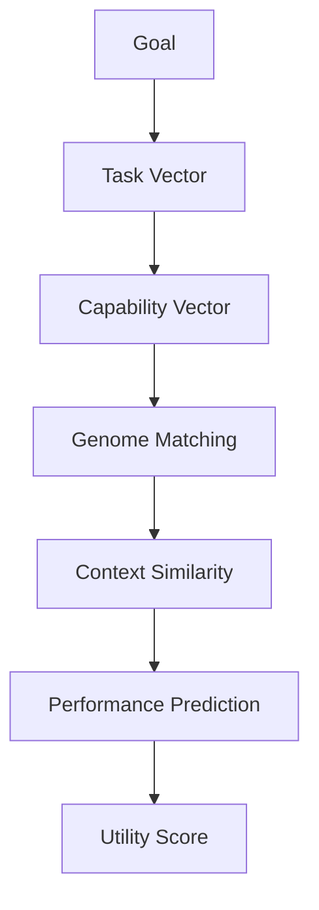
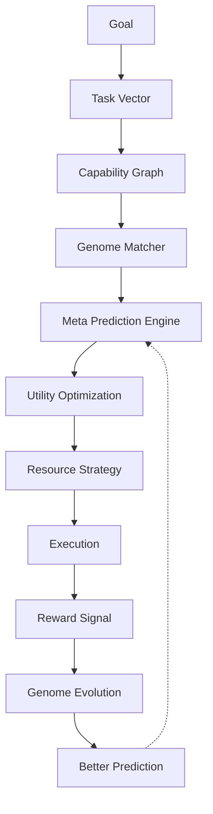

# Volume 4-C. Resource Genome & Meta Prediction Engine

- **Version:** v1.0 Draft
- **Classification:** Core Intelligence Layer
- **Status:** Proprietary Algorithm Design
- **Depends on:** [Volume 4-B — Resource Intelligence](v4b-resource-intelligence.md)

> Volume 1~7이 시스템 설계라면, 본 문서는 **Intent OS만의 독창성이 생기는 부분**이다.

---

## 1. Why Resource Genome?

지금 AI를 분류하는 방식은 **이름(Name) 기반**이다. (GPT-5.5, Claude, Gemini, Grok, DeepSeek)

하지만 Intent OS 입장에서 이름은 중요하지 않다. 중요한 것은 **행동(Behavior)** 이다.

사람을 "김철수"라고 기억하는 것이 아니라 `논리적 / 창의적 / 빠름 / 보수적 / 긴 글 잘 씀`으로 기억하는 것과 같다.

---

## 2. Genome Philosophy

Resource Genome은 AI가 **무엇인지**가 아니라 AI가 **어떻게 행동하는지**를 표현한다.

```
Model → Behavior → Prediction → Decision
```

---

## 3. Resource Genome

모든 Resource는 Genome을 가진다.

```
Resource Genome
├── Cognitive Genome
├── Linguistic Genome
├── Creative Genome
├── Reliability Genome
├── Execution Genome
├── Tool Genome
├── Learning Genome
└── Economic Genome
```

---

## 4. Cognitive Genome

AI의 사고 방식.

**항목:** Logical, Analytical, Reflective, Planning, Abstraction, Mathematical, Deductive, Inductive

```json
{
  "logical": 95,
  "planning": 90,
  "mathematical": 88,
  "creative_reasoning": 72
}
```

---

## 5. Linguistic Genome

언어 특성.

**항목:** Writing Style, Tone, Compression, Expansion, Instruction Following, Localization, Long Context

| Resource | 특성 |
|---|---|
| Claude | 긴 글, 맥락 유지 높음 |
| GPT | 짧고 명확, 구조화 높음 |

---

## 6. Creative Genome

**항목:** Originality, Novelty, Risk Taking, Storytelling, Visual Thinking, Divergence

---

## 7. Reliability Genome

**항목:** Consistency, Hallucination Rate, Fact Following, Stability, Determinism

---

## 8. Economic Genome

AI마다 경제성이 다르다.

**항목:** Input Cost, Output Cost, Latency, Availability, Rate Limit, Throughput

---

## 9. Behavioral Genome

**가장 중요하다.** AI의 실제 행동을 기록한다.

**예시 — 질문이 애매할 때**

| Resource | 행동 |
|---|---|
| GPT | 추측해서 답변 |
| Claude | 질문을 다시 물음 |
| Gemini | 검색 수행 |

이런 행동 차이가 Genome이다.

---

## 10. Genome Extraction Engine

> Genome은 사람이 입력하지 않는다. **Intent OS가 추론한다.**

```
Execution → Observation → Feature Extraction → Genome Update
```

1000번 실행하며 다음을 관찰한다.

```
Prompt → Response → Latency → Tool Usage → Feedback
  ↓
Genome 변경
```

---

## 11. Genome Mutation

새 버전 출시 시 Genome이 변이한다.

```
Claude 5 — Writing 91 → 96
  ↓
Genome Mutation 기록: v4 → v4.1 → v5
```

---

## 12. Genome Similarity

새 AI(Model X) 등장 → Genome 계산

```
Claude와 91% 유사
  ↓
Decision Engine이 초기부터 Claude와 비슷하게 사용
```

---

## 13. Meta Prediction Engine

**여기부터가 핵심.** Prediction은 "어떤 AI가 좋을까?"를 예측하는 모델이다.

```
Input:  Goal + Task + Context + Genome
Output: Expected Success / Quality / Cost / Risk
```

---

## 14. Prediction Pipeline



---

## 15. Context Similarity

**현재 Task**

```
한국 / 교육 / 마케팅 / 부모 / 윈터스쿨
```

**과거 DB 탐색**

```
교육 / 입시 / 상담 / 홍보
```

유사도 95% → Prediction 정확도 증가.

---

## 16. Few-Shot Resource Evaluation

새 AI가 나왔을 때:

| | 방식 |
|---|---|
| 기존 | 1000개 테스트 |
| **Intent OS** | Genome 분석 → 대표 Task 20개만 실행 → Genome 보정 → Prediction 완료 |

**적은 실행으로도 성향을 빠르게 추정한다.**

---

## 17. Meta Learning

Prediction Engine도 학습한다.

```
Prediction → Execution → Outcome → Prediction Error → Model Update
```

Prediction 자체가 점점 좋아진다.

---

## 18. Strategy Genome

AI는 혼자 쓰는 것보다 **조합이 더 중요하다.**

```
Research → Search AI → Reasoning AI → Writing AI
```

이 Pipeline 자체를 Genome으로 저장한다.

```
Strategy Genome
  Research → Perplexity → GPT → Claude
  Success: 94%
```

이후에는 모델이 아니라 **전략 자체를 재사용한다.**

---

## 19. Meta Reinforcement Learning

Decision Engine은 보상을 받는다.

```
Task → Decision → Outcome → Reward → Policy Update
```

**Reward 구성:** 품질 + 사용자 만족도 + 비용 절감 + 속도

Decision Policy는 Reward를 최대화하도록 변화한다.

---

## 20. Self-Evolving Intelligence Network



---

## Appendix A — 후속 문서

> 아래 세 문서는 제안 단계를 거쳐 **실제로 작성되었다.**
>
> 현재 Intent OS는 "어떤 AI를 선택할 것인가"에는 강하다. 하지만 경쟁 우위를 만들려면 선택을 넘어 **AI를 발견하고, 실험하고, 검증하는 자동 연구 시스템**이 필요하다.

### [Volume 4-D — Autonomous Benchmarking Engine](v4d-autonomous-benchmarking.md)

Intent OS가 스스로 새로운 모델을 발견하고, 대표 태스크를 자동 생성해 성능을 측정하며, 결과를 Resource Intelligence에 반영하는 시스템.

### [Volume 4-E — Strategy Graph Engine](v4e-strategy-graph.md)

"Claude 사용"이 아니라 "검색 → 추론 → 작성 → 검토" 같은 **워크플로우 자체**를 학습하고 재사용하는 엔진. 장기적으로 개별 모델보다 더 큰 경쟁력이 될 수 있다.

### [Volume 4-F — World Model Engine](v4f-world-model.md)

사용자의 목표 / 비즈니스 도메인 / 시장 상황 / 사용 가능한 도구 / AI의 특성을 하나의 지식 그래프로 연결하는 상위 추론 계층.

---

## Appendix B — 미해결 설계 질문

> 현재 문서는 훌륭한 시스템 설계이지만 아직 **"연구 계획"에 가깝다.** 실제 제품을 만들려면 문서보다 **알고리즘과 데이터 구조**가 더 중요해진다.

다음 질문에 답해야 비로소 "구현 가능한 Intent OS"가 된다.

- [ ] Genome을 어떤 수학적 표현(벡터, 그래프, 확률분포)으로 저장할 것인가?
- [ ] Prediction 모델은 어떤 입력 피처를 사용하고 어떤 모델(XGBoost, Transformer, GNN 등)을 사용할 것인가?
- [ ] Reward 함수는 어떻게 정의할 것인가?
- [ ] Exploration 비율은 어떤 정책으로 조정할 것인가?

이 단계가 이 프로젝트의 진짜 핵심이며, 특허나 논문으로 이어질 가능성이 가장 높은 영역이다.
