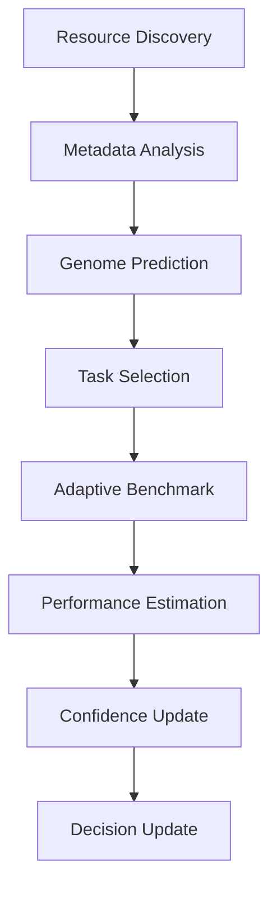
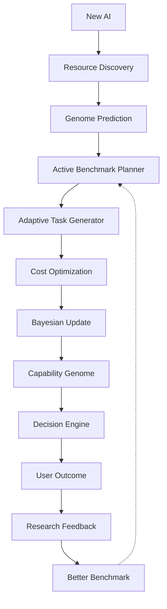

# Volume 4-D. Autonomous Benchmarking Engine

- **Version:** v1.0 Draft
- **Classification:** Autonomous Research Layer
- **Status:** Proprietary Algorithm Design
- **Depends on:** [Volume 4-C — Resource Genome](v4c-resource-genome.md)

> 본 문서는 Intent OS가 **스스로 AI를 연구하는 시스템(AI Researcher)** 을 설계한다.
>
> 향후 수백~수천 개의 모델이 등장할 때 사람이 전부 테스트하는 것은 불가능하다. Intent OS가 스스로 연구원이 되어야 한다.

---

## 1. Vision

| | 흐름 |
|---|---|
| 기존 | 새 AI 등장 → 사람이 벤치마크 → 리뷰 작성 → 몇 주 후 순위 반영 |
| **Intent OS** | 새 AI 감지 → 자동 분석 → 자동 실험 → 자동 학습 → **Decision Engine 즉시 업데이트** |

---

## 2. Purpose

Autonomous Benchmarking Engine(ABE)의 목적:

> **새로운 Resource를 최소 비용으로, 최대 신뢰도로 자동 평가하는 것**

중요한 점: 절대로 `1000개의 테스트 실행`을 하지 않는다. 그건 토큰 낭비다.

---

## 3. Core Principles

### Principle 1 — Benchmark는 "시험"이 아니다

Benchmark는 **의사결정에 필요한 정보만 얻는 과정**이다.

### Principle 2 — 모든 Capability를 측정하지 않는다

현재 필요한 Capability만 측정한다. 교육 마케팅 사용자가 많다면 코딩 Benchmark는 나중에 해도 된다.

### Principle 3 — Information Gain Maximization

가장 많은 정보를 주는 테스트만 실행한다.

---

## 4. Benchmark Pipeline



---

## 5. Resource Discovery Engine

새로운 Resource 발견 (GPT-6, Claude 6, Gemini Ultra, DeepSeek X, Local Model 등)

**발견 경로:** Provider API, Registry, 사용자 추가, Plugin Marketplace, Community Feed

---

## 6. Metadata Analyzer

실행 전에 최대한 많은 정보를 수집한다.

<!-- validate: none -->
```json
{
  "context_window": 1000000,
  "tool_use": true,
  "reasoning_model": true,
  "vision": true,
  "price": 0.002,
  "provider": "..."
}
```

실행 없이도 Genome 일부를 초기화한다.

---

## 7. Genome Prior Estimation

새 AI를 기존 Genome Space에 투영한다.

```
새 모델 → Claude와 92% 유사 → 초기 Genome 생성
```

이것이 **사전 확률(Prior)** 이다.

---

## 8. Active Task Selection

**여기부터 핵심.**

| | Task 수 |
|---|---|
| 기존 | 1000개 |
| **Intent OS** | **20개 Representative Task** |

**선택 기준:** Information Gain, Capability Coverage, Domain Diversity, Cost

**대표 Task 예시**

```
Creative Writing / Reasoning / Coding / Planning / Search
Vision / Math / Translation / Tool Use / Long Context
```

---

## 9. Adaptive Benchmark

> **시험은 고정되어 있지 않다.**

| Capability | Confidence | 조치 |
|---|---|---|
| Coding | 95% | 더 이상 테스트 안 함 |
| Vision | 20% | Vision Task 추가 |

```
Confidence ↓  →  Benchmark ↑
```

---

## 10. Bayesian Capability Update

Capability는 고정 점수가 아니다. 새 데이터가 들어올 때마다 갱신된다.

```
초기 85 → 성공 87 → 성공 89 → 실패 88
```

즉 **베이지안 업데이트**처럼 신뢰도를 점진적으로 수정한다.

---

## 11. Information Gain Optimizer

**가장 중요한 알고리즘.**

> "다음 테스트 하나를 실행한다면 어떤 테스트가 가장 가치 있는가?"

| Capability | Confidence | 테스트 가치 |
|---|---|---|
| Writing | 97% | 낮음 |
| Planning | 22% | **높음** |

---

## 12. Cost-Aware Benchmark

Benchmark에도 예산이 있다. (예: Daily Budget $20)

$$\text{Maximize} \quad \frac{\text{Information Gain}}{\text{Cost}}$$

---

## 13. Multi-Armed Bandit Strategy

AI 선택 문제는 전형적인 **Bandit 문제**다. Intent OS는 탐험(Exploration)과 활용(Exploitation)의 균형을 유지한다.

```
90%  Known Best
10%  Exploration
```

Confidence가 낮을수록 탐험 증가.

---

## 14. Continuous Benchmark

Benchmark는 한 번 하고 끝나는 것이 아니다.

```
Model Update → Re-test → Genome Update
```

자동 반복.

---

## 15. Drift Detection

```
Expected: 95
Actual:   82
  ↓ Drift 발생
```

**원인:** 모델 업데이트, API 변경, 가격 변경, 응답 품질 저하 → 자동 재평가.

---

## 16. Shadow Evaluation

**매우 중요한 개념.**

사용자에게는 기존 AI 결과만 제공하고, 동시에 백그라운드에서 새 AI도 같은 Task를 수행한다. 결과는 버리고 **학습만 한다.**

| 경로 | 흐름 |
|---|---|
| Production | User → Claude |
| Shadow | GPT-X → Benchmark Only |

사용자는 이를 인지하지 않는다.

---

## 17. Challenge Benchmark

AI끼리 경쟁도 가능하다. 같은 Goal을 GPT / Claude / Gemini / Model X에 주고 자동 비교.

> 단, 이 방식은 비용이 많이 들기 때문에 **모든 요청에 적용하는 것이 아니라, 전략적으로 선택된 소수의 평가 작업에만** 사용한다.

---

## 18. Domain Benchmark Generator

Benchmark를 사람이 만들지 않는다. Intent OS가 자동 생성한다.

```
Education → 새 Benchmark 생성
Marketing → 새 Benchmark 생성
Medicine  → 새 Benchmark 생성
```

도메인이 계속 성장한다.

---

## 19. Benchmark Knowledge Graph

모든 결과를 저장한다.

```
Task → Genome → Resource → Performance → Outcome
  ↓
Knowledge Graph
```

---

## 20. Benchmark Confidence Engine

Confidence 계산 요소: 테스트 수, 최근성, 다양성, 실제 사용자 결과, 도메인 범위

---

## 21. Autonomous Research Loop

```
New Resource → Metadata → Genome Prediction
→ Representative Tasks → Adaptive Benchmark → Capability Update
→ Decision Engine → Real User Outcome → Benchmark Refinement
```

---

## 22. Meta-Benchmark Learning

Intent OS는 Benchmark 자체도 학습한다.

| Task | Information Gain | 조치 |
|---|---|---|
| A | 낮음 | 제거 |
| B | 높음 | 유지 |

**Benchmark 자체가 진화한다.**

---

## 23. Self-Improving Research System



---

## Appendix — 향후 확장 제안

> 아래는 **확정 명세가 아닌 설계 제안**이다.

### ① Causal Benchmarking

현재는 "이 모델이 잘했다"를 기록한다. 하지만 실제로는 **왜 잘했는지**를 알아야 한다. 성능 향상의 원인이

- 더 긴 Context Window 때문인지
- Tool Calling 때문인지
- 추론 능력 때문인지

를 인과적으로 분리해야, 새로운 모델이 등장했을 때 성능을 더 정확히 예측할 수 있다.

### ② Benchmark Distillation

모든 테스트 결과를 그대로 저장하는 대신, 결과를 압축해 **대표 패턴**만 남긴다.

```
1,000개의 코딩 테스트
  ↓
"이 모델은 재귀 문제보다 비동기 문제에서 강함"
```

사람이 이해할 수 있는 지식으로 요약한다.

### ③ Simulation Before Execution

장기적으로는 실제 API를 호출하기 전에 **Genome과 과거 데이터를 이용해 가상 실행(Simulation)** 을 먼저 수행한다. 예측 신뢰도가 충분히 높으면 실제 테스트를 생략할 수도 있다.

---

## 기술적 중요도 정리

| 순위 | 문서 | 역할 |
|---|---|---|
| 1 | [4-A Decision Engine](v4a-decision-engine-detail.md) | Intent OS의 **두뇌** |
| 2 | [4-B Resource Intelligence](v4b-resource-intelligence.md) | Intent OS의 **감각 기관** |
| 3 | [4-C Resource Genome](v4c-resource-genome.md) | Intent OS의 **인지 모델** |
| 4 | **4-D Autonomous Benchmarking** | Intent OS의 **연구소** |

이 네 가지가 결합되면 Intent OS는 단순한 AI 라우터가 아니라 **스스로 AI 생태계를 관찰하고, 학습하고, 최적화하는 시스템**이 된다.

---

## Volume 4-D Completion Criteria

| 항목 | 근거 | 판정 |
|---|---|---|
| 자동 벤치마킹 목적·원칙 정의 | §1~§3 | ✅ |
| Benchmark Pipeline 정의 | §4 | ✅ |
| Resource 발견·메타데이터 분석 정의 | §5, §6 | ✅ |
| Task 선택 전략 정의 | §8, §11 (Active Selection / Information Gain) | ⚠️ 부분 — 선택 기준만. Gain 산출식 미정의 |
| Capability 갱신 방식 정의 | §10 Bayesian Update | ⚠️ 부분 — 사전분포·갱신식 미정의. 점수 갱신의 운용 정본은 [Volume 5 §8.1](v5-learning-engine.md) |
| 비용 통제 정의 | §12 | ✅ |
| 탐색 전략 정의 | §13 Multi-Armed Bandit | ⚠️ 부분 — 정책 선택은 [4-C Appendix B](v4c-resource-genome.md) Open Issue |
| 지속 벤치마크·Drift 정의 | §14, §15 | ⚠️ 부분 — [4-B §13](v4b-resource-intelligence.md)과 마찬가지로 임계값 미정의 |
| Shadow Evaluation 정의 | §16 | ✅ |
| Benchmark 지식 축적 정의 | §19, §22 | ⚠️ 부분 |


---

**다음:** [Volume 4-E — Strategy Graph Engine](v4e-strategy-graph.md)
