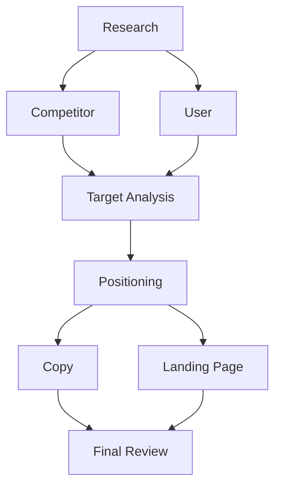
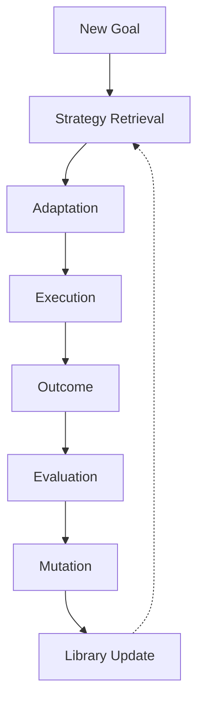

# Volume 4-E. Strategy Graph Engine

- **Version:** v1.0 Draft
- **Classification:** Strategic Intelligence Layer
- **Status:** Long-term Research Specification
- **Depends on:** [Volume 4-D — Autonomous Benchmarking](v4d-autonomous-benchmarking.md)

> ⚠️ **문서 성격 주의**
>
> 4-A~4-D는 비교적 현실적인 연구 방향이다. 검색, 추천 시스템, AutoML, Bandit, Bayesian Optimization 같은 기존 연구를 조합해 구현할 수 있다.
>
> 반면 **4-E부터는 기존 연구가 거의 없는 영역**이다. 설계자의 가설이 많이 포함되어 있다. 본 문서는 "구현 계획"이 아니라 **장기 연구 비전**으로 읽어야 한다.

---

## 1. Problem Statement

현재 대부분의 AI 시스템은 이렇게 생각한다.

```
Task → Best Model → Result
```

하지만 현실에서 좋은 결과는 **모델 하나**가 아니라 **작업 전략(Workflow)** 에 의해 결정되는 경우가 많다.

사용자가 *"우리 학원 겨울특강 모집을 늘리는 마케팅 전략을 만들어줘"* 라고 요청했다고 하자. 사람은 머릿속으로 이렇게 일한다.

```
시장 조사 → 경쟁사 분석 → 타깃 정의 → 광고 전략 → 카피 작성 → 검토
```

> 즉, 문제를 푸는 단위는 AI가 아니라 **전략(Strategy)** 이다.

---

## 2. Vision

Intent OS는 모델을 기억하지 않는다. **성공한 전략**을 기억한다.

```
Goal → Strategy → Resources → Outcome
```

---

## 3. Strategy Object

Intent OS 내부에서 Strategy는 하나의 객체다.

```json
{
  "strategy_id": "marketing.education.v12",
  "goal": "Increase Enrollment",
  "workflow": [
    "research",
    "analysis",
    "planning",
    "copywriting",
    "review"
  ]
}
```

---

## 4. Strategy Graph

Strategy는 선형이 아니라 **그래프**다.



---

## 5. Node Types

```
Goal Node / Task Node / Decision Node / Human Node
AI Node / Tool Node / Memory Node / Evaluation Node
```

---

## 6. Edge Types

노드 간 연결도 의미를 가진다.

```
Depends On / Produces / Reviews / Improves / Requires / Verifies
```

---

## 7. Strategy Library

Intent OS는 성공한 Strategy를 라이브러리화한다.

| Domain | Strategy | 결과 |
|---|---|---|
| Education Marketing | Strategy #17 | Conversion +22% |
| Code Migration | Strategy #5 | Failure Rate −31% |

---

## 8. Strategy Retrieval

새 Goal이 들어오면 Intent OS는 **모델을 찾는 것이 아니라 먼저 Strategy를 찾는다.**

```
Goal → Embedding → Nearest Strategies → Reuse
```

---

## 9. Strategy Adaptation

같은 전략도 상황에 맞게 수정된다.

```
원래: B2B SaaS
  ↓
새 목표: Art Academy
  ↓
Target만 변경, 전체 전략은 유지
```

---

## 10. Resource Assignment

**Strategy는 Resource와 분리된다.**

```
Strategy → Task1 → Research
              ↓
        오늘: Perplexity
        내일: GPT-X
        5년 후: 새 AI

        ← Strategy는 그대로
```

---

## 11. Strategy Mutation

전략도 진화한다.

```
기존:  Research → Writing → Review
신규:  Research → Planning → Writing → Review   (더 높은 성과)
  ↓
새 Strategy 생성
```

---

## 12. Strategy Crossover

두 전략을 교배한다.

```
Marketing Strategy + Research Strategy → 새로운 Strategy
```

이 개념은 **유전 알고리즘(Genetic Algorithm)** 에서 영감을 얻은 것으로, 실제 구현 시에는 탐색 비용과 품질 검증이 중요한 연구 과제가 된다.

---

## 13. Strategy Scoring

전략은 점수를 가진다.

```
Success / Cost / Latency / Generality / Reliability / Learning Value
```

---

## 14. Strategy Embedding

전략도 Embedding으로 표현한다.

```
Strategy → Vector → Similarity Search
```

---

## 15. Strategy Replay

성공한 전략은 재실행 가능하다.

```
Marketing Strategy → Replay → 새 고객
```

---

## 16. Strategy Compression

비슷한 전략은 합친다.

```
1000개의 전략 → 120개의 대표 전략
```

---

## 17. Strategy Discovery

Intent OS는 새 전략도 만든다.

```
기존:      A → B → C
발견:      A → C        (더 좋음)
  ↓
Strategy 등록
```

---

## 18. Multi-Agent Strategy

Strategy 하나 안에도 여러 Agent가 있다.

```
Planner → Researcher → Writer → Reviewer → QA
```

---

## 19. Strategy Knowledge Graph

```
Goal → Strategy → Tasks → Capabilities → Resources → Outcomes → Learning
```

---

## 20. Self-Evolving Strategy Network



---

## Appendix — 향후 확장 제안

> 아래는 **확정 명세가 아닌 설계 제안**이다. 실제 제품으로 만들려면 다음 세 가지가 반드시 추가되어야 한다.

### ① Strategy DSL (Domain-Specific Language)

전략을 사람이 읽을 수 있는 자연어와, 시스템이 실행할 수 있는 형식으로 동시에 표현해야 한다.

```yaml
goal: increase_enrollment

steps:
  - research_competitors
  - identify_target
  - generate_campaign
  - review_copy
```

이런 DSL이 있어야 전략을 버전 관리하고 공유할 수 있다.

### ② Strategy Marketplace

개발자와 기업이 자신들의 전략을 공유하거나 판매할 수 있다.

- "스타트업 투자 피치 전략"
- "SEO 블로그 제작 전략"
- "논문 리뷰 전략"

이런 것들이 AI 모델이 아니라 **전략 패키지**로 거래된다.

### ③ Outcome Attribution

**가장 중요한 연구 과제다.** 전략이 성공했을 때

- 전략이 좋아서 성공했는지
- 특정 AI가 좋아서 성공했는지
- 운이 좋아서 성공했는지

를 분리해서 추정해야 한다. 이 문제는 현재 AI 에이전트 분야에서도 매우 어려운 문제이며, Intent OS가 장기적으로 풀어야 할 핵심 과제 중 하나다.

---

## 설계 관점 — 이 문서의 위치

Strategy Graph Engine은 Intent OS를 **"AI 선택기"에서 "AI 운영체제"로 바꾸는 전환점**이다.

시간이 지나면 개별 모델의 성능 차이는 줄어들 가능성이 크다. 하지만 **"어떤 순서로, 어떤 도구를 조합해, 어떤 검증 과정을 거치는가"** 라는 전략은 계속 경쟁력이 될 가능성이 높다.

장기적으로 Intent OS의 가장 큰 자산은 AI 모델 목록이 아니라 **성공 전략 라이브러리**가 될 수 있다.

---

**다음:** [Volume 4-F — World Model Engine](v4f-world-model.md)
