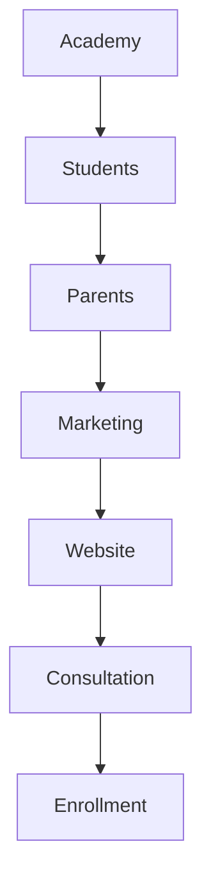
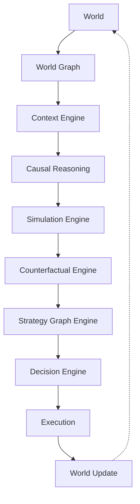
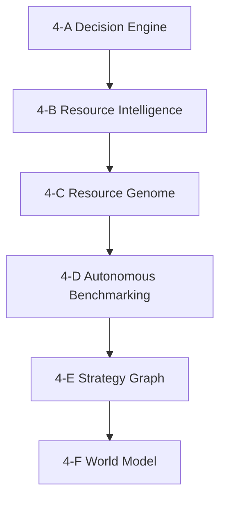

# Volume 4-F. World Model Engine

- **Version:** v1.0 Draft
- **Classification:** Cognitive Intelligence Layer
- **Status:** Long-term Research Architecture
- **Depends on:** [Volume 4-E — Strategy Graph Engine](v4e-strategy-graph.md)

> ⚠️ **문서 성격 주의** — 4-E와 마찬가지로 기존 연구가 거의 없는 영역이며, 설계자의 가설이 다수 포함된 **장기 연구 비전** 문서다.

---

## 0. 왜 이 계층이 필요한가

Volume 4의 하위 문서는 다음 질문에 차례로 답해 왔다.

| 문서 | 질문 |
|---|---|
| 4-A | 어떻게 **선택**할 것인가 |
| 4-B | AI를 어떻게 **이해**할 것인가 |
| 4-C | AI를 어떻게 **예측**할 것인가 |
| 4-D | AI를 어떻게 **연구**할 것인가 |
| 4-E | AI를 어떻게 **조합**할 것인가 |

여기서 빠진 질문이 하나 있다.

> **"도대체 무엇을 위해 이 모든 선택을 하는가?"**

현재 대부분의 AI는 사용자가 말한 문장을 그대로 처리한다. 하지만 사람은 그렇게 일하지 않는다. 사람은 항상 **세상을 하나의 모델(World Model)** 로 이해한 후 행동한다.

사용자가 *"우리 학원 윈터스쿨 홍보 좀 해줘"* 라고 말하면, 사람은 머릿속에서 다음을 하나의 세계로 연결해 생각한다.

- 지금은 몇 월인가?
- 학생 모집 시즌인가?
- 경쟁 학원은?
- 부모가 중요하게 보는 것은?
- 예산은?
- 이미 홈페이지가 있는가?
- SNS는 운영하는가?

Intent OS에도 이 계층이 필요하다.

---

## 1. Vision

AI는 Prompt를 처리하는 것이 아니다. Intent OS는 **사용자의 현실(World State)을 이해하고 변화시키는 시스템**이다.

```
Prompt → World Understanding → Strategy → Execution → World Change
```

---

## 2. Core Philosophy

| | 흐름 |
|---|---|
| 기존 AI | Prompt → Answer |
| **Intent OS** | Current World → Goal World → Gap Analysis → Strategy → Execution |

---

## 3. World State

Intent OS는 항상 Current State를 가진다.

```yaml
business:
  industry: education
  location: seoul
  product: winter school

marketing:
  website: true
  sns: instagram
  ads: false

resources:
  budget: 300000

time:
  month: august

goal:
  enrollment: +30%
```

---

## 4. Goal State

사용자는 원하는 미래를 말한다. (`학생 모집률 30% 증가`) → Goal State 생성.

---

## 5. World Gap

Intent OS는 현재와 목표를 비교한다.

```
Current 120명 → Target 160명
  ↓
Gap: 40명
```

---

## 6. World Graph

세상은 Graph다. 모든 객체는 연결된다.



---

## 7. Entity Types

```
Person / Organization / Product / Service / Location
Document / Goal / Task / Event / Resource
```

---

## 8. Relationship Types

```
owns / uses / depends_on / created_by
located_at / competes_with / influences / requires
```

---

## 9. Context Engine

AI는 항상 Context를 가져야 한다.

```
Current Month → August → Winter School Recruitment
  ↓
홍보 우선순위 증가
```

---

## 10. Temporal Model

World는 시간에 따라 변한다.

```
Today → Next Week → Next Month → Winter
```

Intent OS는 미래도 예측한다.

---

## 11. Causal Graph

**가장 중요한 부분.** Intent OS는 상관관계가 아니라 가능하면 **인과관계(Causality)** 를 모델링하려고 시도한다.

```
Homepage Improvement → More Consultation → Higher Enrollment
```

```
More Ads → More Clicks → No Enrollment
  ↓
원인 분석
```

---

## 12. Uncertainty Model

AI는 모든 것을 확신하지 않는다.

```
Competitor Budget: Unknown
Confidence: 32%
  ↓
추가 조사
```

---

## 13. Observation Engine

World는 계속 업데이트된다.

```
Website Updated → World Graph Update
Sales Increased → Business State Update
```

---

## 14. Simulation Engine

Intent OS는 실행 전에 시뮬레이션한다.

```
SNS 광고 → 예상 상담 +20% → 예상 등록 +8%
```

> ※ 실제 비즈니스에서는 이 예측이 불확실하므로, **신뢰구간과 과거 유사 사례를 함께 제시**하는 것이 바람직하다.

---

## 15. Counterfactual Engine

Intent OS는 "만약"을 계산한다.

- 광고를 하지 않았다면?
- 예산을 두 배로 늘리면?

→ 결과 비교.

---

## 16. Multi-World Planning

한 가지 계획만 세우지 않는다. Plan A / B / C 각각의 비용, 위험, 성공 확률을 비교한다.

---

## 17. Human Model

Intent OS는 사용자도 이해한다.

```yaml
user:
  prefers_speed: true
  budget_sensitive: false
  experience:
    marketing: medium
```

> 이 정보는 **사용자의 동의와 설정을 바탕으로** 저장·사용한다.

---

## 18. Organization Model

```
Company → Team → Roles → Projects → Goals
```

---

## 19. Environment Model

외부 환경도 World의 일부다.

```
Season / Competitors / Economy / Regulation / AI Market
  ↓
Decision 반영
```

---

## 20. World Memory

World는 기억된다.

```
2026 → Winter Campaign → Conversion 18%
  ↓
내년 재사용
```

---

## 21. Goal Decomposition

Goal은 자동 분해된다.

```
Increase Enrollment → Marketing → Website → Ads → Consultation → Conversion
```

---

## 22. Action Planner

World를 변경하기 위한 Action.

```
Update Website → Create Campaign → Launch Ads → Collect Feedback
```

---

## 23. World Evolution

```
Observe → Understand → Predict → Plan → Execute → Observe
```

반복.

---

## 24. Long-Term World Intelligence



---

## 25. World DSL

World를 사람이 읽고 AI도 실행할 수 있도록 DSL을 정의한다.

```yaml
world:
  organization:
    type: academy
    students: 120

goal:
  enrollment: 160

constraints:
  budget: 300000
  deadline: "2026-11-30"

environment:
  season: winter_recruitment
```

이 DSL은 Intent OS의 내부 표현이자 API의 공용 언어가 될 수 있다.

---

## 26. Digital Twin Layer

각 사용자·기업은 하나의 **Digital Twin**을 가진다.

```
Real Business → Digital Twin → Simulation → Recommendation → Real Execution
```

> 단, 실제 비즈니스를 정확히 반영하려면 **지속적인 데이터 동기화와 사용자의 명시적 동의**가 필요하다.

---

## Appendix — 향후 확장 제안

> 아래는 **확정 명세가 아닌 연구 과제**다.

### ① Hierarchical World Models

`개인 → 팀 → 회사 → 시장 → 국가 → 글로벌` 처럼 여러 수준의 World를 동시에 표현하고 연결해야 한다.

### ② Belief State

World에는 항상 불확실성이 있다. Intent OS는 **"사실"과 "추정"을 명확히 구분**해야 한다.

```
학생 수 = 120 (확정)
경쟁사 예산 = 약 5천만 원 (추정)
```

### ③ Explainable World Reasoning

사용자가 *"왜 이 전략을 추천했어?"* 라고 물으면 World Graph를 따라 원인을 설명할 수 있어야 한다.

```
모집률이 낮음
  ↓ 홈페이지 이탈률 높음
  ↓ 상담 신청 부족
  ↓ 랜딩페이지 개선 추천
```

---

## Core Intelligence 전체 구조



---

## 설계 관점 — 프로젝트 방향의 변화

처음에는 **"최적의 AI를 선택하는 운영체제"** 를 만들려고 했다. 하지만 4-A부터 4-F까지 진행하면서 설계는 한 단계 위인 **"목표를 달성하기 위한 지능형 의사결정 운영체제"** 에 가까워졌다.

즉, AI 모델 선택은 시스템의 일부 기능일 뿐이고 진짜 핵심은 다음 네 가지다.

1. 세상을 이해하고 — **World Model** (4-F)
2. 성공 전략을 축적하며 — **Strategy Graph** (4-E)
3. 새로운 AI를 자동 연구하고 — **Autonomous Benchmarking** (4-D)
4. 상황에 맞는 실행 계획을 세우는 것 — **Decision Engine** (4-A)

AI 모델은 계속 바뀌지만, **세상을 이해하고 목표 달성을 최적화하는 운영체제**라는 개념은 특정 모델에 종속되지 않는다. 이는 [Volume 1 Principle 03 — Resource Agnostic](v1-core-concepts.md#principle-03--resource-agnostic)과 일치한다.

---

## Volume 4-F Completion Criteria

> **본 문서는 장기 연구 문서다** ([Volume 4](v4-decision-engine.md) 문서 목록의 ⚠️ 표시).

| 항목 | 근거 | 판정 |
|---|---|---|
| 계층의 필요성 정의 | §0, §1, §2 | ✅ |
| World State / Goal State / Gap 정의 | §3~§5 | ✅ |
| World Graph 구조 정의 | §6~§8 | ⚠️ 부분 — 유형 목록만. [Entity 003 Context](entities/e003-context.md)와의 경계 미정의 |
| 시간 모델 정의 | §10 | ⚠️ 부분 |
| 인과 그래프 정의 | §11 | ❌ **미충족** — 인과 추론 방법 미정의. 상관과 인과의 구분 기준이 없다 |
| 불확실성 모델 정의 | §12 | ⚠️ 부분 |
| Simulation / Counterfactual 정의 | §14, §15 | ❌ **미충족** — 시뮬레이션의 신뢰 구간과 실행 대체 조건 미정의 |
| Human / Organization 모델 정의 | §17, §18 | ⚠️ 부분 |
| Goal 분해·행동 계획 정의 | §21, §22 | ⚠️ 부분 — [Volume 3 Stage 3](v3-runtime.md) Planning과 역할 중복. 경계 정리 필요 |
| World DSL 정의 | §25 | ⚠️ 부분 |

**미충족 2건(§11 인과, §14·15 시뮬레이션)은 서로 묶여 있다.** 인과 그래프 없이는 시뮬레이션이 상관관계의 외삽에 그치고, 그런 시뮬레이션으로 실제 실행을 대체하면 [4-D §16 Shadow Evaluation](v4d-autonomous-benchmarking.md)보다 위험하다.

### Volume 4 계열 종결

4-A~4-F로 Decision·Resource·Strategy·World 계층의 설계가 끝난다. 확정 명세는 **4-A와 4-B**이며, 4-C~4-F는 연구 설계 상태다.

| 문서 | 상태 |
|---|---|
| [4-A Decision Engine Detail](v4a-decision-engine-detail.md) | Specification |
| [4-B Resource Intelligence](v4b-resource-intelligence.md) | Specification |
| [4-C Resource Genome](v4c-resource-genome.md) | Research Design |
| [4-D Autonomous Benchmarking](v4d-autonomous-benchmarking.md) | Research Design |
| [4-E Strategy Graph](v4e-strategy-graph.md) | Research Design ⚠️ |
| [4-F World Model](v4f-world-model.md) | Research Design ⚠️ |


---

**다음:** [Volume 5 — Learning Engine](v5-learning-engine.md)
