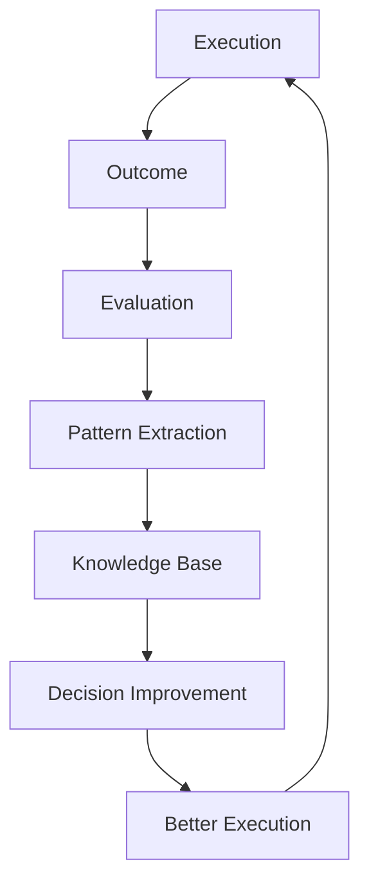

# Volume 5. Learning Engine Specification

- **Version:** v0.1 Draft
- **Status:** Adaptive Intelligence Specification
- **Depends on:** [Volume 1](v1-core-concepts.md), [Volume 2](v2-architecture.md), [Volume 3](v3-runtime.md), [Volume 4](v4-decision-engine.md)

---

## 1. Introduction

### 1.1 Purpose

Learning Engine Specification은 Intent OS가 실행 경험을 축적하고, 미래의 Decision Quality를 향상시키는 방법을 정의한다.

### 1.2 Core Principle

> Intent OS는 **모델 자체를 학습시키지 않는다.**
>
> 대신 **어떤 상황에서 어떤 Resource를 어떻게 활용해야 성공하는가**를 학습한다.

| 기존 AI | Intent OS |
|---|---|
| Model → Output | Decision → Execution → Outcome → Knowledge → Better Decision |

---

## 2. Learning Philosophy

### Principle 01 — Experience is Data

Intent OS에서 모든 실행은 데이터다.

```
성공한 실행:
  Strategy + Resource + Context = Successful Outcome

실패한 실행:
  Wrong Decision + Wrong Context + Wrong Resource = Learning Signal
```

---

### Principle 02 — Learn Decisions, Not Answers

Intent OS가 저장해야 하는 것은 **결과물이 아니다.** 중요한 것은 *"왜 이 선택을 했고, 결과가 어땠는가"* 이다.

| | Memory |
|---|---|
| ❌ 나쁜 Memory | 사용자에게 광고 문구 제공 |
| ⭕ 좋은 Memory | Goal: 교육 서비스 홍보<br>Context: 한국 학부모 대상<br>Selected Resource: Claude<br>Reason: 한국어 설득 구조 우수<br>Outcome: 전환율 증가<br>Confidence: 92% |

---

### Principle 03 — Generalize Patterns

Intent OS는 개별 경험을 패턴으로 변환한다.

```
개별 사례:
  A 미술학원 / 겨울캠프 광고 / Claude 사용 / 성공
        ↓
패턴:
  Education Marketing + Korean Audience + Emotional Copy
  = Claude 계열 Resource 높은 적합도
```

---

## 3. Learning Architecture

```
Learning Engine
├── Data Collector
├── Outcome Evaluator
├── Pattern Extractor
├── Knowledge Manager
└── Decision Optimizer
```

---

## 4. Data Collector

**Responsibility** — Intent OS 실행 데이터를 수집한다.

| 구분 | 수집 대상 |
|---|---|
| **Execution Data** | Goal, Task, Selected Resource, Prompt Context, Execution Time, Cost, Result |
| **Decision Data** | Candidate Resources, Prediction Score, Final Selection, Confidence |
| **Feedback Data** | User Rating, Correction, Modification, Rejection, Acceptance |

**Schema**

```json
{
  "execution_id": "",
  "goal_pattern": "",
  "resource": "",
  "prediction": "",
  "outcome": "",
  "feedback": ""
}
```

---

## 5. Outcome Evaluator

**Responsibility** — 실행 결과를 평가한다.

### 5.1 Goal Achievement

```
Goal:    학생 모집 증가
Outcome: 상담 신청 30% 증가
Score:   0.85
```

### 5.2 Quality

정확성 · 완성도 · 적합성

### 5.3 Efficiency

```
        Value Generated
Score = ───────────────
        Cost Consumed
```

### 5.4 User Satisfaction

사용자의 실제 반응 신호: 수정 요청 횟수, 재사용 여부, 평가, 추가 질문

---

## 6. Pattern Extractor

**Responsibility** — 개별 경험에서 일반 패턴을 추출한다.

```
Input:  1000개의 Execution Record
Output: Knowledge Pattern
```

**예시**

```
Raw Data (500회 반복):
  Task:     Legal Document Review
  Resource: GPT
  Outcome:  High
        ↓
Pattern:
  Legal Analysis Task → GPT Family → High Reliability
```

---

## 7. Knowledge Manager

Intent OS의 **장기 기억 시스템.** Knowledge는 4가지로 구분된다.

### 7.1 Resource Knowledge

```
Claude
  Strength: Writing
  Weakness: Complex Coding
  Cost:     Medium
```

### 7.2 Task Knowledge

```
Marketing Copy
  Best Resource:      Claude
  Average Confidence: 91%
```

### 7.3 User Knowledge

| 사용자 | Preference |
|---|---|
| A | Quality > Speed, Detailed Output Preferred |
| B | Speed > Quality |

### 7.4 Domain Knowledge

```
Medical Research
  Requires: High Accuracy, Multiple Validation, Human Review
```

---

## 8. Decision Optimization

Learning Engine은 Decision Engine을 개선한다.

| Resource | Before Learning | After Experience (Education Marketing) |
|---|---|---|
| Claude | 86 | **94** |
| GPT | 85 | 87 |
| Gemini | 84 | 82 |

---

## 9. Model Update Learning

**문제:** 새로운 모델 등장. Intent OS는 모른다.

| Step | 내용 |
|---|---|
| 1. Resource Registration | Model X Added |
| 2. Capability Evaluation | Writing? Reasoning? Coding? |
| 3. Controlled Testing | 무작위 실행하지 않는다. **Low-risk Task에서 검증.** |
| 4. Performance Update | Marketing 92 / Coding 96 / Reasoning 94 |

---

## 10. Exploration vs Exploitation

Intent OS는 두 가지 균형이 필요하다.

- **Exploitation** — 검증된 Resource 사용. 안정성 ↑
- **Exploration** — 새로운 Resource 테스트. 미래 최적화 ↑

**Intent OS 전략**

```
90%  Known Best Resource
10%  New Candidate Exploration
```

---

## 11. Learning Feedback Loop



---

## 12. Personal Intelligence Layer

향후 Intent OS의 차별점. **모든 사용자는 다른 Intent OS를 가진다.**

| 사용자 | 흐름 |
|---|---|
| A (최고 품질 선호) | Complex Planning → Premium Resource |
| B (빠른 결과 선호) | Fast Resource |

즉, **하나의 Intent OS × 개인별 Decision Model** 구조.

---

## 13. Learning Safety

학습에는 위험이 존재한다.

| 문제 | 해결 |
|---|---|
| 잘못된 Feedback | `Single Feedback ≠ Learning Update` — 여러 데이터를 요구 |
| Bias 강화 | Continuous Exploration |
| Outdated Knowledge | Knowledge Expiration |

---

## 14. Learning Metrics

Intent OS 성장 측정 기준:

- **Decision Accuracy** — 예측과 실제 결과 일치율
- **Resource Selection Improvement** — 시간에 따른 선택 개선
- **Cost Reduction** — 같은 품질 대비 비용 감소
- **User Satisfaction** — 사용자 만족도 증가

---

## 15. Future Learning Architecture

장기적으로 `Individual + Collective + Global AI Ecosystem` 학습 구조.

- **Individual** — 개인 사용자 경험
- **Collective** — 익명화된 전체 사용자 패턴
- **Ecosystem** — AI 모델 변화 감지

---

## 16. Learning Engine Summary

```
Experience → Data → Evaluation → Pattern → Knowledge
→ Better Decision → Higher Performance
```

---

## Volume 5 Completion Criteria

- [x] Learning 대상 정의
- [x] 데이터 수집 구조 정의
- [x] Outcome 평가 구조 정의
- [x] Knowledge 구조 정의
- [x] Decision 개선 구조 정의
- [x] 신규 AI 모델 대응 구조 정의
- [x] 개인화 학습 구조 정의
