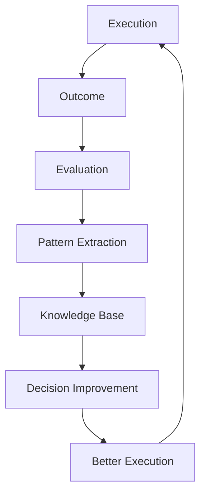

# Volume 5. Learning Engine Specification

- **Version:** v0.1 Draft
- **Status:** Adaptive Intelligence Specification
- **Depends on:** [Volume 1](v1-core-concepts.md), [Volume 2](v2-architecture.md), [Volume 3](v3-runtime.md), [Volume 4](v4-decision-engine.md)

---

## 1. Introduction

### 1.1 Purpose

Learning Engine Specification은 Intent OS가 실행 경험을 축적하고, 미래의 Decision Quality를 향상시키는 방법을 정의한다.

### 1.2 Core Principle

> Intent OS는 **모델 자체를 학습시키지 않는다.**
>
> 대신 **어떤 상황에서 어떤 Resource를 어떻게 활용해야 성공하는가**를 학습한다.

| 기존 AI | Intent OS |
|---|---|
| Model → Output | Decision → Execution → Outcome → Knowledge → Better Decision |

---

## 2. Learning Philosophy

### Principle 01 — Experience is Data

Intent OS에서 모든 실행은 데이터다.

```
성공한 실행:
  Strategy + Resource + Context = Successful Outcome

실패한 실행:
  Wrong Decision + Wrong Context + Wrong Resource = Learning Signal
```

---

### Principle 02 — Learn Decisions, Not Answers

Intent OS가 저장해야 하는 것은 **결과물이 아니다.** 중요한 것은 *"왜 이 선택을 했고, 결과가 어땠는가"* 이다.

| | Memory |
|---|---|
| ❌ 나쁜 Memory | 사용자에게 광고 문구 제공 |
| ⭕ 좋은 Memory | Goal: 교육 서비스 홍보<br>Context: 한국 학부모 대상<br>Selected Resource: Claude<br>Reason: 한국어 설득 구조 우수<br>Outcome: 전환율 증가<br>Confidence: 92% |

---

### Principle 03 — Generalize Patterns

Intent OS는 개별 경험을 패턴으로 변환한다.

```
개별 사례:
  A 미술학원 / 겨울캠프 광고 / Claude 사용 / 성공
        ↓
패턴:
  Education Marketing + Korean Audience + Emotional Copy
  = Claude 계열 Resource 높은 적합도
```

---

## 3. Learning Architecture

```
Learning Engine
├── Data Collector
├── Outcome Evaluator
├── Pattern Extractor
├── Knowledge Manager
└── Decision Optimizer
```

---

## 4. Data Collector

**Responsibility** — Intent OS 실행 데이터를 수집한다.

| 구분 | 수집 대상 |
|---|---|
| **Execution Data** | Goal, Task, Selected Resource, Prompt Context, Execution Time, Cost, Result |
| **Decision Data** | Candidate Resources, Prediction Score, Final Selection, Confidence |
| **Feedback Data** | User Rating, Correction, Modification, Rejection, Acceptance |

### 4.1 Learning Record

Learning Engine은 **새 Entity를 만들지 않는다.** 학습 레코드는 기존 Entity 5개를 잇는 **조인 뷰(projection)** 이며, 저장되는 것은 참조와 파생 값뿐이다.

<!-- validate: none -->
```json
{
  "record_id": "lrn_00921",
  "execution_id": "exe_219",
  "decision_id": "dec_118",
  "outcome_id": "out_219",
  "evaluation_id": "eva_219",
  "feedback_ids": ["fbk_041"],
  "goal_pattern": "education_marketing.ko.parents",
  "resource_id": "anthropic:claude",
  "predicted_quality": 0.93,
  "actual_quality": 0.95,
  "prediction_error": -0.02,
  "cost": { "amount": 1240, "currency": "KRW" },
  "collected_at": "2026-08-04T10:22:00Z"
}
```

각 필드의 **출처 Entity**는 다음과 같다. 값을 복제하지 않고 참조로 두는 이유는, 원본이 정정되면 학습 데이터도 함께 정정되어야 하기 때문이다.

| 필드 | 출처 | 스키마 |
|---|---|---|
| `execution_id` | [Entity 013](entities/e013-execution.md) | [`execution.schema.json`](intent-os-spec/schemas/execution.schema.json) |
| `decision_id`, `predicted_quality` | [Entity 009](entities/e009-decision.md) | [`decision.schema.json`](intent-os-spec/schemas/decision.schema.json) |
| `outcome_id`, `cost` | [Entity 014](entities/e014-outcome.md) | [`outcome.schema.json`](intent-os-spec/schemas/outcome.schema.json) |
| `evaluation_id`, `actual_quality` | [Entity 015](entities/e015-evaluation.md) | [`evaluation.schema.json`](intent-os-spec/schemas/evaluation.schema.json) |
| `feedback_ids` | [Entity 012](entities/e012-feedback.md) | [`feedback.schema.json`](intent-os-spec/schemas/feedback.schema.json) |
| `goal_pattern`, `prediction_error` | 파생값 (§6에서 생성) | — |

**타입 규약**

| 필드 | 타입 | 제약 |
|---|---|---|
| `predicted_quality`, `actual_quality` | number | 0~1 |
| `prediction_error` | number | `predicted − actual`, −1~1 |
| `goal_pattern` | string | `<domain>.<language>.<audience>` 형식 |
| `collected_at` | string | RFC 3339 |

`prediction_error`가 §14 Decision Accuracy 지표의 입력이며, [4-A §13](v4a-decision-engine-detail.md)의 `A` (Prediction Accuracy) 항을 만든다.

---

## 5. Outcome Evaluator

**Responsibility** — 실행 결과를 평가한다.

> 평가 기준의 정본은 [Entity 015 — Evaluation](entities/e015-evaluation.md)이며, 네 기준의 명칭은 [Volume 3 Stage 6](v3-runtime.md)과 동일하다. 초안이 첫 항목을 `Goal Achievement`로 쓰던 것은 **`Goal Alignment`로 통일했다.**

### 5.1 Goal Alignment

```
Goal:    학생 모집 증가
Outcome: 상담 신청 30% 증가
Score:   0.85
```

### 5.2 Quality

정확성 · 완성도 · 적합성

### 5.3 Efficiency

```
        Value Generated
Score = ───────────────
        Cost Consumed
```

### 5.4 User Satisfaction

사용자의 실제 반응 신호: 수정 요청 횟수, 재사용 여부, 평가, 추가 질문

---

## 6. Pattern Extractor

**Responsibility** — 개별 경험에서 일반 패턴을 추출한다.

```
Input:  1000개의 Execution Record
Output: Knowledge Pattern
```

**예시**

```
Raw Data (500회 반복):
  Task:     Legal Document Review
  Resource: GPT
  Outcome:  High
        ↓
Pattern:
  Legal Analysis Task → GPT Family → High Reliability
```

---

## 7. Knowledge Manager

Intent OS의 **장기 기억 시스템.** Knowledge는 4가지로 구분된다.

> 저장 형태의 정본은 [Entity 011 — Knowledge](entities/e011-knowledge.md)다. 본 절은 **무엇을 축적하는가**만 다루고, 스키마·수명·신뢰도 필드는 Entity 011을 따른다. [Entity 010 — Memory](entities/e010-memory.md)와의 구분도 그 문서에 있다.

### 7.1 Resource Knowledge

```
Claude
  Strength: Writing
  Weakness: Complex Coding
  Cost:     Medium
```

### 7.2 Task Knowledge

```
Marketing Copy
  Best Resource:      Claude
  Average Confidence: 91%
```

### 7.3 User Knowledge

| 사용자 | Preference |
|---|---|
| A | Quality > Speed, Detailed Output Preferred |
| B | Speed > Quality |

### 7.4 Domain Knowledge

```
Medical Research
  Requires: High Accuracy, Multiple Validation, Human Review
```

---

## 8. Decision Optimization

Learning Engine은 Decision Engine을 개선한다.

| Resource | Before Learning | After Experience (Education Marketing) |
|---|---|---|
| Claude | 86 | **94** |
| GPT | 85 | 87 |
| Gemini | 84 | 82 |

### 8.1 갱신 규칙

위 표는 **결과**다. 어떻게 그 값에 도달하는지가 없으면 구현할 수 없다.

`observed_score`는 지수이동평균으로 갱신한다.

$$score_{new} = (1 - \alpha) \cdot score_{old} + \alpha \cdot outcome$$

| 기호 | 값 | 의미 |
|---|---|---|
| α | `max(0.02, 1/n)` | 학습률. `n`은 해당 (Capability × Context)의 누적 표본 수 |
| `outcome` | 0~100 | [Evaluation](entities/e015-evaluation.md)의 품질 점수 × 100 |

α의 하한 0.02는 **오래된 Resource가 갱신을 멈추지 않게 하는 장치**다. `1/n`만 쓰면 표본 1000건 이후 α가 0.001이 되어 실제 성능이 떨어져도 점수가 반응하지 않는다 — 그러면 §13의 Drift를 영원히 못 잡는다.

**수렴 조건과 예외**

| 조건 | 처리 |
|---|---|
| 최근 20건의 `prediction_error` 표준편차 < 0.05 | 수렴 판정. `confidence` 상한 해제 |
| Drift 감지 ([4-B §13](v4b-resource-intelligence.md)) | `n`을 리셋해 α를 되올린다. 새 버전은 새 Resource로 취급 |
| 단일 Feedback | **갱신하지 않는다** (§13) |

---

## 9. Model Update Learning

**문제:** 새로운 모델 등장. Intent OS는 모른다.

**절차의 정본은 [Volume 4-B §11 Cold Start Strategy](v4b-resource-intelligence.md)이며 5단계다.** 초안이 본 절을 4단계로 적어 4-B와 어긋나 있었다 — Confidence 축적 단계가 빠져 있었다.

| Step | 내용 | 산출 |
|---|---|---|
| 1. Metadata 수집 | 공식 스펙, 가격, 컨텍스트 길이 | [Resource](entities/e007-resource.md) 등록 (`lifecycle = Registered`) |
| 2. Capability 추정 | Writing? Reasoning? Coding? — 선언값만 |  `declared_score` |
| 3. Controlled Testing | 무작위 실행하지 않는다. **Low-risk Task에서 검증** | `lifecycle = Evaluating` |
| 4. 실사용 데이터 축적 | 실제 Execution 결과 수집 | `observed_score` |
| 5. Confidence 증가 | 표본 30건에 접근하며 신뢰도 상승 | `lifecycle = Active` |

5단계가 필요한 이유는 [4-A §13](v4a-decision-engine-detail.md)에 있다. Confidence는 표본 수 `H = min(1, n/30)`에 좌우되므로, 4단계에서 멈추면 점수는 있어도 Confidence가 낮아 **Decision이 이 Resource를 계속 회피한다.** 5단계는 그 정체를 푸는 과정이다.

---

## 10. Exploration vs Exploitation

Intent OS는 두 가지 균형이 필요하다.

- **Exploitation** — 검증된 Resource 사용. 안정성 ↑
- **Exploration** — 새로운 Resource 테스트. 미래 최적화 ↑

**Intent OS 전략 — Phase 1 잠정값**

```
90%  Known Best Resource
10%  New Candidate Exploration
```

> **📌 이 90/10은 확정 정책이 아니라 초기 고정값이다.** [Volume 4-C Appendix B](v4c-resource-genome.md)는 *"Exploration 비율을 어떤 정책으로 조정할 것인가"* 를 미해결 질문으로 남겨 두었다. 초안이 본 절에서 이를 확정값처럼 서술해 두 문서가 어긋나 있었다.

단계별로 다음과 같이 다룬다.

| Phase | 정책 | 근거 |
|---|---|---|
| **1 (현재)** | 고정 10% | 데이터가 없어 적응형을 쓸 수 없다 |
| **2** | Resource 수와 Confidence 분산에 따라 5~20% 가변 | 후보가 많을수록 탐색 가치가 크다 |
| **3** | 미정 — Bandit 계열 정책 후보 | [4-C Appendix B](v4c-resource-genome.md) Open Issue |

**탐색은 아무 데서나 하지 않는다.** [4-A §9.4](v4a-decision-engine-detail.md)의 Risk Gate를 통과한 Task에서만 수행한다. 고위험 Task에서의 탐색은 학습 이득보다 손실이 크다.

---

## 11. Learning Feedback Loop



---

## 12. Personal Intelligence Layer

향후 Intent OS의 차별점. **모든 사용자는 다른 Intent OS를 가진다.**

| 사용자 | 흐름 |
|---|---|
| A (최고 품질 선호) | Complex Planning → Premium Resource |
| B (빠른 결과 선호) | Fast Resource |

즉, **하나의 Intent OS × 개인별 Decision Model** 구조.

---

## 13. Learning Safety

학습에는 위험이 존재한다.

| 문제 | 해결 |
|---|---|
| 잘못된 Feedback | `Single Feedback ≠ Learning Update` — 여러 데이터를 요구 |
| Bias 강화 | Continuous Exploration |
| Outdated Knowledge | Knowledge Expiration |

---

## 14. Learning Metrics

Intent OS 성장 측정 기준:

- **Decision Accuracy** — 예측과 실제 결과 일치율
- **Resource Selection Improvement** — 시간에 따른 선택 개선
- **Cost Reduction** — 같은 품질 대비 비용 감소
- **User Satisfaction** — 사용자 만족도 증가

---

## 15. Future Learning Architecture

장기적으로 `Individual + Collective + Global AI Ecosystem` 학습 구조.

- **Individual** — 개인 사용자 경험
- **Collective** — 익명화된 전체 사용자 패턴
- **Ecosystem** — AI 모델 변화 감지

---

## 16. Learning Engine Summary

```
Experience → Data → Evaluation → Pattern → Knowledge
→ Better Decision → Higher Performance
```

---

## Volume 5 Completion Criteria

| 항목 | 근거 | 판정 |
|---|---|---|
| Learning 대상 정의 | §2 원칙 3개 · §4 수집 대상 | ✅ |
| 데이터 수집 구조 정의 | §4.1 Learning Record (타입·출처 Entity 매핑) | ✅ |
| Outcome 평가 구조 정의 | §5 · 정본 [Entity 015](entities/e015-evaluation.md) | ✅ |
| Knowledge 구조 정의 | §7 · 정본 [Entity 011](entities/e011-knowledge.md) | ✅ |
| Decision 개선 구조 정의 | §8.1 갱신식(EMA) · 학습률 · 수렴 조건 | ✅ |
| 신규 AI 모델 대응 구조 정의 | §9 (5단계, [4-B §11](v4b-resource-intelligence.md)과 일치) | ✅ |
| Exploration 정책 정의 | §10 | ⚠️ **부분** — Phase 1 고정값만 확정. Phase 3 정책은 [4-C Appendix B](v4c-resource-genome.md) Open Issue |
| 개인화 학습 구조 정의 | §12 | ⚠️ **부분** — 개념만. 개인 모델의 저장 단위·격리 규칙 미정의 |
