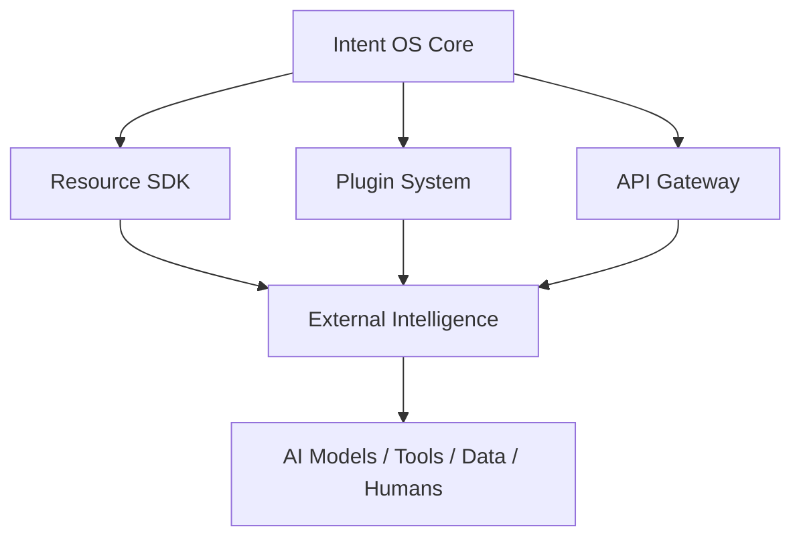

# Volume 6. Developer Platform Specification

- **Version:** v0.1 Draft
- **Status:** Ecosystem & Integration Specification
- **Depends on:** [Volume 1~5](README.md)

---

## 1. Introduction

### 1.1 Purpose

Developer Platform Specification은 Intent OS가 외부 Resource와 연결되고 확장될 수 있도록 하는 **표준 구조**를 정의한다.

| 현재 AI 생태계 | Intent OS |
|---|---|
| New AI Model Released | New AI Model Released |
| ↓ Developer manually integrates | ↓ Register Resource |
| ↓ Users discover capability | ↓ Evaluate Capability |
| ↓ Users manually choose | ↓ Intent OS understands |
| | ↓ **Automatically available** |

### 1.2 Platform Vision

> **Any intelligence can become a Resource.**

어떤 AI든, 어떤 Tool이든, 어떤 데이터든, 어떤 인간 전문가든 — Intent OS 안에서는 **동일한 Resource로 취급된다.**

---

## 2. Platform Architecture



---

## 3. Resource Adapter Framework

### 3.1 Purpose

외부 Resource를 Intent OS가 이해할 수 있는 형태로 변환한다.

**문제:** 각 AI는 인터페이스가 다르다. (OpenAI API, Anthropic API, Google API, Custom Model, Internal Tool)

Intent OS 내부에서는 **Universal Resource Interface**로 통일한다.

### 3.2 Resource Interface

```python
class Resource:
    """모든 외부 지능이 구현해야 하는 최소 계약."""

    def identify(self) -> ResourceMetadata:
        """resource.schema.json을 만족하는 메타데이터를 반환한다."""

    def capabilities(self) -> list[CapabilityDeclaration]:
        """제공 Capability 선언. 최소 1개 (Rule R-001)."""

    def estimate_cost(self, task: Task) -> Cost:
        """실행 전 비용 추정. Decision의 C 항이 된다 (4-A §8.1)."""

    def estimate_latency(self, task: Task) -> LatencyMs:
        """실행 전 지연 추정. Decision의 L 항이 된다."""

    def execute(self, task: Task, ctx: ExecutionContext) -> ExecutionResult:
        """Task 1건을 수행한다. 예외를 던지지 않고 실패도 결과로 반환한다."""

    def evaluate_result(self, result: ExecutionResult) -> SelfCheck | None:
        """자체 점검. 최종 판정은 Intent OS가 한다 — 선택 구현."""
```

**계약 규칙**

| # | 규칙 | 이유 |
|---|---|---|
| A1 | `execute()`는 **예외를 던지지 않는다.** 실패는 `ExecutionResult(status=Failed, failure_class=...)`로 반환한다 | 실패도 Outcome을 낳아야 한다 ([INV-04](entities/e000a-entity-relationships.md)) |
| A2 | `estimate_*`는 부수효과가 없어야 한다 | Decision 단계에서 후보 전체에 호출된다 |
| A3 | `identify()`·`capabilities()`는 **멱등**이어야 한다 | Registry가 주기적으로 재조회한다 |
| A4 | `evaluate_result()`의 반환은 **참고값**이다 | Resource의 자기 평가를 그대로 믿지 않는다 (§5) |

`failure_class`는 [`execution.schema.json`](intent-os-spec/schemas/execution.schema.json)의 enum을 따른다 — `resource_unavailable`, `resource_incapable`, `input_insufficient`, `timeout`, `constraint_violation`, `policy_violation`, `internal_error`.

**대응 Entity**

| 인터페이스 반환 | Entity | 스키마 |
|---|---|---|
| `ResourceMetadata` | [007 Resource](entities/e007-resource.md) | [`resource.schema.json`](intent-os-spec/schemas/resource.schema.json) |
| `CapabilityDeclaration` | [006 Capability](entities/e006-capability.md) | [`capability.schema.json`](intent-os-spec/schemas/capability.schema.json) |
| `ExecutionResult` | [013 Execution](entities/e013-execution.md) → [014 Outcome](entities/e014-outcome.md) | [`execution.schema.json`](intent-os-spec/schemas/execution.schema.json) |
| 관측된 성능 | [025 Resource Profile](entities/e025-resource-profile.md) | [`resource-profile.schema.json`](intent-os-spec/schemas/resource-profile.schema.json) |

Agent와 Tool은 Resource의 특수형이며 각각 [Entity 023](entities/e023-agent.md), [Entity 024](entities/e024-tool.md)에 별도 명세가 있다. 본 인터페이스는 셋 모두의 공통 계약이다.

### 3.3 Resource Metadata Schema

모든 Resource는 Registry에 등록된다. → [`schemas/resource.schema.json`](intent-os-spec/schemas/resource.schema.json)

<!-- validate: resource.schema.json -->
```json
{
  "id": "acme:video-gen-v2",
  "name": "Acme Video Generator",
  "type": "video_model",
  "provider": "Acme",
  "version": "2.0",
  "capabilities": [
    { "name": "creation.video.short_form", "declared_score": 88 }
  ],
  "cost_model": { "unit": "per_second", "price": 0.04, "currency": "USD" },
  "performance": { "reliability": 0.97, "latency_ms": 45000 },
  "limitations": ["최대 60초", "한국어 자막 미지원"],
  "availability": "24/7",
  "lifecycle": "Registered"
}
```

등록 직후 `lifecycle`은 **`Registered`** 다. `capabilities[].declared_score`만 있고 `observed_score`가 없는 것에 주목한다 — §5의 원칙대로 **선언값만으로는 Active가 되지 않는다.**

---

## 4. Resource Registry

Intent OS가 모든 Resource를 관리하는 **중앙 데이터베이스.**

**역할:** Resource 발견, Capability 저장, 성능 기록, 버전 관리, 상태 관리

```
Resource Registry
├── AI Models
├── APIs
├── Tools
├── Databases
├── Agents
└── Human Experts
```

---

## 5. Capability Declaration System

**Purpose** — Resource가 무엇을 잘하는지 정의한다.

<!-- validate: none -->
```json
{
  "capabilities": [
    { "name": "Coding", "score": 95 },
    { "name": "Reasoning", "score": 92 }
  ]
}
```

> **하지만 중요한 점:** 초기 등록 정보만 믿지 않는다.

```
Declared Capability + Observed Performance = Final Capability Score
```

---

## 6. Plugin System

### 6.1 Purpose

외부 개발자가 Intent OS 기능을 확장할 수 있도록 한다.

```
Plugin
├── Resource Plugin
├── Tool Plugin
├── Domain Plugin
├── Agent Plugin
└── Data Plugin
```

### 6.2 Resource Plugin

새로운 AI 연결. 예: `Video Generation AI Plugin → Intent OS Resource → Video Capability`

### 6.3 Tool Plugin

외부 도구 연결. 예: `Analytics Tool → Data Analysis Capability`

### 6.4 Domain Plugin

특정 분야 전문화. 예: Medical / Legal / Education Domain Plugin

---

## 7. Intent OS SDK

**Purpose** — 개발자가 쉽게 Resource를 연결하도록 한다.

```python
from intentos import Resource


class MyAI(Resource):

    capabilities = ["image_generation"]

    def execute(self):
        ...


IntentOS.register(MyAI)
```

결과: Intent OS가 자동 인식.

---

## 8. API Gateway

**Responsibility** — 외부 요청을 관리한다.

**역할:** Authentication, Rate Limiting, Monitoring, Logging, Billing

```
External Request → API Gateway → Intent OS Core → Resource
```

---

## 9. Developer Workflow

| Step | 내용 |
|---|---|
| 1. Resource 등록 | Developer → Register Resource |
| 2. Capability 선언 | What can it do? |
| 3. Validation | Capability Test / Performance Test / Cost Test |
| 4. Production Availability | Resource Available |

---

## 10. Resource Evaluation Framework

새로운 Resource는 자동 평가된다.

| 평가 항목 | 의미 |
|---|---|
| Capability | 얼마나 잘하는가 |
| Reliability | 얼마나 안정적인가 |
| Cost Efficiency | 비용 대비 성능 |
| Speed | 응답 속도 |
| Safety | 위험성 |

```
Resource Score = Capability + Reliability + Efficiency + Safety
```

---

## 11. Version Management

AI 모델은 계속 변경된다. 따라서 Resource는 **Version 객체**를 가진다.

```
GPT Version A → GPT Version B → GPT Version C
```

Intent OS는 각 버전을 별도로 관리한다.

### 11.1 버전 경계 규칙

| # | 규칙 |
|---|---|
| V1 | `id`는 **버전을 포함한다** (`openai:gpt-5.5`). 같은 이름의 다른 버전은 **다른 Resource**다 |
| V2 | [Resource Profile](entities/e025-resource-profile.md)은 버전마다 별도로 쌓인다. 이전 버전의 `observed_score`를 상속하지 않는다 |
| V3 | 새 버전은 [Cold Start](v4b-resource-intelligence.md) 5단계를 다시 거친다 |
| V4 | 이전 버전은 즉시 삭제하지 않고 `Deprecated`로 유지한다 — 과거 Decision의 재현에 필요하다 |

V2가 가장 중요하다. 점수를 상속하면 성능이 **떨어진** 새 버전이 이전 버전의 신뢰도를 물려받아 계속 선택된다. [4-B §13 Drift Detection](v4b-resource-intelligence.md)이 잡으려는 것이 바로 이 상황이다.

❌ `Claude 4.0의 Writing 91점을 Claude 4.1이 물려받는다` — 4.1이 96이든 82든 알 수 없는 상태에서 시작해야 한다.

---

## 12. Resource Lifecycle

```
Registered → Evaluating → Active → Optimized → Deprecated → Removed
```

---

## 13. Marketplace Concept

장기적으로 Intent OS는 Marketplace가 될 수 있다.

```
Developer → Create Resource → Publish → Intent OS Evaluation → Users Benefit
```

**가능한 경제 모델**

- API Revenue Share
- Plugin Marketplace Fee
- Enterprise Distribution

---

## 14. Security Specification

### 14.1 Resource Isolation

외부 Resource는 Core System과 분리된다.

```
Core | Sandbox | External Resource
```

### 14.2 Permission System

<!-- validate: none -->
```json
{
  "data_access": "limited",
  "user_data": "blocked"
}
```

### 14.3 Data Privacy

- 필요한 데이터만 전달
- 실행 기록 관리
- 민감 데이터 보호

### 14.4 Policy와의 관계

§14.1~14.3은 **플랫폼 차원의 격리 수단**이다. 어떤 Resource에 무엇을 허용할지의 **판정 규칙**은 [Entity 019 — Policy](entities/e019-policy.md)가 소유한다.

| 계층 | 담당 | 위반 시 |
|---|---|---|
| Sandbox (§14.1) | 실행 격리 | 프로세스 차단 |
| Permission (§14.2) | 데이터 접근 범위 | 호출 거부 |
| [Policy](entities/e019-policy.md) | 상황별 허용 판정 | Decision 단계에서 후보 제외 ([4-A §9.4](v4a-decision-engine-detail.md) R4) |

Policy 위반은 **실행 시점이 아니라 Decision 시점에 걸러진다.** 실행까지 간 뒤 막으면 이미 데이터가 전달된 뒤다.

---

## 15. Developer Experience Principles

1. **Easy Integration** — 10분 안에 Resource 연결 가능해야 한다.
2. **Automatic Evaluation** — 개발자가 직접 Benchmark를 만들 필요가 없어야 한다.
3. **Capability First** — Resource가 아니라 Capability 중심으로 등록한다.

---

## 16. Developer Platform Summary

```
Developer → Resource SDK → Resource Registry → Capability Evaluation
→ Decision Engine → User Goal Execution → Performance Data → Better Ranking
```

---

## Volume 6 Completion Criteria

| 항목 | 근거 | 판정 |
|---|---|---|
| Resource Adapter 정의 | §3.2 인터페이스(시그니처·반환형) · 계약 규칙 A1~A4 · Entity 대응표 | ✅ |
| Plugin 구조 정의 | §6 (5종) | ⚠️ 부분 — 종류만 정의. 로딩·격리·수명주기 미정의 |
| SDK 구조 정의 | §7 | ⚠️ 부분 — 등록 예시만. 패키징·배포 규약 미정의 |
| Resource Registry 정의 | §4 · 정본 [Entity 007](entities/e007-resource.md) | ✅ |
| Capability 등록 방식 정의 | §5 · 정본 [Entity 006](entities/e006-capability.md) | ✅ |
| 외부 AI 연결 방식 정의 | §3, §8, §9 | ✅ |
| 버전 관리 정의 | §11.1 규칙 V1~V4 | ✅ |
| 보안 구조 정의 | §14.1~14.3 · §14.4 [Policy](entities/e019-policy.md) 계층 구분 | ✅ |
