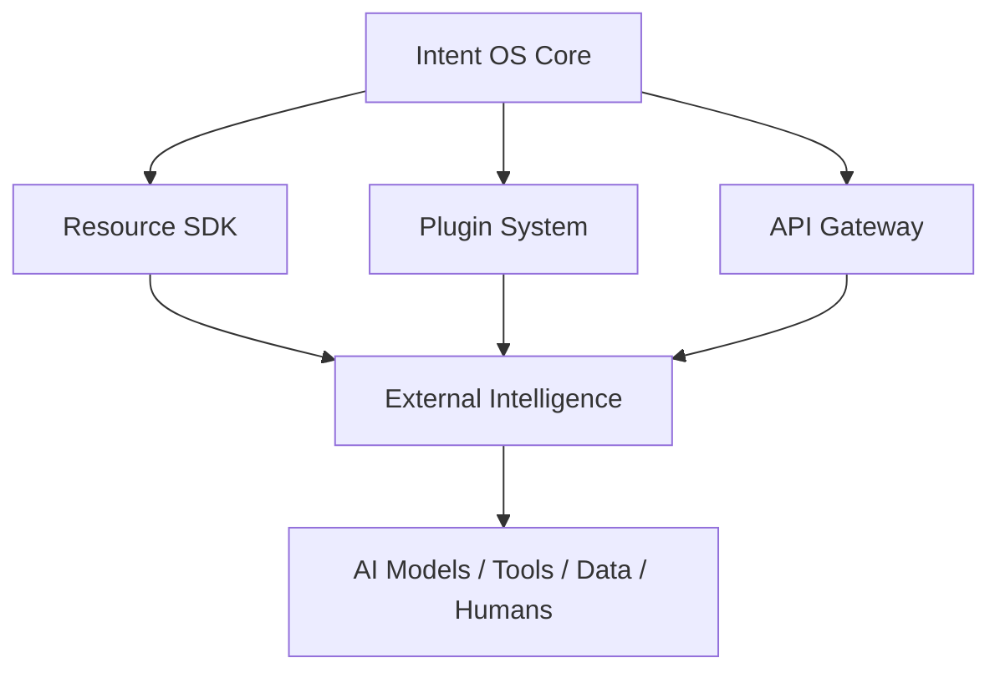

# Volume 6. Developer Platform Specification

- **Version:** v0.1 Draft
- **Status:** Ecosystem & Integration Specification
- **Depends on:** [Volume 1~5](README.md)

---

## 1. Introduction

### 1.1 Purpose

Developer Platform Specification은 Intent OS가 외부 Resource와 연결되고 확장될 수 있도록 하는 **표준 구조**를 정의한다.

| 현재 AI 생태계 | Intent OS |
|---|---|
| New AI Model Released | New AI Model Released |
| ↓ Developer manually integrates | ↓ Register Resource |
| ↓ Users discover capability | ↓ Evaluate Capability |
| ↓ Users manually choose | ↓ Intent OS understands |
| | ↓ **Automatically available** |

### 1.2 Platform Vision

> **Any intelligence can become a Resource.**

어떤 AI든, 어떤 Tool이든, 어떤 데이터든, 어떤 인간 전문가든 — Intent OS 안에서는 **동일한 Resource로 취급된다.**

---

## 2. Platform Architecture



---

## 3. Resource Adapter Framework

### 3.1 Purpose

외부 Resource를 Intent OS가 이해할 수 있는 형태로 변환한다.

**문제:** 각 AI는 인터페이스가 다르다. (OpenAI API, Anthropic API, Google API, Custom Model, Internal Tool)

Intent OS 내부에서는 **Universal Resource Interface**로 통일한다.

### 3.2 Resource Interface

```python
class Resource:

    def identify():
        pass

    def capabilities():
        pass

    def execute():
        pass

    def estimate_cost():
        pass

    def estimate_latency():
        pass

    def evaluate_result():
        pass
```

### 3.3 Resource Metadata Schema

모든 Resource는 Registry에 등록된다. → [`schemas/resource.schema.json`](schemas/resource.schema.json)

```json
{
  "id": "",
  "name": "",
  "type": "",
  "provider": "",
  "capabilities": [],
  "cost_model": {},
  "performance": {},
  "limitations": [],
  "availability": ""
}
```

---

## 4. Resource Registry

Intent OS가 모든 Resource를 관리하는 **중앙 데이터베이스.**

**역할:** Resource 발견, Capability 저장, 성능 기록, 버전 관리, 상태 관리

```
Resource Registry
├── AI Models
├── APIs
├── Tools
├── Databases
├── Agents
└── Human Experts
```

---

## 5. Capability Declaration System

**Purpose** — Resource가 무엇을 잘하는지 정의한다.

```json
{
  "capabilities": [
    { "name": "Coding", "score": 95 },
    { "name": "Reasoning", "score": 92 }
  ]
}
```

> **하지만 중요한 점:** 초기 등록 정보만 믿지 않는다.

```
Declared Capability + Observed Performance = Final Capability Score
```

---

## 6. Plugin System

### 6.1 Purpose

외부 개발자가 Intent OS 기능을 확장할 수 있도록 한다.

```
Plugin
├── Resource Plugin
├── Tool Plugin
├── Domain Plugin
├── Agent Plugin
└── Data Plugin
```

### 6.2 Resource Plugin

새로운 AI 연결. 예: `Video Generation AI Plugin → Intent OS Resource → Video Capability`

### 6.3 Tool Plugin

외부 도구 연결. 예: `Analytics Tool → Data Analysis Capability`

### 6.4 Domain Plugin

특정 분야 전문화. 예: Medical / Legal / Education Domain Plugin

---

## 7. Intent OS SDK

**Purpose** — 개발자가 쉽게 Resource를 연결하도록 한다.

```python
from intentos import Resource


class MyAI(Resource):

    capabilities = ["image_generation"]

    def execute(self):
        ...


IntentOS.register(MyAI)
```

결과: Intent OS가 자동 인식.

---

## 8. API Gateway

**Responsibility** — 외부 요청을 관리한다.

**역할:** Authentication, Rate Limiting, Monitoring, Logging, Billing

```
External Request → API Gateway → Intent OS Core → Resource
```

---

## 9. Developer Workflow

| Step | 내용 |
|---|---|
| 1. Resource 등록 | Developer → Register Resource |
| 2. Capability 선언 | What can it do? |
| 3. Validation | Capability Test / Performance Test / Cost Test |
| 4. Production Availability | Resource Available |

---

## 10. Resource Evaluation Framework

새로운 Resource는 자동 평가된다.

| 평가 항목 | 의미 |
|---|---|
| Capability | 얼마나 잘하는가 |
| Reliability | 얼마나 안정적인가 |
| Cost Efficiency | 비용 대비 성능 |
| Speed | 응답 속도 |
| Safety | 위험성 |

```
Resource Score = Capability + Reliability + Efficiency + Safety
```

---

## 11. Version Management

AI 모델은 계속 변경된다. 따라서 Resource는 **Version 객체**를 가진다.

```
GPT Version A → GPT Version B → GPT Version C
```

Intent OS는 각 버전을 별도로 관리한다.

---

## 12. Resource Lifecycle

```
Registered → Evaluating → Active → Optimized → Deprecated → Removed
```

---

## 13. Marketplace Concept

장기적으로 Intent OS는 Marketplace가 될 수 있다.

```
Developer → Create Resource → Publish → Intent OS Evaluation → Users Benefit
```

**가능한 경제 모델**

- API Revenue Share
- Plugin Marketplace Fee
- Enterprise Distribution

---

## 14. Security Specification

### 14.1 Resource Isolation

외부 Resource는 Core System과 분리된다.

```
Core | Sandbox | External Resource
```

### 14.2 Permission System

```json
{
  "data_access": "limited",
  "user_data": "blocked"
}
```

### 14.3 Data Privacy

- 필요한 데이터만 전달
- 실행 기록 관리
- 민감 데이터 보호

---

## 15. Developer Experience Principles

1. **Easy Integration** — 10분 안에 Resource 연결 가능해야 한다.
2. **Automatic Evaluation** — 개발자가 직접 Benchmark를 만들 필요가 없어야 한다.
3. **Capability First** — Resource가 아니라 Capability 중심으로 등록한다.

---

## 16. Developer Platform Summary

```
Developer → Resource SDK → Resource Registry → Capability Evaluation
→ Decision Engine → User Goal Execution → Performance Data → Better Ranking
```

---

## Volume 6 Completion Criteria

- [x] Resource Adapter 정의
- [x] Plugin 구조 정의
- [x] SDK 구조 정의
- [x] Resource Registry 정의
- [x] Capability 등록 방식 정의
- [x] 외부 AI 연결 방식 정의
- [x] 버전 관리 정의
- [x] 보안 구조 정의
