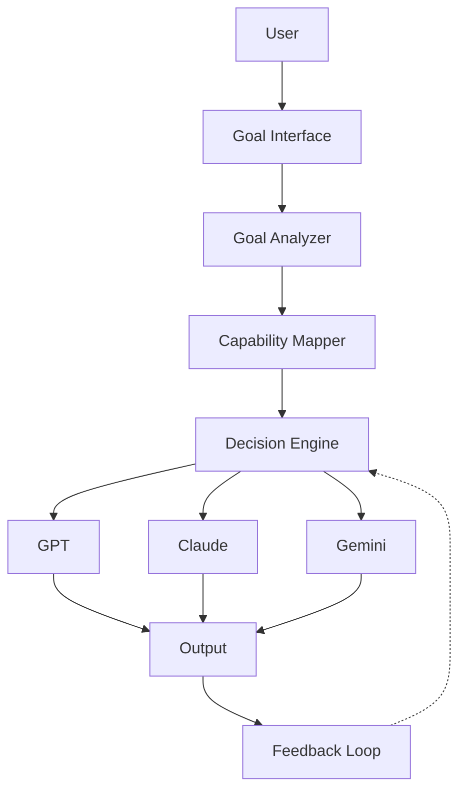
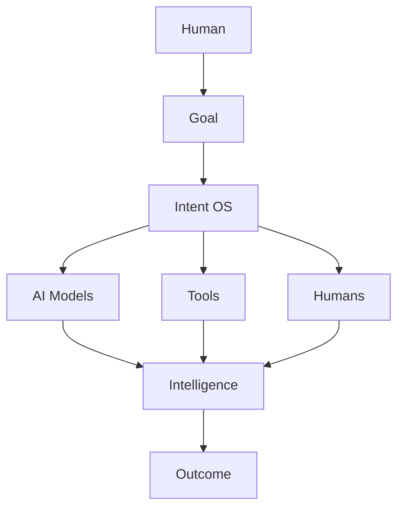

# Volume 7. Reference Implementation Specification

- **Version:** v0.1 Draft
- **Status:** Product Implementation Blueprint
- **Depends on:** [Volume 1~6](README.md)

---

## 1. Introduction

### 1.1 Purpose

Reference Implementation Specification은 Intent OS 개념을 실제 서비스 및 제품으로 구현하기 위한 **기준 아키텍처**를 정의한다.

```
Specification → Prototype → MVP → Production System → Intent Operating System Platform
```

### 1.2 Implementation Philosophy

**잘못된 접근**

처음부터 모든 AI 연결 / 모든 분야 지원 / 완벽한 자동화 / 자체 학습 시스템을 만들려고 한다.

```
결과: 복잡도 증가 → 개발 지연 → 검증 실패
```

**올바른 접근**

Intent OS의 핵심 가치 하나부터 검증한다.

> **핵심 가설:** "사용자는 어떤 AI를 써야 하는지 고민하지 않고 목표만 입력하면 된다."

---

## 2. Product Definition

### 2.1 Initial Product Form

초기 Intent OS는 다음 형태가 적합하다.

```
AI Decision Assistant + Prompt Generator + Multi-AI Router
```

**사용자 경험 비교**

| 기존 | Intent OS |
|---|---|
| 사용자 → ChatGPT 선택 → Claude 선택 → Prompt 작성 → 결과 비교 | 사용자 → 목표 입력 → Intent OS 분석 → 최적 AI 선택 → 자동 실행 → 결과 제공 |

---

## 3. MVP Definition

### MVP Goal

Intent OS 전체를 만드는 것이 아니다. 검증해야 하는 것은:

> **"AI 선택 자동화가 실제 사용자 시간을 줄이고 결과 품질을 높이는가?"**

### MVP Feature Set

#### Feature 1 — Goal Understanding (필수)

```
Input: "내 학원 겨울캠프 모집을 늘리고 싶어"
```

MVP도 Goal 표현은 [`goal.schema.json`](intent-os-spec/schemas/goal.schema.json)을 그대로 쓴다. **MVP라고 임시 형식을 만들면 Phase 2에서 전체 마이그레이션이 필요해진다.**

<!-- validate: goal.schema.json -->
```json
{
  "goal_id": "goal_01HZX9M4Y4QF2X",
  "version": 1,
  "title": "2027 윈터캠프 학생 모집",
  "goal_type": "Outcome",
  "objective": {
    "description": "겨울캠프 등록 학생 수를 늘린다",
    "desired_state": {
      "metric": "registered_students",
      "operator": ">=",
      "target": 100,
      "unit": "students",
      "baseline": 42
    }
  },
  "context": { "environment": { "domain": "Education Marketing" } },
  "status": { "phase": "Structured", "progress": 0 },
  "metadata": {
    "created_by": "system",
    "created_at": "2026-08-04T09:05:00Z",
    "source": "conversation"
  }
}
```

`tasks` 목록은 Goal 안에 넣지 않는다. 별도 [Task](entities/e005-task.md) Entity로 만들고 `goal_id`로 연결한다.

#### Feature 2 — Capability Mapping

```
광고 제작
  ↓
Capabilities: Copywriting / Marketing Strategy / Audience Analysis
```

#### Feature 3 — AI Resource Router (핵심 MVP)

초기 지원 Resource: OpenAI API, Anthropic API, Google API, Search API

#### Feature 4 — Prompt Compiler

Intent OS의 중요한 차별점.

```
사용자 입력: "광고 만들어줘"
        ↓
Intent OS 내부 변환:
  Role:         Senior Education Marketing Strategist
  Context:      Korean Art Academy
  Goal:         Increase Winter Camp Enrollment
  Requirements: ...
```

#### Feature 5 — Result Evaluation (최소한)

평가: Goal Alignment, Quality, User Feedback

---

## 4. MVP Architecture



### 4.1 MVP가 생략하는 Layer

위 그림은 [Volume 2 §2](v2-architecture.md)의 8개 Layer를 **전부 담지 않는다.** 무엇을 뺐는지 명시하지 않으면 아키텍처 위반처럼 보이므로 아래에 적는다.

| Volume 2 Layer | MVP | 사유 |
|---|---|---|
| 1 User | ✅ Goal Interface | |
| 2 Goal | ✅ Goal Analyzer | |
| 3 Planning | ⚠️ **축소** — Task Graph 없이 평면 Task 목록 | 의존성 해석은 Phase 2 |
| 4 Capability | ✅ Capability Mapper | |
| 5 Decision | ✅ Decision Engine (Rule Based, §7 Phase 1) | |
| 6 Resource | ❌ **생략** — 어댑터 3종을 직접 호출 | Registry는 Resource가 3개뿐일 때 이득이 없다 |
| 7 Execution | ⚠️ **축소** — 재시도만, 대체 Resource 전환 없음 | |
| 8 Learning | ⚠️ **축소** — Feedback 수집만, 패턴 추출 없음 | [Volume 5](v5-learning-engine.md) 전체는 Phase 2 |

**생략해도 되는 것과 안 되는 것의 기준은 하나다** — 나중에 넣을 때 **데이터를 버려야 하는가.**

Resource Layer(6)는 나중에 넣어도 기존 데이터가 살아남으므로 생략할 수 있다. 반면 Learning Layer(8)의 **수집**은 축소하되 없애지 않았다. 지금 안 모은 실행 데이터는 나중에 소급해서 만들 수 없기 때문이다. Phase 1에서 [§4.1 Learning Record](v5-learning-engine.md)를 그대로 적재하는 이유가 여기에 있다.

---

## 5. Recommended Technology Stack

| 영역 | 추천 | 이유 |
|---|---|---|
| **Frontend** | Next.js, React, Tailwind | 빠른 검증 |
| **Backend** | Python, FastAPI | AI 생태계와 가장 많은 연결성 |
| **Database** | PostgreSQL | 초기 |
| **Vector Memory** | Pinecone / Weaviate / Chroma | |
| **AI Integration** | OpenAI API, Anthropic API, Google AI API | |

---

## 6. Core Backend Structure

```
intent-os/
├── core/
│   ├── goal_engine
│   ├── planner
│   ├── decision_engine
│   ├── runtime
│   └── learning
├── resources/
│   ├── openai
│   ├── anthropic
│   └── google
├── memory/
└── api/
```

---

## 7. Decision Engine MVP

처음부터 머신러닝 모델을 만들 필요 없다.

| Phase | 방식 | 내용 |
|---|---|---|
| **1** | Rule Based | `IF coding task → Prefer coding optimized model`<br>`IF marketing writing → Prefer writing optimized model` |
| **2** | Data Driven Ranking | Historical Success Data → Ranking Model |
| **3** | Self Improving | Intent OS learns |

---

## 8. Prompt Compiler Architecture

Intent OS의 중요한 경쟁 요소.

```
Input:   Goal Object, Task, Capability, Resource

Process: Context Assembly
         → Instruction Generation
         → Constraint Injection
         → Output Format Design

Output:  Resource별 최적 Prompt
```

| Resource | Prompt 형태 |
|---|---|
| GPT | Reasoning optimized format |
| Claude | Long context optimized format |

---

## 9. Evaluation System MVP

처음에는 완벽한 평가 모델이 필요 없다.

- **Automatic** — Length, Completeness, Structure, Consistency
- **User Feedback** — 좋음 / 수정 필요 / 실패
- **Business Outcome** (향후) — Conversion, Revenue, Engagement 연결

---

## 10. Development Roadmap

| Phase | 기간 | 목표 | 구현 |
|---|---|---|---|
| **Phase 0**<br>Research Prototype | 2~4주 | AI Router 검증 | Goal Input, AI Selection, Prompt Generation, Result Comparison |
| **Phase 1**<br>MVP | 3개월 | 100명 테스트 사용자 확보 | Goal Engine, Decision Engine, Resource Router, Memory |
| **Phase 2**<br>Domain Optimization | 6개월 | 특정 분야 최고 효율 | Marketing / Education / Business Intent OS |
| **Phase 3**<br>Platform | 12개월+ | 생태계 구축 | SDK, Plugin, Marketplace, Developer Ecosystem |

---

## 11. First Market Strategy

Intent OS는 처음부터 모든 사용자를 대상으로 하면 어렵다.

**좋은 초기 시장 조건**

```
AI 사용 빈도 높음 + AI 선택 문제가 큼 + 결과 가치가 높음
```

| 분야 | 적합한 작업 |
|---|---|
| Marketing | 광고 제작, 콘텐츠 제작, 시장 분석 |
| Software Development | 코드 생성, Debugging, Architecture |
| Research | 자료 조사, 논문 분석 |

---

## 12. Initial Business Model

1. **Subscription** — Free → Pro → Enterprise
2. **Usage Based** — AI Execution Cost + Platform Fee
3. **Enterprise AI Optimization** — 기업 대상 AI 사용 비용 절감 + 생산성 향상

---

## 13. Competitive Advantage

1. **Decision Data** — 더 많은 실행 데이터 → 더 좋은 선택 → 더 좋은 결과
2. **User Context** — 개인별 Preference, History, Domain Knowledge 축적
3. **Resource Intelligence** — AI 모델이 증가할수록 가치 증가

---

## 14. Long-Term Architecture



---

## 15. Success Metrics

| 구분 | 지표 |
|---|---|
| **User Metric** | 목표 달성 시간 감소, AI 선택 시간 감소, 만족도 증가 |
| **System Metric** | Decision Accuracy, Resource Optimization, Cost Efficiency |
| **Business Metric** | Retention, Revenue, Enterprise Adoption |

---

## 16. Final Architecture Summary

```
Volume 1 Core Concepts
→ Volume 2 Architecture
→ Volume 3 Runtime
→ Volume 4 Decision Engine
→ Volume 5 Learning Engine
→ Volume 6 Developer Platform
→ Volume 7 Reference Implementation
```

---

## Final Statement

> Intent OS의 본질은 **"하나의 강력한 AI를 만드는 것"이 아니다.**
>
> **"계속 등장하는 모든 지능을 가장 효율적으로 조합하는 시스템을 만드는 것"**이다.
>
> AI 모델의 시대가 아니라, **AI Resource Management의 시대**를 위한 운영체제다.

---

## Volume 7 Completion Criteria

| 항목 | 근거 | 판정 |
|---|---|---|
| MVP 정의 | §3 Feature 1~5 | ✅ |
| 제품 방향 정의 | §2 | ✅ |
| 기술 구조 정의 | §4 · §4.1 생략 Layer 명시 · §5, §6 | ✅ |
| 개발 단계 정의 | §10 Phase 0~3 | ✅ |
| 시장 진입 전략 정의 | §11 | ✅ |
| 사업 모델 정의 | §12 | ✅ |
| 장기 확장 구조 정의 | §14 | ✅ |
